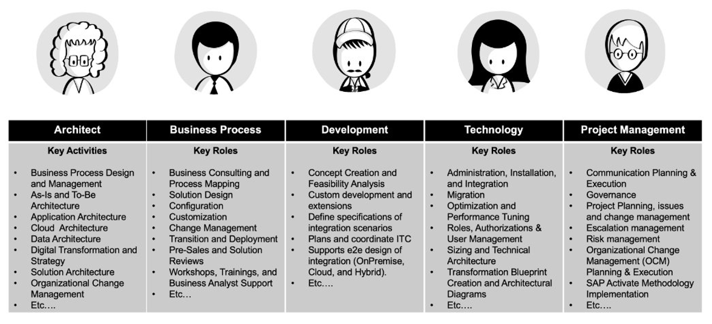

**SAP Joule for Consultants Overview**

SAP Joule for Consultants is a Gen AI powered copilot designed to boost consulting productivity by providing fast, reliable answers grounded in exclusive SAP content. In this mission, you will gain knowledge on utilizing Joule for Consultants. This includes the pre-requisites, setup, prompting strategies, some examples of key personas and their tasks, and examples of testing. 

The image below can give you a glimpse of all the user personas who can use Joule for Consultants. We will be discussing them in more detail, once the service is activated.
 

 
 

 

 <b>Image 1</b> 

**Key Capabilities**

##### Enablement & Discovery 
Provides comprehensive insights into the SAP domain by addressing questions related to product names, entity definitions, SAP concepts, programs, processes, and functional capabilities across the SAP portfolio. 

##### Guidance & Instructions 
Offers step-by-step support for achieving specific objectives, including setup, configuration, customization, and transformation of SAP systems and business processes across the SAP product suite. 

##### Support & Troubleshooting 
Delivers precise solutions for resolving functional issues or operational challenges within SAP systems and business processes across the SAP ecosystem. 

##### ABAP Code Interpretation  
Deciphers ABAP code by explaining its business logic and technical characteristics. 
 
 
