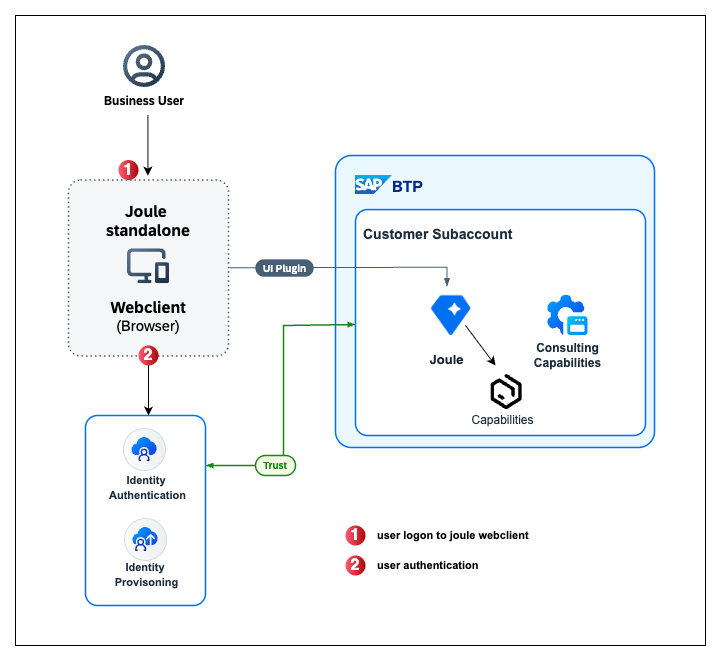

### SAP Joule for Consultants Architecture Diagram

 

 
 

 <b>Solution Diagram</b> 

 

#### Solution Diagram Description

In this mission, we will discuss who can access the application and how to authenticate using SAP Cloud Identity Services. We recommend using an existing SAP Cloud Identity Services. If you are new to SAP Cloud Identity Services or are not aware of existing services, please refer to the SAP Help page <a href="https://help.sap.com/docs/cloud-identity-services/cloud-identity-services/initial-setup">SAP Cloud Identity Services > Initial Setup</a> or the SAP Discovery Center Mission <a href="https://discovery-center.cloud.sap/missiondetail/4538/4826/">Establish a Unified Joule Instance</a>.

If you would like to validate the existing SAP Cloud Identity Services in your organisation, you can visit <a href="https://help.sap.com/docs/cloud-identity-services/cloud-identity-services/viewing-assigned-tenants-and-administrators">View Assigned Tenants and Administrators</a>.

**Note:**
As an alternative, you can view the administrators of the tenants that are assigned to you and add new administrators in SAP Cloud Identity Services via the <a href="https://help.sap.com/docs/link-disclaimer?site=https%3A%2F%2Fme.sap.com%2Fhome">SAP for Me</a> portal. For more information see <a href="https://help.sap.com/docs/link-disclaimer?site=https%3A%2F%2Fsupport.sap.com%2Fcontent%2Fs4m%2Fhelp%2Fsystems%2Fsystems%2Fdetails%2Fias.html"> Cloud Identity Services Administrators Card</a>.
