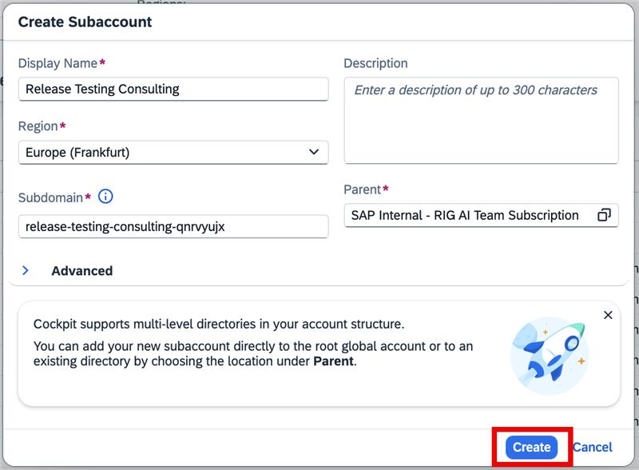
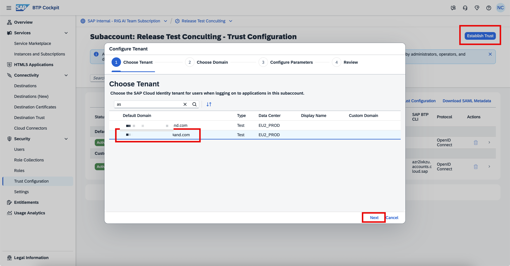
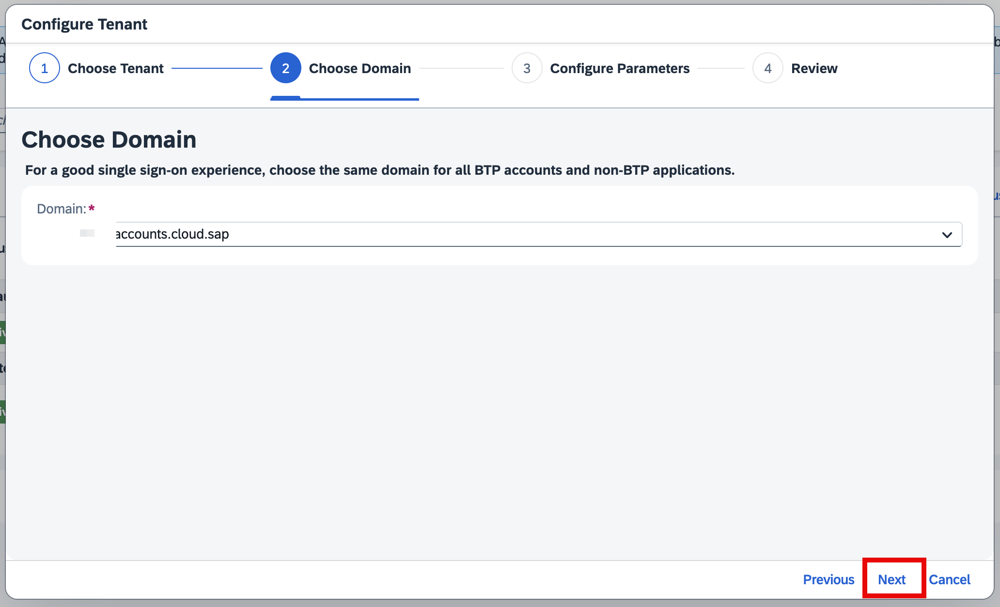
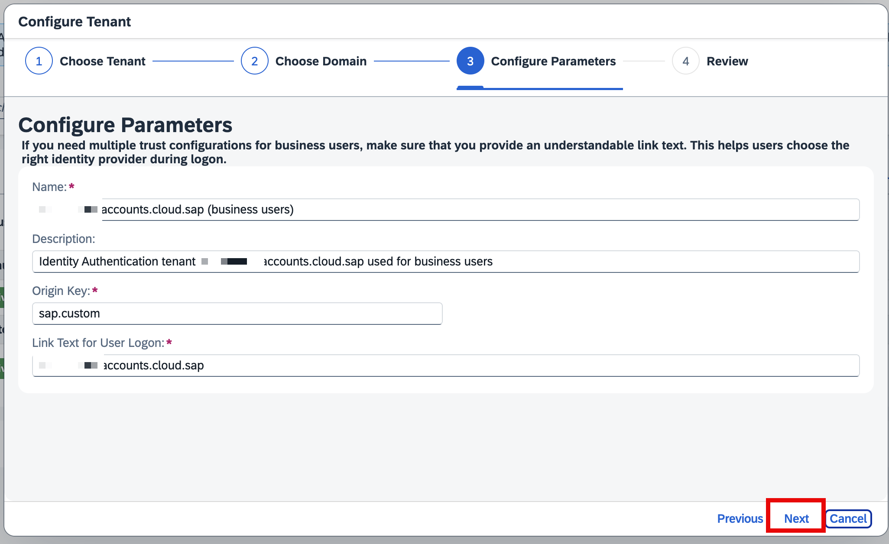
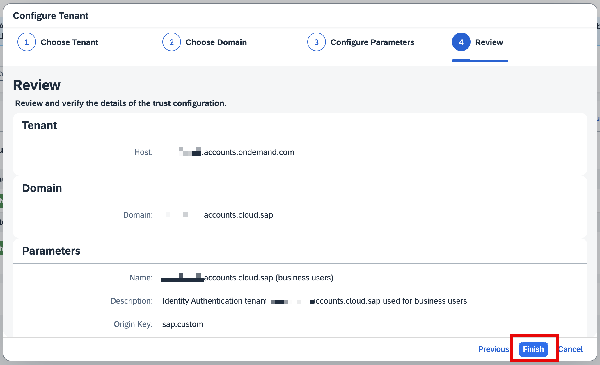

## Create a SAP BTP Subaccount

We are now going to create a new SAP BTP subaccount dedicated to SAP Joule for Consultants. Remember that it is only supported in EU10, EU11 and US10 in the current release.

Navigate to your SAP BTP Global Account with Global Admin authorization. In the **Account Explorer** page, click on **Create** and select **Subaccount**. Enter the following details and click on **Create**.

- **Display Name:** As per your choice
- **Region:** EU10 or EU11 or US10
- **Subdomain:** The URL (domain) to access Joule for Consultants.

> **Note:** The subdomain cannot be changed once the subaccount is created.

  

## Configure Trust with SAP Cloud Identity Services

By now, we understand that you have selected your SAP Cloud Identity Services for SAP Joule for Consultants services. To configure it:

- Expand **Security** → click on **Trust Configuration**
- Click on **Establish Trust** and select the appropriate **SAP Cloud Identity Services** tenant and click on **Next**

  

- Follow the onscreen instructions; no changes are required. You can click on **Next**

  

  

- Review and verify the details of the trust configuration and click on **Finish**

  

## Add the Entitlements to your SAP BTP Subaccount

To activate the services, we will be adding the required services to the subaccount we created. Within the SAP BTP Subaccount, click on **Entitlements** → click on **Edit** → click on **Add Service Plans**.

In the new pop-up window, search for SAP Joule for Consultants → select the service **"standard-ga (Application)"**. Similarly, search for **Joule**, add the service **"foundation (Application)"**, and click on **"Add 2 Service Plans"**.

  

Ensure you **Save** the settings.
