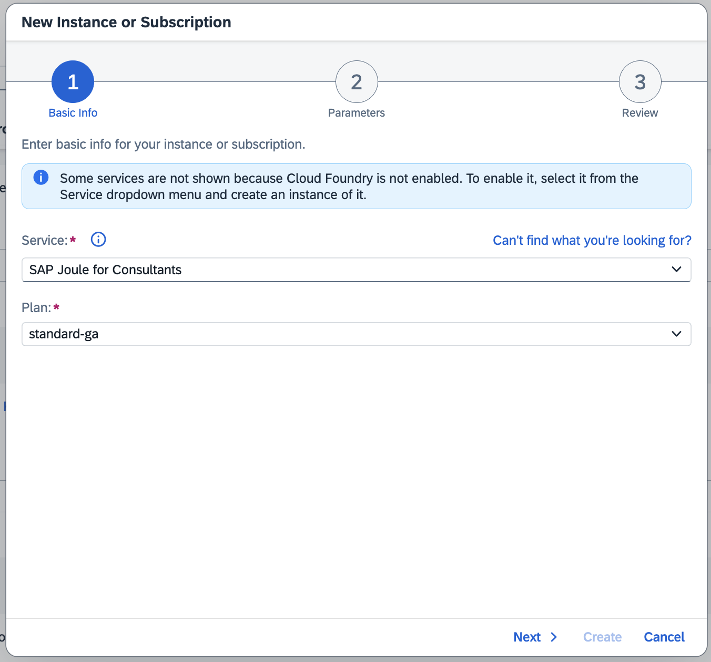
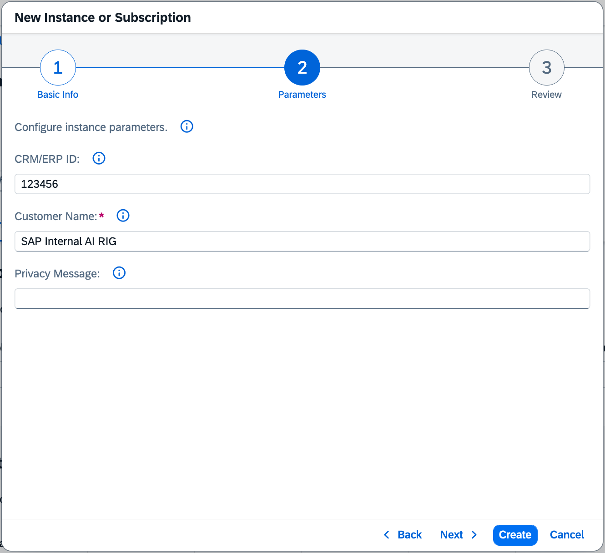
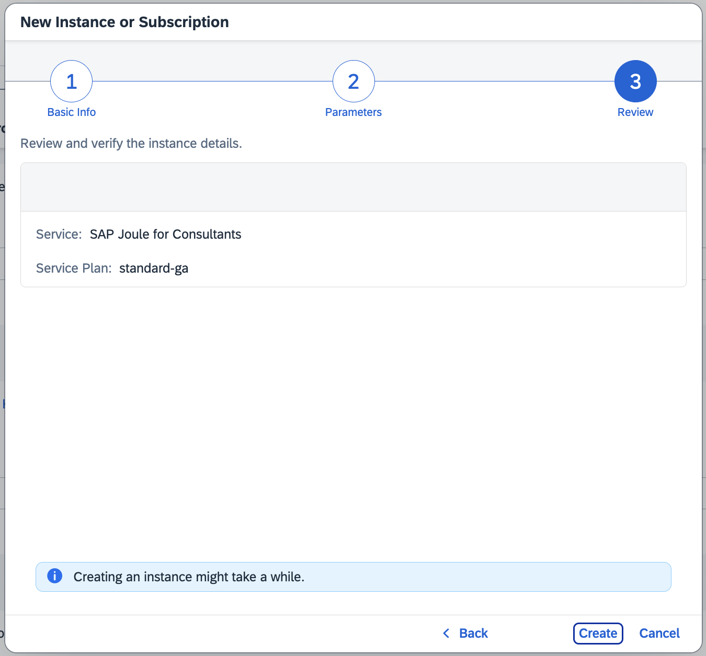
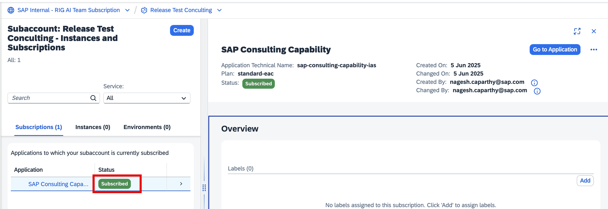
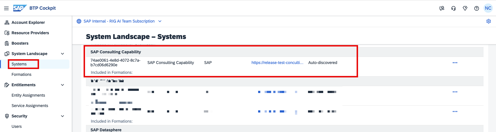

## Create a Service Instance

We will now be activating the **SAP Joule for Consultants** service in your SAP BTP Subaccount.

- Navigate to **Instances and Subscriptions**
- Click on **Create** and choose **SAP Joule for Consultants** as the service

  

- Please enter both the Customer ID and the Customer Name.

  

- Review the details and click on **Create**

  

- Wait for the instance to be successfully created

  

## Verify Instance Creation and Confirm System Landscape

- Go to **System Landscape**
- Ensure that **SAP Consulting Capability** is now displayed.

  

This completes the pre-requisites setup process, and we are now good to execute the **Joule Booster**.
