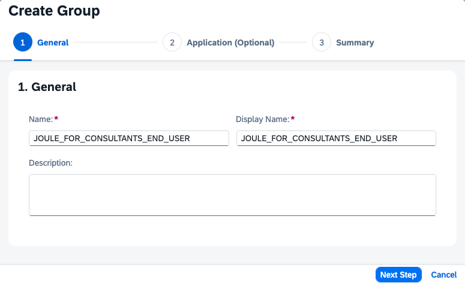
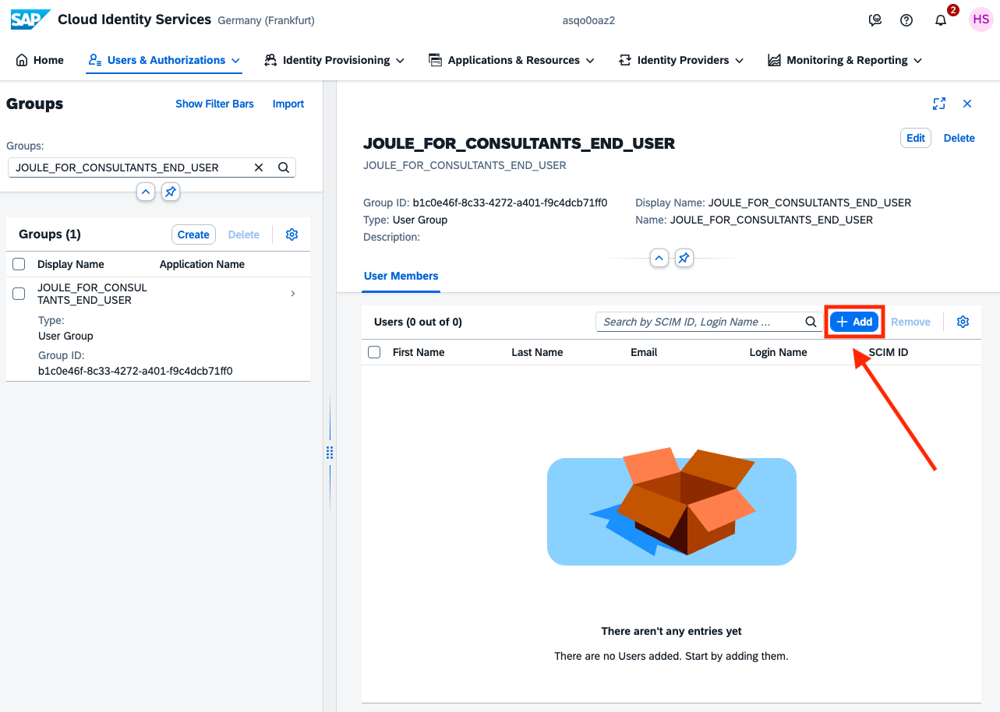

## Configure the Role Collection

- In the subaccount, open **Security** → **Role Collections**.
- Create a role collection.
- Assign the role `end_user` from the application `das-application!b188376`.
- Add a user group mapping with a name of your choice, e.g. `JOULE_FOR_CONSULTANTS_END_USER`.

> **Note:** The name can be chosen freely. In case of multiple instances of SAP Joule for Consultants, you may choose the naming convention `JOULE_FOR_CONSULTANTS_END_USER-<name of subaccount>`.

  

## Activate the Package in SAP for Me

As part of the Joule for Consultants onboarding process, you need to activate the package and its features in SAP for Me. This requires an SAP S-user with Cloud Administrator or Super Administrator authorization.

To activate the package in SAP for Me:

- Go to the [AI Activation Dashboard](https://me.sap.com/portfolio/businessAI) in SAP for Me.
- Find **SAP Joule for Consultants** and click **Ready for Activation**.
- Set the number of users who will be using the package and click **Activate**.
- Once the package is shown as **Activated** on the dashboard, the list of SAP Joule for Consultants features will be available for activation.
- Find the features you would like to activate and select **Request Activation**.

Feature activation requires you to log in to your SAP Central Business Configuration account to activate the features on the specific tenants.

> **Note:** To access your SAP Central Business Configuration tenant, you will need to have your user account set up with the `readFeatureActivationStatus` and `writeFeatureActivationStatus` policies on your account with the connected SAP Cloud Identity Services tenant, as outlined in the [User Setup](https://help.sap.com/docs/CENTRAL_BUSINESS_CONFIGURATION/ffae1b25fe4543d08db67dcbab9b288d/47dff1ba0c6240deacfb62781fa7386e.html) guide.

For further information, see [Activating Business AI and Assigning Users](https://help.sap.com/docs/joule/capabilities-guide/activating-business-ai-and-assigning-users).

## Open SAP Cloud Identity Services and Manage Groups

- Open SAP Cloud Identity Services.
- Navigate to **Users & Authorizations** and open **Groups**.
- Create a user group with name `JOULE_FOR_CONSULTANTS_END_USER`.

  

- Add the users who should have access to SAP Joule for Consultants.

  

> **Note:** For other ways to add users besides manual entry, see [Managing Users | SAP Help Portal](https://help.sap.com/docs/cloud-identity-services/cloud-identity-services/user-management).

> **Note:** Instead of creating the user group `JOULE_FOR_CONSULTANTS_END_USER` in SAP Cloud Identity Services and mapping it in the role collection, you have the option to directly add users to the BTP role collection established in the previous step. However, we recommend using the user group mapping approach.

## Assign Users to the Authorization Policies for Console Access

There are two built-in authorization policies for the SAP Joule for Consultants console:

- **SAP_JOULE_CONSULTANTS – Admin**, with access to all console features (including e.g. settings and usage metrics).
- **SAP_JOULE_CONSULTANTS – Standard**, with limited access.

To assign authorization policies to the users:

- Go to **Users & Authorizations** > **Groups**.
- Search for **SAP_JOULE_CONSULTANTS – Standard**.
- Select the authorization policy with the correct Application Name `scc-identity-service(<subaccount name>)`.
- Add the users who should have access to SAP Joule for Consultants (the same users that are in the group `JOULE_FOR_CONSULTANTS_END_USER`).

Similarly, add users who need full admin privileges to the authorization policy **SAP_JOULE_CONSULTANTS – Admin**.

For more information, see [SAP Joule for Consultants Console](https://help.sap.com/docs/joule/joule-tools-12ace5a963e147ffa6f5aab8a4cf15f4/sap-joule-for-consultants-console).

> **Note:** To access the SAP Joule for Consultants console, navigate to **Instances and Subscription** in the SAP BTP subaccount and click on the **SAP Joule for Consultants** subscription.

## Enable Access to Gated Content

SAP Joule for Consultants provides access to exclusive content such as SAP Notes and SAP Knowledge Base Articles (KBAs). To access the gated content, each user must have a corresponding S-user. The following conditions must be met:

- The email address used for login matches the email of the S-user.
- The S-user is associated with one of the Customer IDs listed in the Admin Console, in the section **Settings > Customer Information**.

For more information on how to create and maintain S-users, please refer to the following:

- [Get SAP S-user | SAP Help Portal](https://help.sap.com/docs/SAP_ENTITLEMENT_MANAGEMENT/2807ede877724c7b8f59f6e1c12a7d67/cff2d8cb05bf471cb09e0e969bff719d.html)
- [S-user Maintenance in SAP for Me | Guided Answers](https://ga.support.sap.com/index.html#/tree/1475/actions/18516)
