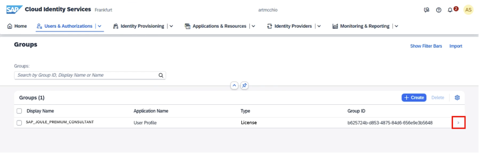
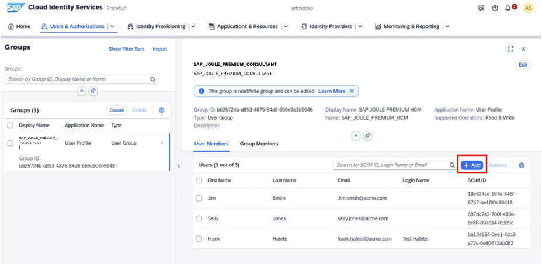

## Request Activation and Assign Users
 
As part of the Joule for Consultants activation process, you will need to create a ticket to establish the License Group in the SAP Cloud Identity Services.

**Note:**
The AI Activation Dashboard can be found in <a href="https://me.sap.com/portfolio/businessAI">SAP for Me</a>. However, packages cannot be activated from this dashboard as this feature is under development.
 
To log in to SAP for Me, you will need your SAP S-user ID with Cloud Administrator authorization.
 
To activate the package, please [create a ticket](https://me.sap.com/createIssue/0) and include the following information:
<li>Support component: CBC-AIX
<li>URL of the SAP Cloud Identity Services tenant
<li>PUPM package: SAP Joule for Consultants
<li>Subaccount ID

**Note:**
Admins should anticipate some processing time while the CBC team completes the request.
 
## Assign users to access Joule for Consultants

**Note:**
Ensure the ticket has been processed from the previous step before completing this step.
 
<li>Once the ticket is processed, the <b>SAP_JOULE_PREMIUM_CONSULTANT</b> License Group will be created in your SAP Cloud Identity Services. You can log in to SAP Cloud Identity Services and navigate to <b>Users & Authorization</b> -> click on <b>Groups</b> to see the group shown below.</li>
 

  
 

 <b>Image 2</b> 

 
<li>Add the users who should have access to SAP Joule for Consultants
  <b>Note: </b>
You can add the users manually or use the <a href="https://help.sap.com/docs/cloud-identity-services/cloud-identity-services/import-csv-file-with-full-user-profile">Import CSV File</a> functionality.
  

 
 

 <b>Image 3</b> 

**Note:**
Charges will occur based on the total number of users assigned to the license group during the month.

## Assign users to the authorization groups for console access
The Joule for Consultants console uses two built-in access role policies:
<li>Admin – Complete access to all console features (including settings section and usage metrics section).</li>
<li>Standard – Limited access. Currently optional.</li>
  
When running the booster, two authorization groups were created in the IAS (Cloud Identity Services):
<li>SAP_JOULE_CONSULTANTS – Admin</li>
<li>SAP_JOULE_CONSULTANTS – Standard</li>
  
To assign Admin rights:
<li>Go to <b>Users & Authorizations</b> > <b>Groups</b>.</li>
<li>Search for <b>SAP_JOULE_CONSULTANTS – Admin</b>.</li>
<li>Select the group with the correct Application Name <b>scc-identity-service(&#60subaccount name&#62)</b>.</li>
<li>Add the users who need full admin privileges.</li>
  
As already mentioned, assignment to the group "SAP_JOULE_CONSULTANTS – Standard” is optional. Users that are not assigned to any group will get the same behavior.

## Create a BTP role collection and add the required role

<li>Navigate to the SAP BTP subaccount you created earlier
<li>Expand <b>Security</b> → click on <b>Role Collections</b></li>
<li>Create a role collection for the end users with a name of your choice, e.g. Joule End User
<li>Add the role end_user from the application das-application!b188376 
<li>Add a user group with a name of your choice, e.g. SAP_JOULE_END_USER
<li>Click on <b>Save</b></li>
 

 
 

## Assign users to enable Joule
<li>Navigate to the SAP Cloud Identity Services
<li>Expand <b>Users & Authorizations</b> → click on <b>Groups</b></li>
<li>Click on <b>Create</b></li>
<li>Add Name and Display Name, here: SAP_JOULE_END_USER
<li>Follow the rest of the steps and click on <b>Finish</b></li>
<li>Add the same users you assigned earlier</li>
 <b>Note: </b>
Instead of creating the user group SAP_JOULE_END_USER in the SAP Cloud Identity Services and mapping it in the role collection, you have the option to directly add users to the BTP role collection established in the previous step. However, we recommend using the user group mapping approach.
  

 
 

## Enable access to gated content
Joule for Consultants provides access to exclusive content unavailable to other chatbots, such as SAP Notes and Knowledge Base Articles (KBAs). To access this gated content, each user must have a corresponding S-user. Ensure the email address used for login matches the email associated with the S-user.
