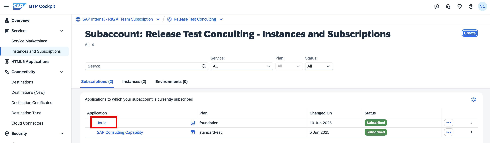
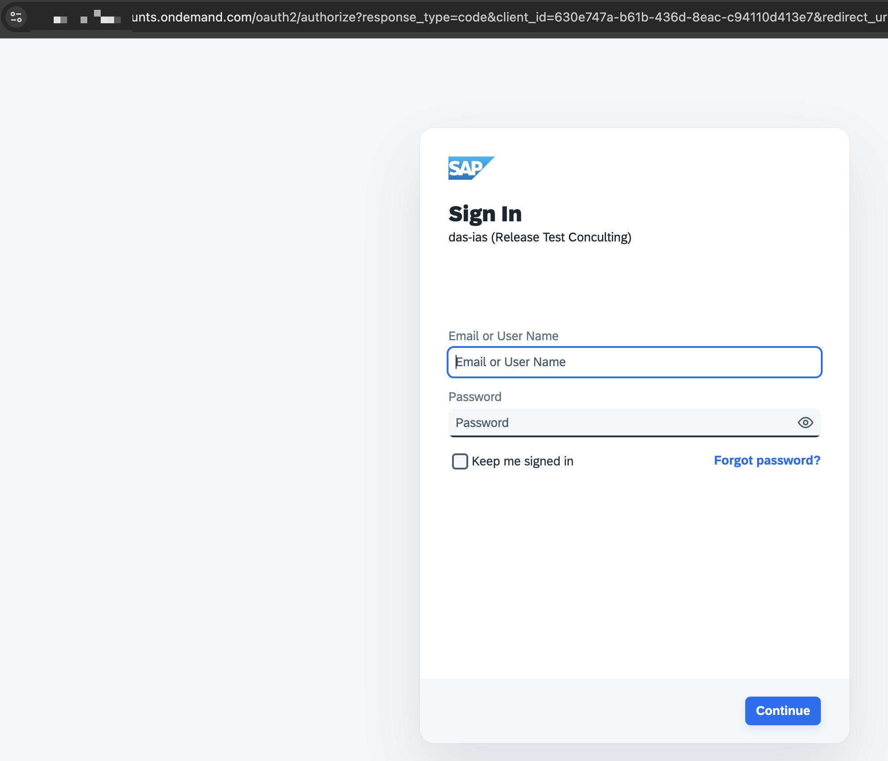
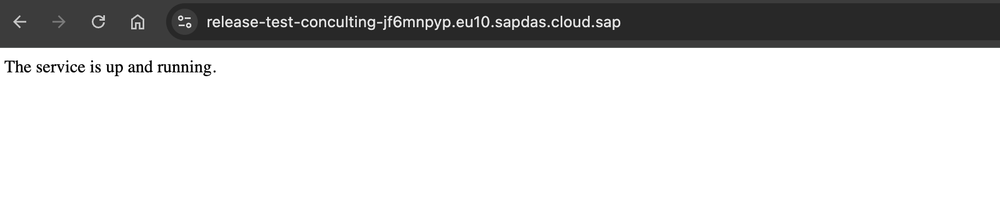
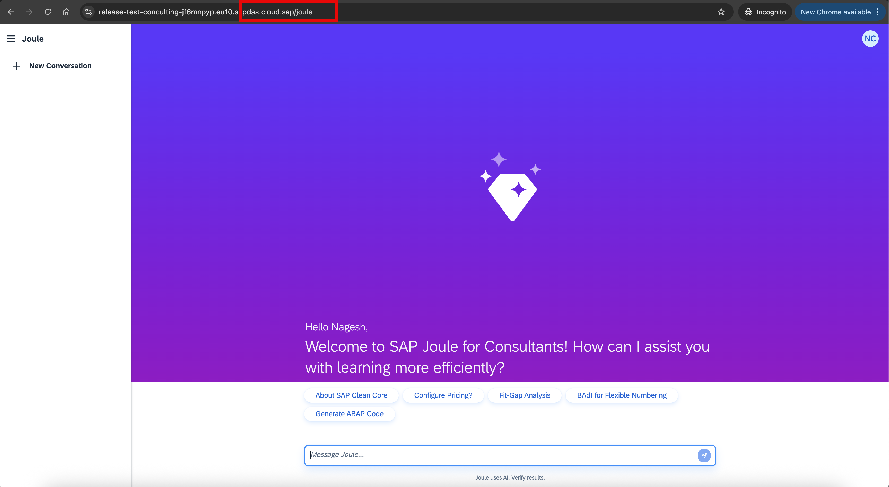

## Launch SAP Joule for Consultants

**Congratulations**, all the required setup and authorizations have been taken care of. We are now ready to launch Joule for Consultants. 

For the first time, as an administrator, you will need to open the Joule Standalone URL to access the service. To do this, you can navigate back to your SAP BTP Subaccount and follow the instructions. 

<li>In your SAP BTP Subaccount, navigate to <b>Instances and Subscription</b>, click on the Joule instance  
 

 
 

 <b>Image 1</b> 

 
<li>The page should be navigating you to the <b>SAP Cloud Identity Services</b>. Log in using your IAS credentials.
 

 
 

 <b>Image 2</b> 

 
<li>The screen should be displayed as below: The service is up and running. 
 

 
 

 <b>Image 3</b> 

 
<li>Once logged in, append <b>"/joule"</b> to the URL and press <b>Enter</b>
 
<li>The SAP Joule for Consultants UI should load successfully, displaying a greeting message that includes "SAP Joule for Consultants" and quick links shown below it.
 

 
 

 <b>Image 4</b> 

 
You are all set to use SAP Joule for Consultants. 

## Administrator Tips

The above Joule URL Services can be shared with the organisation's employees who have the required roles assigned to access Joule for Consultants.

 
 

## [Optional] Using Corporate Identity Providers (IDP)
If your organization uses a corporate IDP, you must align the settings for both Joule and Joule for Consultants.
<li>das-ias(&#60subaccount name&#62)<li>
<li>scc-identity-service(&#60subaccount name&#62)<li>
