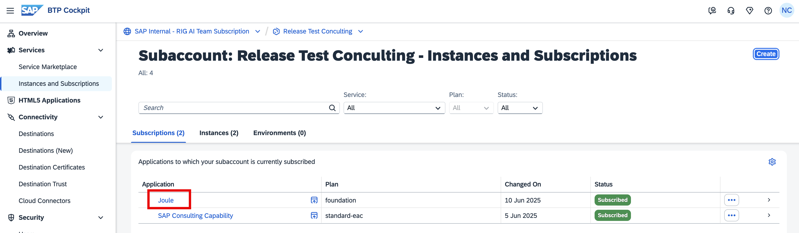
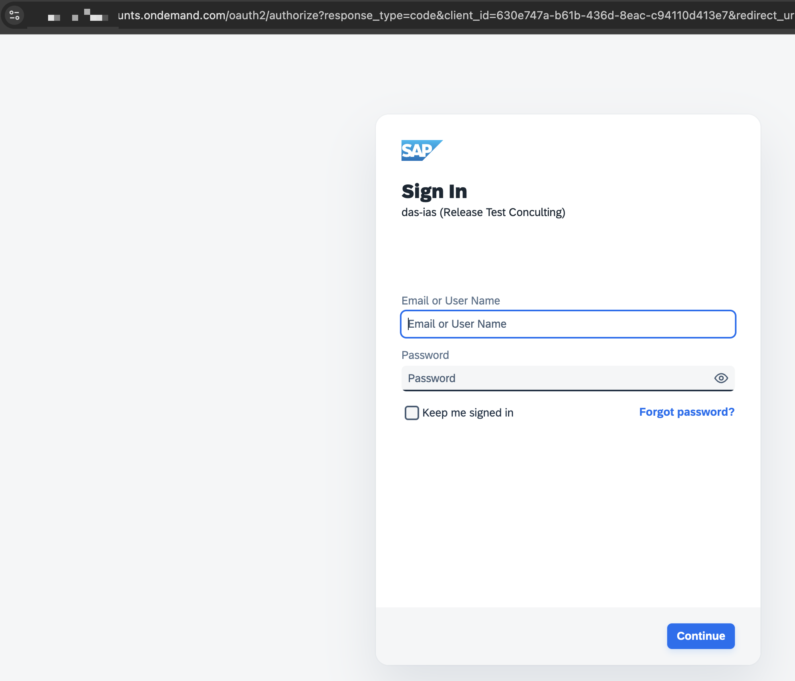
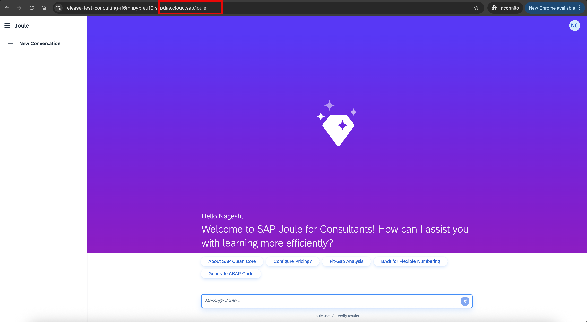

## Launch SAP Joule for Consultants

**Congratulations**, all the required setup and authorizations have been taken care of. We are now ready to launch Joule for Consultants.

For the first time, as an administrator, you will need to open the Joule Standalone URL to access the service. To do this, you can navigate back to your SAP BTP Subaccount and follow the instructions.

- In the SAP BTP subaccount, navigate to **Instances and Subscriptions** and click on the **Joule** subscription.

  

- Log in using your SAP Cloud Identity Services credentials.

  

- The screen should be displayed with the message: **The service is up and running**.

  

- Append `/joule` to the URL and press **Enter**.

The SAP Joule for Consultants UI should load successfully, displaying a greeting message that includes **SAP Joule for Consultants**.

  

> **Note:** If you encounter any issues during provisioning or with SAP Joule for Consultants, refer to the [Monitoring and Troubleshooting](https://help.sap.com/docs/joule/serviceguide/troubleshooting) guide for support.

> **Tip:** The console can also be reached by clicking on **New Conversation** > **Quick Links** > **Open Console**.

You are all set to use SAP Joule for Consultants.

## Administrator Tips

The above Joule URL can be shared with the organisation's employees who have the required roles assigned to access Joule for Consultants.

## [Optional] Configure Integration with a Corporate Identity Provider

If your organization uses a corporate Identity Provider, you need to align the following applications in SAP Cloud Identity Services:

- `das-ias(<subaccount name>)`
- `scc-identity-service(<subaccount name>)`

For more information, see [Using Corporate Identity Providers (IDP)](https://help.sap.com/docs/joule/joule-tools-12ace5a963e147ffa6f5aab8a4cf15f4/sap-joule-for-consultants-console#using-corporate-identity-providers-(idp)).