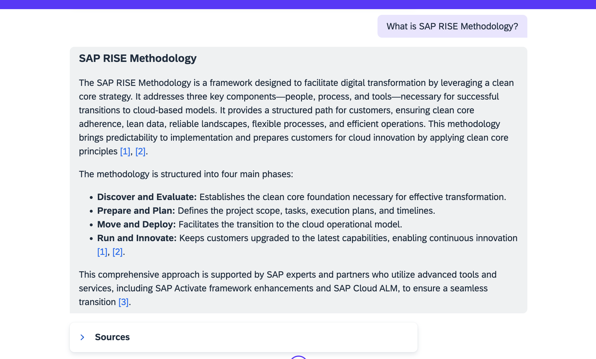
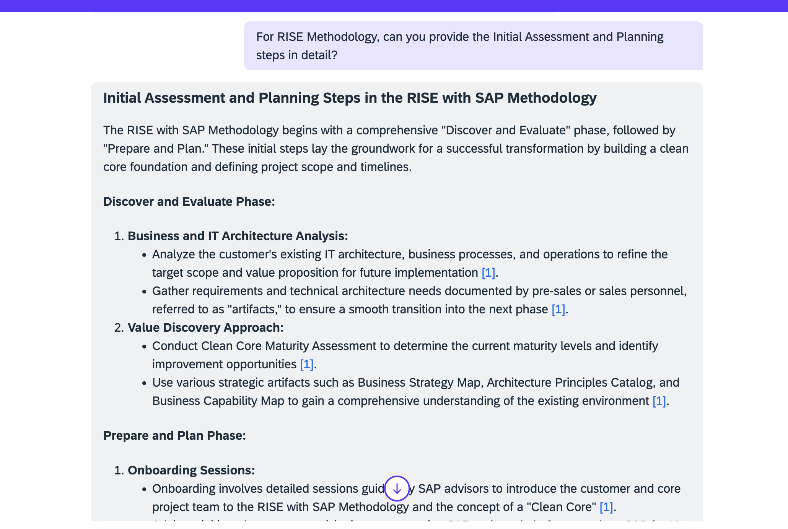
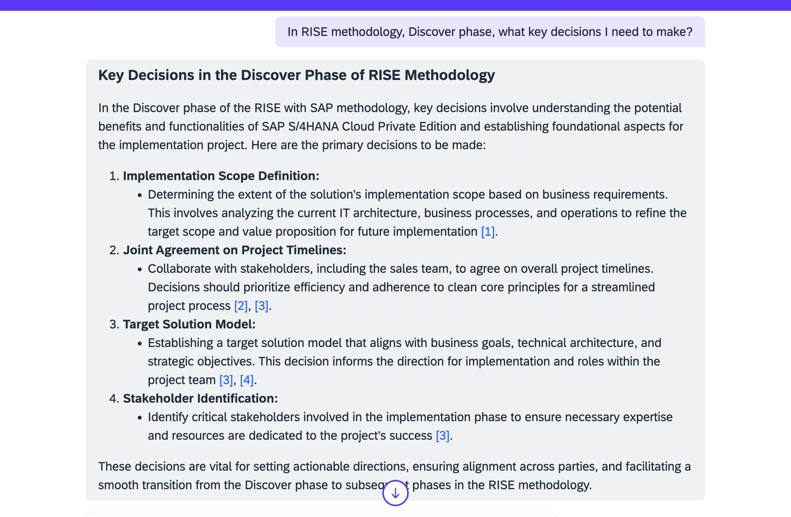
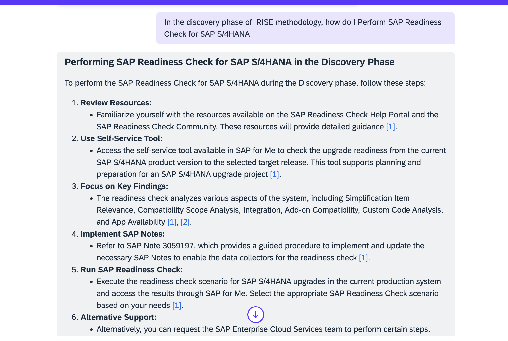

# Test Scenario

Now we shall see an example to understand how Joule for Consultants works with the help of a test scenario and it's outcome.

## Scenario: Provide proper understanding on how to start migration with RISE methodology
### Outome: An SAP RISE Migration Onboarding Story
<b> Step 1: Understand the Process </b>

<b> Prompt 1: What is SAP RISE Methodology?</b>
 

 
 

 <b>Image 1</b> 

 

<b> Step 2: Get Guidance & Instructions to start the process </b>

<b> Prompt 2: For RISE Methodology, can you provide the Initial Assessment and Planning steps in detail? </b>
 

 
 

 <b>Image 2</b> 

 

<b> Step 3: Understanding Step 1: Discover</b>

<b> Prompt 3: In RISE methodology, Discover phase, what key decisions I need to make?</b>
 

 
 

 <b>Image 3</b> 

 

<b> Step 4: Understanding Step 2: Discover: Readiness check </b>

<b> Prompt 4: In the discovery phase of  RISE methodology, how do I Perform SAP Readiness Check for SAP S/4HANA? </b>

 

 
 

 <b>Image 4</b> 

 
