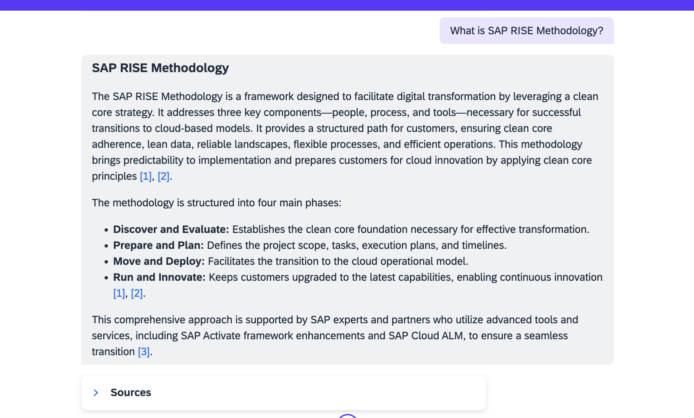
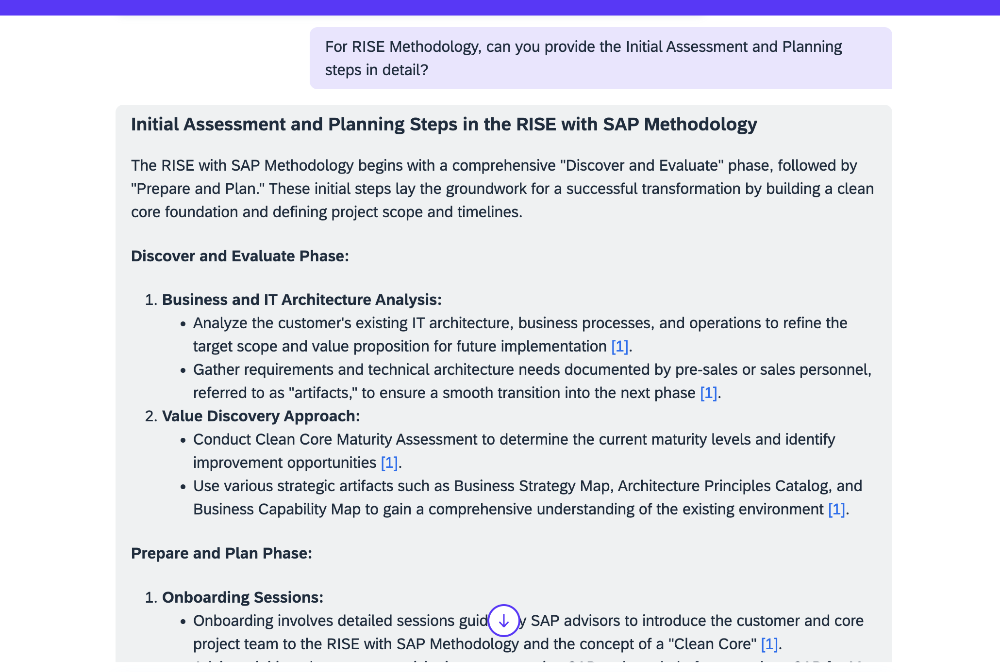
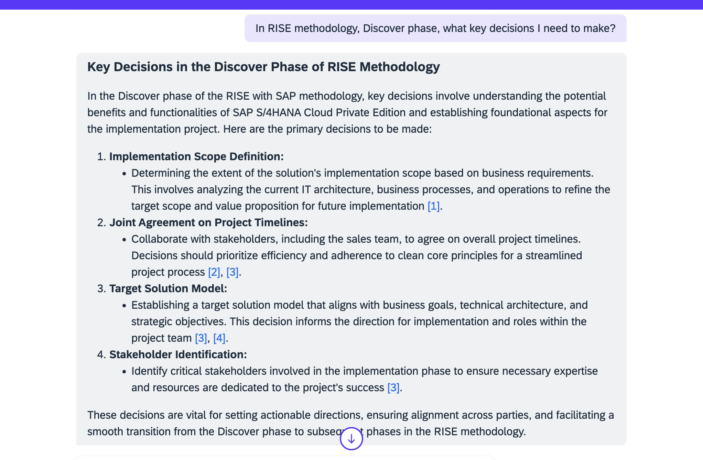
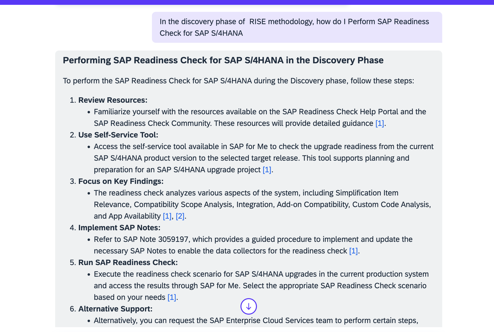

# Test Scenario

Now we shall see an example to understand how Joule for Consultants works with the help of a test scenario and its outcome.

## Scenario: Provide proper understanding on how to start migration with RISE methodology

### Outcome: An SAP RISE Migration Onboarding Story

**Step 1: Understand the Process**

**Prompt 1:** What is SAP RISE Methodology?

  

**Step 2: Get Guidance & Instructions to start the process**

**Prompt 2:** For RISE Methodology, can you provide the Initial Assessment and Planning steps in detail?

  

**Step 3: Understanding Step 1: Discover**

**Prompt 3:** In RISE methodology, Discover phase, what key decisions I need to make?

  

**Step 4: Understanding Step 2: Discover — Readiness Check**

**Prompt 4:** In the discovery phase of RISE methodology, how do I perform an SAP Readiness Check for SAP S/4HANA?

  

