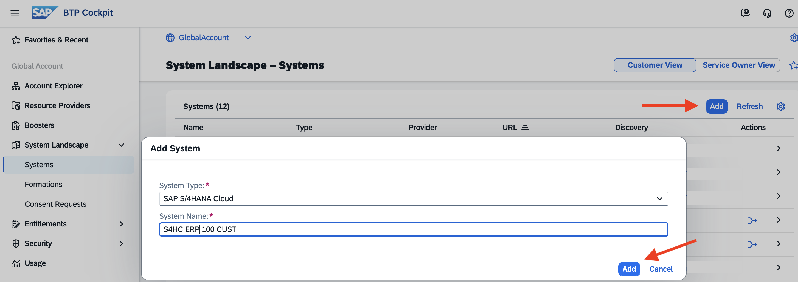
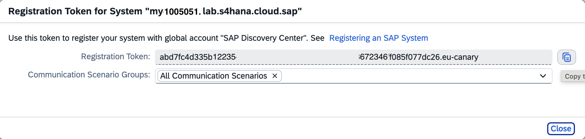
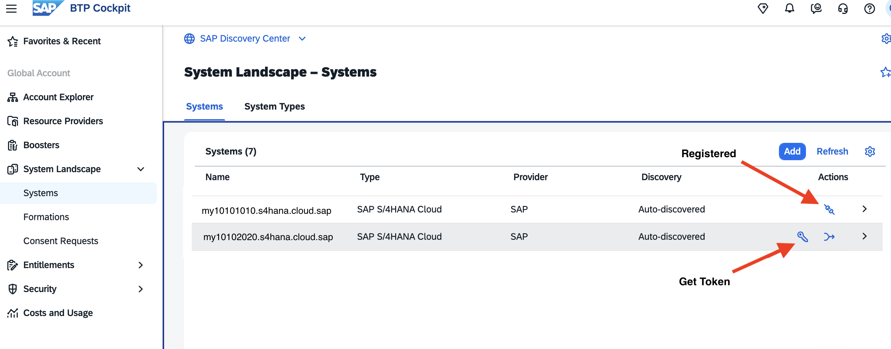
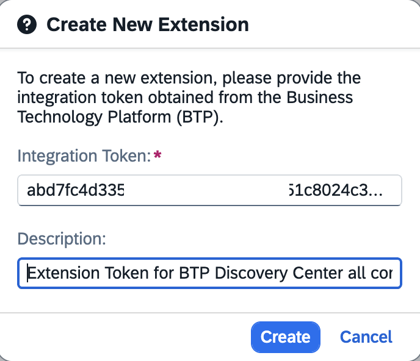
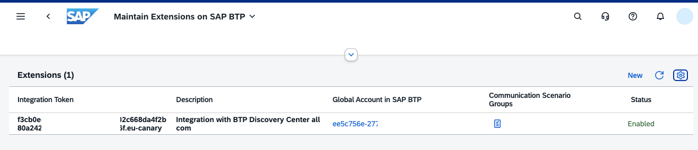
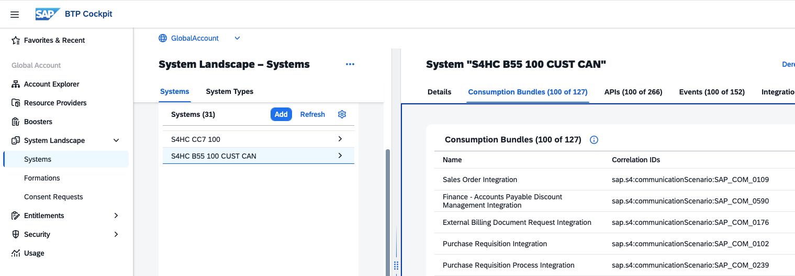

# Managing Unified Customer Landscape

The **Unified Customer Landscape** service provides capabilities for automated integration and extensibility of SAP and third-party systems. You maintain your Unified Customer Landscape service with the **System Landscape** page in the SAP BTP cockpit.

You can integrate several **systems** and **services** into a **Formation**. For example, a formation of type "Integration with Joule" will be required to integrate Joule into a BTP Service.

For more information about maintaining your Unified Customer Landscape and extensibility and integration concepts, see [SAP Help Portal - Extensions](https://help.sap.com/docs/btp/sap-business-technology-platform/btp-extensions?version=LATEST&ai=true&locale=en-US). 

 

## Maintain your System Landscape

Access your Unified Customer Landscape via the **System Landscape** page in the SAP BTP cockpit. The System Landscape page of the SAP BTP cockpit provides a visual overview of the SAP and third-party systems associated with the specified global account. 

For more information, see [SAP Help Portal - Maintaining Unified Customer Landscape](https://help.sap.com/docs/btp/sap-business-technology-platform/maintaining-unified-customer-landscape?locale=en-US&version=LATEST) 

### Systems

There are different ways to add systems in the "Systems" page: manually or automatically. If a system of your solution is associated with your global account or through a subscription in a subaccount, it will appear in the list automatically. Otherwise, you have to add your system manually. 

Systems are added to the list in one of the following ways:

 - Auto-Discovered

   Any SAP system of the supported system types associated with the same customer ID as your global account in SAP BTP will be automatically added to the system landscape list.

- Subaccount/(your-subaccount-name)

  The subscription has been discovered and automatically added to the subaccount.

- Manually-Added
  
  Specifies that the system has been manually added to the list by the global account administrator using the Add System button and completing the wizard. 

One system is significant for this mission: Your Cloud Identity Services tenant. You will need it to set up an Identity Provider. If you do not have one, you can create one later in this mission.

#### Example: Register a S/4HANA Cloud System

If a System, for example, an S/4HANA Cloud system, is missing, you can add it manually. Use this procedure to trigger the registration process for an SAP S/4HANA Cloud system that you want to pair with your global account in SAP BTP.

1. Open BTP Cockpit and navigate to "System Landscape" --> "Systems" and click "Add".

2. In the pop-up window, select your "System Type", e.g., "SAP S/4HANA cloud", and provide a "System Name" and click "Add".

   

3. After the System has been added, a pop-up opens. Select "All Communication Scenarios".

    

4. Select "Get Token". The token will be generated.

    

5. Optional: If the System was auto-discovered, but not yet registered, select the "Get Token" icon.

    

6. In your S/4HANA Cloud system, open the transaction "Maintain Extensions on SAP BTP".

    

7. Paste the Extension Token from your SAP BTP System Landscape.

    

8. Result: Your S/4HANA Cloud system is registered and can be used for all communication scenarios.

    

9. Check the registration in your BTP System.

   You can now see the Communication Scenarios, APIs, and Events of your backend system.

    

 

### Formations

Formations enable you to combine "Systems", simplifying connectivity setup and providing a unified view of all components required for implementing your integration or extension scenario. 

For example, setting up "Joule Studio" requires a Formation Type "Integration with Joule", the "Systems" "Joule", "SAP Build Process Automation", and "Cloud Identity Services".

For more information, see [SAP Help Portal - Integrating SAP Solutions](https://help.sap.com/docs/btp/sap-business-technology-platform/integrating-sap-solutions?locale=en-US&version=LATEST) 

 
