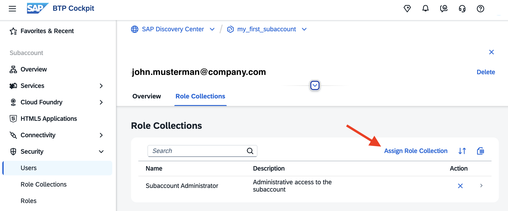
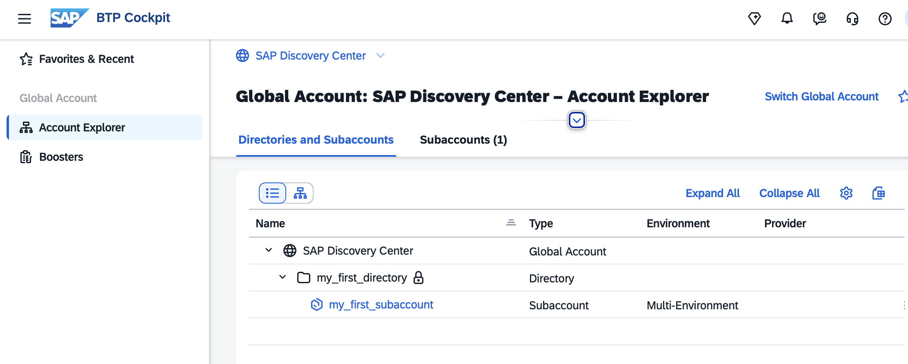
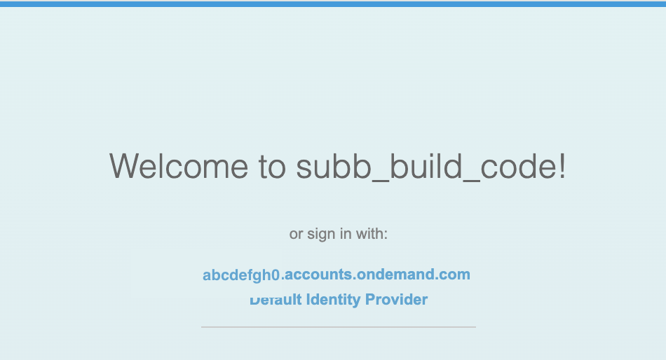
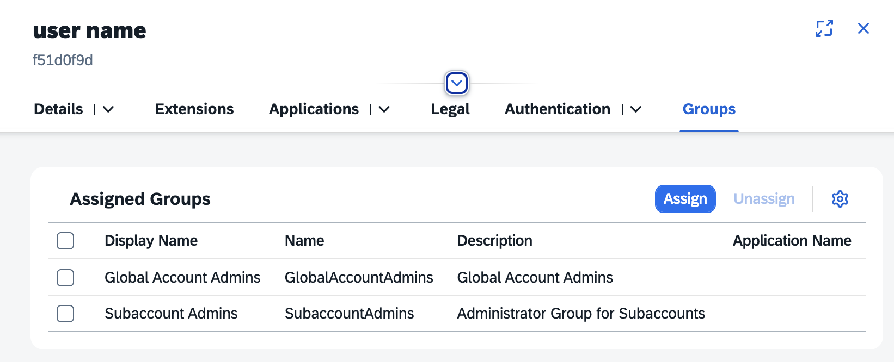
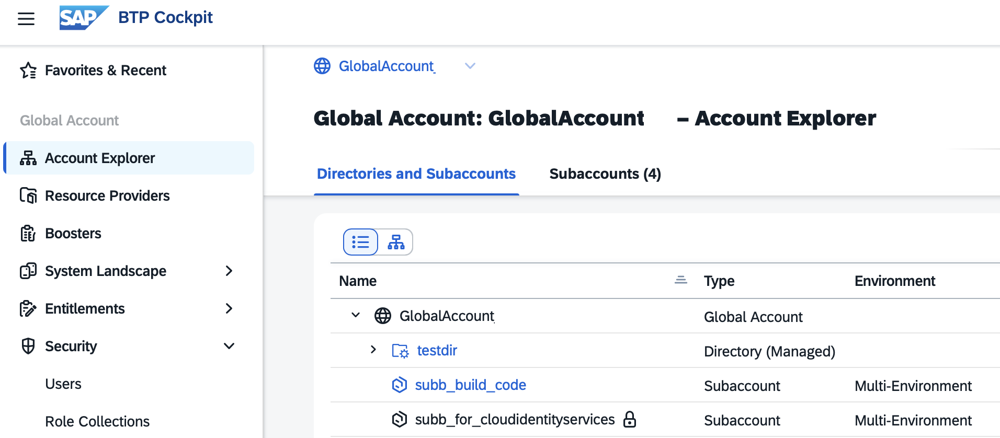
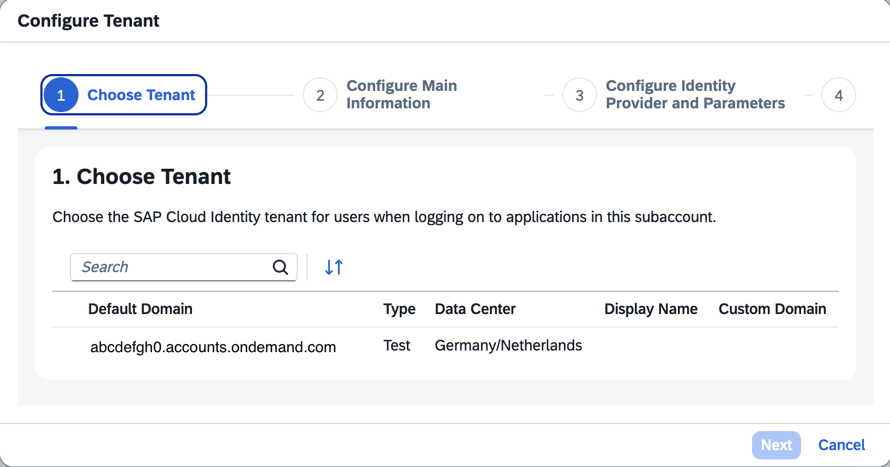
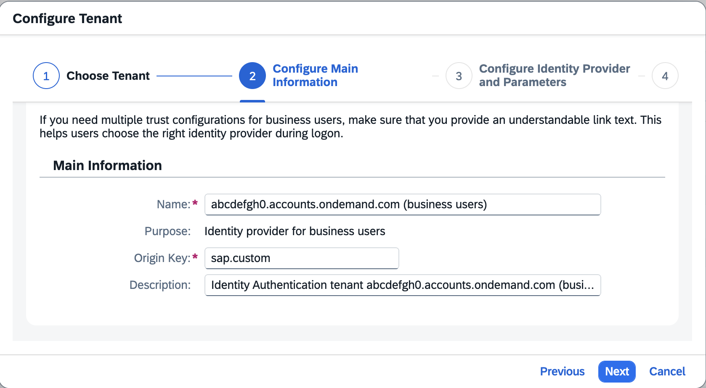
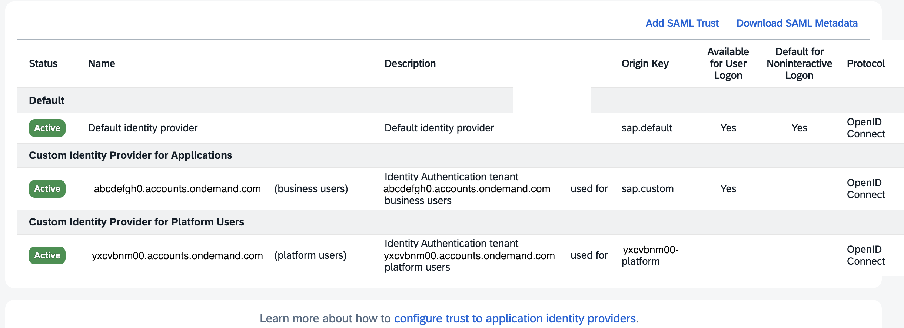

# Managing Authentication and Authorization in Subaccounts

This page describes the tasks that SAP BTP administrators must perform to ensure user authentication and to assign authorizations to users and user groups in Subaccounts.

As a Global Account Administrator, you can assign yourself as a Subaccount Administrator to your Subaccount(s).

If you created the Subaccount as a Global Account Administrator, you are automatically assigned to the Subaccount with the Role Collection "Subaccount Administrator".

To create additional Subaccount Administrators, you can either use the default identity provider (based on the SAP ID service) or your custom identity provider for Platform Users; if you configured one in your Global Account, that IdP will automatically be available in your Subaccounts.

For more information, see SAP Help Portal, [Security Administration: Managing Authentication and Authorization](https://help.sap.com/docs/btp/sap-business-technology-platform/security-administration-managing-authentication-and-authorization?locale=en-US&version=LATEST).

## User Management with Default Identity Provider

The "SAP ID service" is the default identity provider for SAP BTP. You can start using it without further configuration. The default identity provider will work independently from your custom identity provider. 

You have to add ("Create") users from the default identity provider individually in the SAP BTP global account and assign role collections.

Optional: Log in to [SAP ID service](https://account.sap.com/sam/landing) and check your user account and credentials in SAP ID Service.

### Procedure for Subaccounts

You can only assign valid user accounts from the default identity provider, SAP ID service.    

1. Enter your subaccount, navigate to "Security" --> "Users". Select "Create" and fill the form.

   

2. Choose "Create". Click the new user to enter the detail screen.

   Assign a Subaccount Role Collection. Either "Subaccount Administrator" for all roles or a role collection with a specific set of roles for specific tasks, like "Subaccount Viewer".

   

3. Subaccount Admins from the default identity provider can access the Subaccount via the Global Account https://cockpit.btp.cloud.sap.  

   This also works without an assigned GA Admin role and without providing an Identity Provider parameter.

   

4. You can also add additional role collections as authorizations for (business) applications and services. 

   This can be useful during subaccount configuration, but it is not recommended for production use.

   Note: This does not work for all services. Some services, like "Joule", require a custom IdP.

   

5. If you have more than one valid IdP for your email ID, the application or service will ask you to select one.

    

## User Management with Custom Identity Provider

Your custom identity provider(s) can have different trust configurations. 

The Custom IdP configured in your Global Account provides **Platform Users**, who manage subaccounts with cloud management tools. Configured on the GA level, the IdP for Platform User is also available in Subaccounts.

The Custom IdP configured in individual Subaccounts provides **Business Users** who consume applications and services within the Subaccount.

### Add Platform Users in Subaccounts

Prerequisite: You have a Custom IdP for Platform Users, trust and federation have been established on the GA level.

You create additional Subaccount Administrators by adding additional Users to the Users in your Custom IdP. 

For testing purposes, you can use the sap-test.de domain, for example, `<username>@sap-test.de`. Do not use any other nonexisting domains. Replace username with a value of your choice.

1. Open the admin UI for your Cloud Identity Services tenant for Platform Users.

2. Navigate to "Users & Authorizations" --> "Groups".    
   Create a User Group `SubaccountAdmins`.  
   You can restrict the User Group to a specific Application, such as a specific Subaccount. Skip this step for now and choose "Create".

   

3. Navigate to "Users & Authorizations" --> "User Management".

4. Add a User with an email address. For a valid email address, choose "Send activation email", for a test or dummy user, choose "Set initial password" as you cannot send them an activation email.

   

5. Click on the new user to edit the details.

   Check "Verify email". Otherwise, CIS might try to verify the dummy email address.

6. Assign the User to the User Group "Subaccount Admins". If you assign role collections to this user group in SAP BTP, the user will already have the required authorizations after the first login (in this example, the user is already a GA Admin).

   

7. Open your BTP Subaccount. Navigate to "Security" --> Role Collections and select "Subaccount Administrator".

   Select the tab "User Groups", "Edit", and add the Group `SubaccountAdmins` from your Custom IdP. Save your changes.

     

8. Log on with your new user. Use a new browser and access your BTP Cockpit with your (test) user. Provide the "idp" parameter. Replace "tenant" with your tenant name.

   https://cockpit.btp.cloud.sap/cockpit/?idp=tenant.accounts.ondemand.com 

9. Check the result. In this example, your test user has access to one Subaccount, in which you added the "SubaccountAdmins" User Group to your "Subaccount Administrator" Role Collection.

   For the second Subaccount, you did not.

   

10. Access this subaccount, and afterwards navigate to "Security" --> "Users". A shadow user has been added for your Platform User. 
    
    Optional: You can now manually assign additional role collections to this shadow user.

    Optional: You can disable the creation of shadow users, see [SAP Help Portal - Switch Off Automatic Creation of Shadow Users](https://help.sap.com/docs/authorization-and-trust-management-service/authorization-and-trust-management/switch-off-automatic-creation-of-shadow-users?version=LATEST&locale=en-US)

### Business User Management in Subaccounts

Business Users consume applications and services from the Subaccount.  
Business User authentication relies on your custom identity provider.  
Business user authorizations depend on the assigned role collections.   
Business users are distinct from Platform Users.

For more information about Business Users, see [Business Users](https://help.sap.com/docs/btp/sap-business-technology-platform/business-users?version=LATEST&locale=en-US).

#### Establish Trust and Federation of Custom Identity Providers for Business Users

Establish trust and federation between your Subaccount and your Cloud Identity Services (CIS) tenant to provide Business Users for your Subaccount. 

1. Enter your Subaccount.   
   Navigate to "Security" --> "Trust Configuration".   
   Click on "Establish Trust".

   

2. Select your cloud identity services tenant you want to use.

   

3. Configure the name for the Customer Identity Provider for Platform Users 

   
   
4. Select the domain you want to use. Default is `accounts.ondemand.com`. Keep the other default values.

   

5. Review your configurations and click "Finish".
  
6. Check the results. You can now create shadow users with users from your custom identity provider.

   In this example, you use different tenants for platform users and business users. Thus, you do not need to separate platform users from business users in the custom IdP. Platform Users cannot be used for authentication in Subaccount applications.

   

#### Add Business Users for Subaccounts.

The procedure is the same as for Platform Users.

You can manually assign the required role collections to the shadow user in BTP Cockpit. The user has to log in first to create a shadow user.

If you have a larger set of Users, configure a User Group for your Business Users in your Custom Identity Provider for Applications. 

Name it, for example, `BusinessUsers`, and assign in your BTP Subaccount the Role Collections that are required to access your Subaccount applications. 

For example, for a Subaccount with the SAP Build Code activated, you need to assign your User Group "BusinessUsers" from your Custom IdP for Applications to the role collection "Build Code Administrator" to manage the Build Code Lobby.
