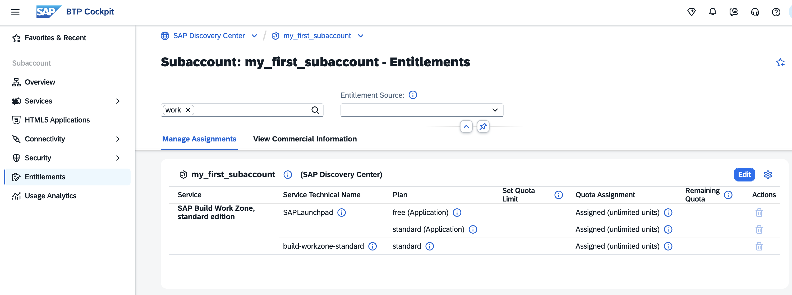
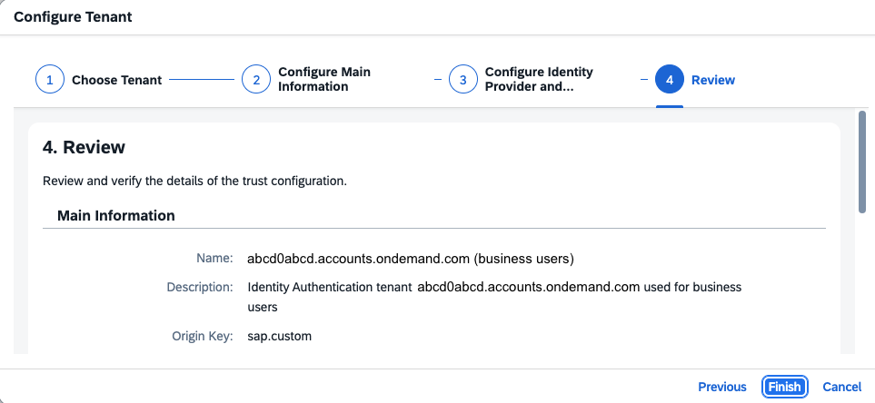
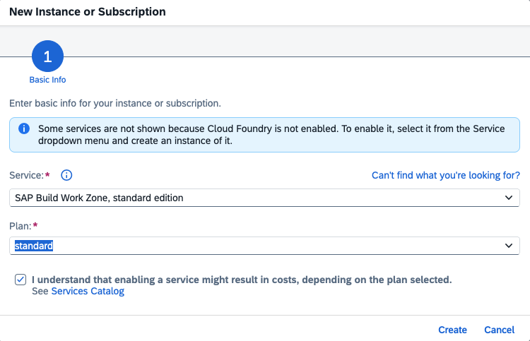
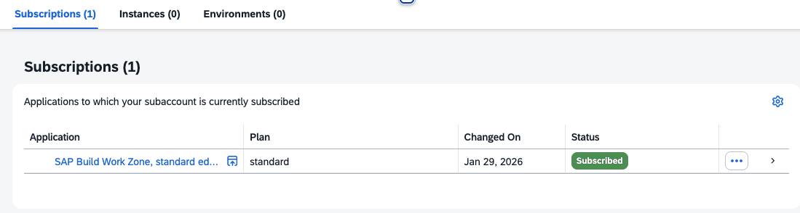
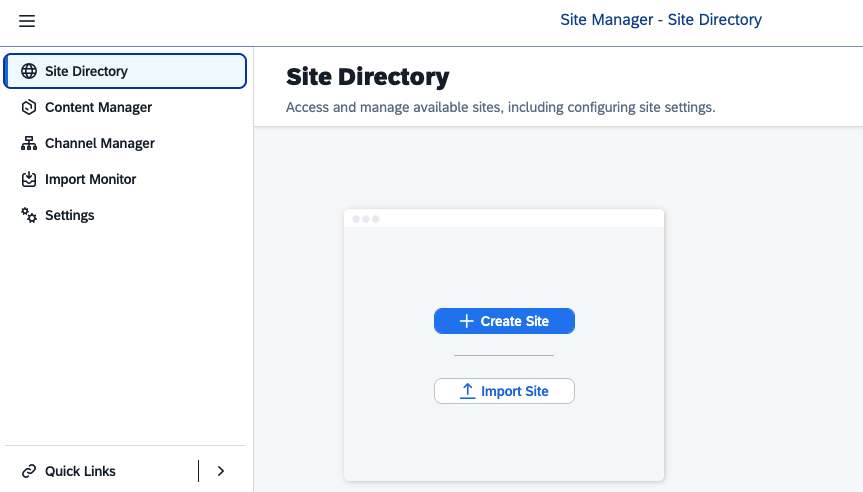
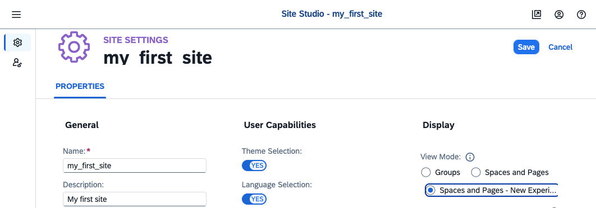
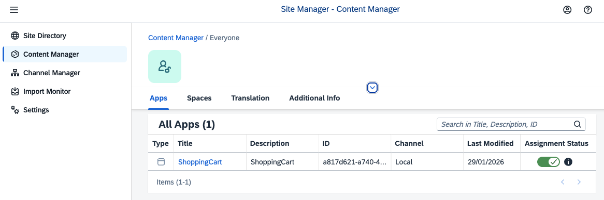
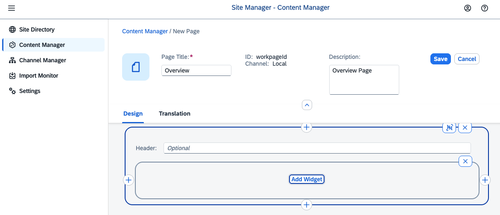
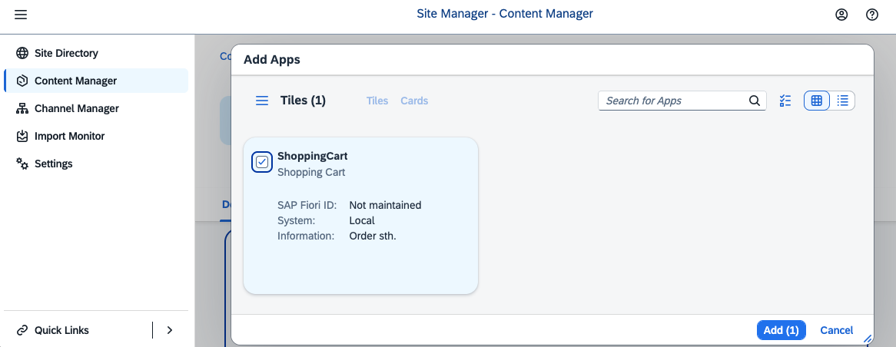

# Subscribe to SAP Build Work Zone, Standard Edition Service

### Prepare your Subaccount

1. Enter your Subaccount. Open "Entitlements" and search for "work zone".

   Check that your Subaccount is entitled to "SAP Build Workzone, standard edition" with the Service Plans:
   - standard (Application)
   - optional: free (Application)
   - optional: standard 

   

2. If your Subaccount is not entitled, click "Edit" and "Add Service Plans".

    

3. Search for "SAP Build Work Zone, standard edition" and select the Service Plan(s) "standard (Application)", and optional "free (Application)" and "standard".

    Click "Add Service Plans," then save your settings.
   
    

4. Navigate to "Security" --> "Trust Configuration". Ensure trust is established with your Custom Identity Provider.
   
    

5. If you do not have a Custom Identity Provider for Applications, create one. Click "Establish Trust" and choose your custom IdP tenant. Follow the steps from the previous chapter.

   If you have an S/4HANA Cloud Backend System, and you consider integrating it, use the same Custom Identity Provider. 
      
   

### Subscribe to the Service.

1. In your Subaccount, go to "Services" --> "Instances and Subscriptions".

   Select "Create".

    

2. Select the Service "SAP Build Work Zone, standard edition" and the Service Plan "Standard (Application"). 

   You can also use "free (Application)" for your first steps and update later to "standard" if your scenario requires it.

   Choose "Create".

   Mark the checkbox "I understand that enabling a service might result in costs, depending on the plan selected."

    

3. The should be "Subscribes".

    

4. Go to "Security" --> "Users", click on your user to enter the detail screen. Assign the Role Collection "Launchpad Admin".

    

5. Optional: You can also assign the Role Collections to a User Group from your Custom Identity Provider and assign this User Group to your Business User in your Custom IdP.

6. Go back to your Subscription and click on "SAP Build Work Zone, standard edition". Sign in using your Custom Identity Provider.

    

7. You entered your Work Zone Subscription. Check what's pre-configured.

    

 

### Create your First Business Site with Apps

This short guide follows the tutorial [Create a Business Site Using SAP Build Work Zone, standard edition](https://developers.sap.com/mission.launchpad-cf.html).

1. In the Site Directory, click on "Create Site" and provide a name, e.g., "my_first_site". Click "Create". After creation, the "Site Settings" opens.

   Click "Edit" and change the "View Mode" to the more modern "Spaces and Pages - New Experience". "Save" your changes.

    

2. In your Site Settings, navigate to "Roles Assignments". Make sure the Role "Everyone" is assigned.

    

3. Go back to your Site Directory.

4. Select the Content Manager and "Create" --> "App".

   Provide a name, e.g., "ShoppingCart", and provide the URL: "https://sapui5.hana.ondemand.com/test-resources/sap/m/demokit/cart/webapp/index.html".

   Keep the other values.

   

5. Select the "Navigation" Tab and enter under "Intent":

    - Semantic Object: Order
    - Action: Display

    and "Save". 
    
6. The App is now available in the Content Manager. Enter the Content Manager, click the Role "Everyone," and select "Edit". You can now assign the new app to the Role Everyone. Don't forget to "Save".

   

7. Go back to your Content Manager and create a "Page". Name it, e.g., "Overview", and click "Add Section". Click "Add Widget".

   

8. Add your ShoppingCart app. Click "Add" and "Save".

   

9. Go back to your Content Manager and create a "Space". Provide a name, e.g., "Space".

   Assign your page and "Save".

   

10. Assign your space to the role "Everyone" and "Save".

    

### Enter your Site

1. Go to "Site Directory" and launch your Site.

    

2. Launch your Shopping Cart App. Click on the tile.

    

3. Enjoy your app.

    

   
