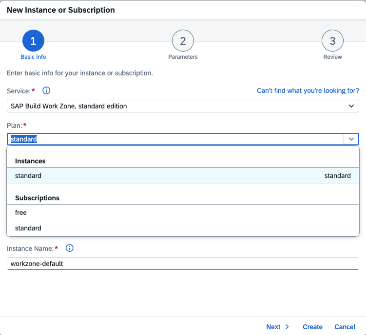
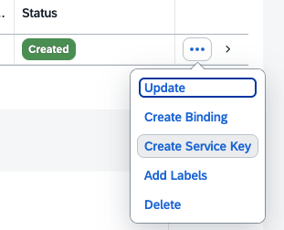
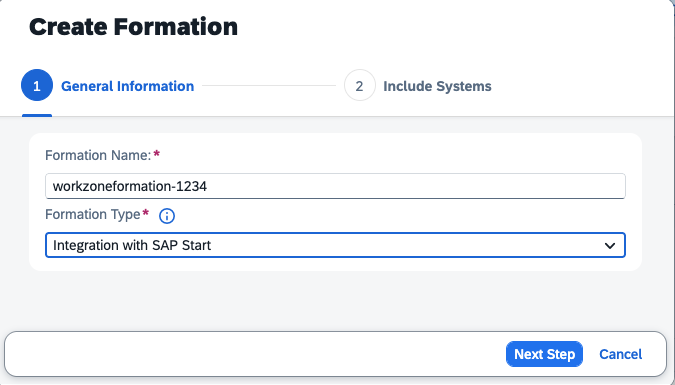
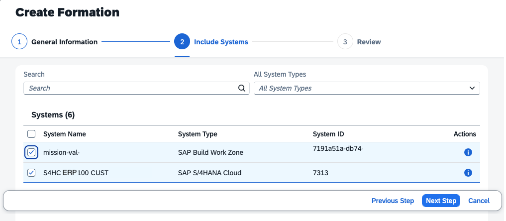
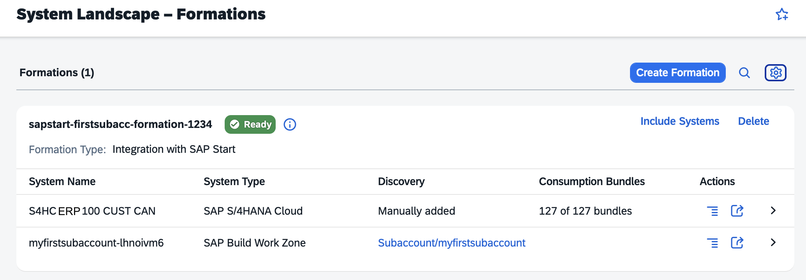
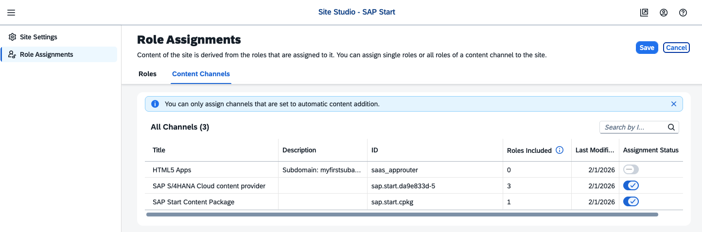
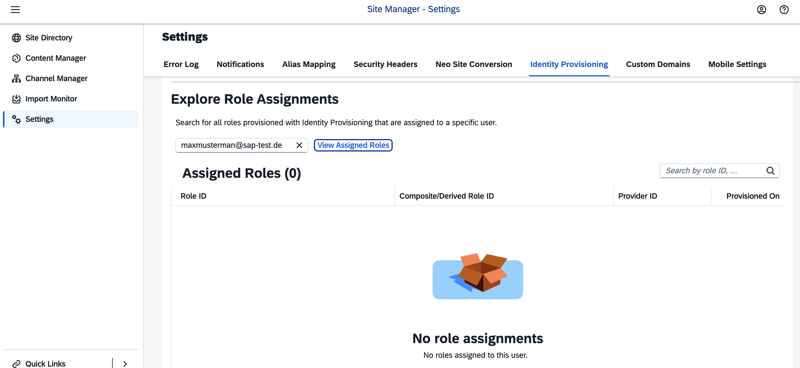

# Advanced Case Study: Set Up SAP Start

SAP Start is a predefined SAP Build Work Zone Site that displays role-based content from the integrated SAP cloud business solutions, such as SAP S/4HANA Cloud Public Edition. 

SAP Start relies on the authorization management of the integrated solutions and enables single sign-on access to them. SAP Cloud Identity Services with Identity Provisioning setup is required.

For more information about SAP Start, see [SAP Help Portal](https://help.sap.com/docs/start/sap-start/setup).

### Prerequisites in SAP BTP

#### Prerequisites in SAP BTP

1. Open your SAP BTP Cockpit and your Subaccount. 

2. Navigate to "Security" --> "Trust Configuration".

   Make sure that trust in your Custom Identity Provider is established. Use the same Custom Identity Provider as you use for your S/4HANA Cloud backend.

   

3. Navigate to "Services" --> "Instances and Subscription".

   Make sure you have a SAP Build Work Zone Subscription, a SAP Build Work Zone Instance, and a Cloud Foundry Environment. The CF environment is a prerequisite for creating Instances.

   

4. If you do not have an SAP Build Work Zone instance yet, create one.

    Your Subaccount requires an Entitlement for the Service Plan "Standard".

    

5. Create a Service Key. Choose a name for it, e.g., "servicekey". You do not need additional parameters.

    

6. Review the properties of the service key of our instance. You will need it later to create systems in Cloud Identity Services.

   

7. Open your SAP BTP Cockpit. Navigate to "System Landscape" --> "Systems".  
 
    Make sure you have a registered S/4HANA public cloud system and a SAP Build Work Zone System.

    

#### Prerequisites in SAP S/4HANA Cloud Public Edition

You need to have the BR_Administrator role.

1. Open in "Administration" --> "Identity and Access Management" --> "Maintain Business Roles".

2. Add the property "Exposed to BTP" to the Business Roles you want to expose to SAP BTP Work Zone.

    

 

### Create a SAP Start Formation in Unified System Landscape

Create a "SAP Start" Formation. For more information, see SAP Help Portal [Integrating SAP Solutions](https://help.sap.com/docs/btp/sap-business-technology-platform/integrating-sap-solutions?locale=en-US&version=LATEST).

1. Open your SAP BTP Cockpit. Navigate to "System Landscape" --> "Formations".  

   Select the Formation Type "SAP Start" and provide a name for the Formation and select "Next".

    

2. Include your S/4HANA System and a SAP Build Work Zone Service from a Subaccount. Both Systems require the same Identity Provider and share user accounts.

    

3. Review the settings and choose "Create".

    

4.  The formation is created through "Synchronization". This takes a while. Note: S4HC exposed its Consumption Bundles, which means Business Roles are available in the Formation. 

    

5. Once created, you access the "SAP Start" Site in your Build Work Zone Site Directory. 

    

6.  So far, this is only an initial configuration of SAP Start. You will not see "Products" so far.

    

 

#### What did the Formation create in your Subaccount?

1. Open your Subaccount. Navigate to "Security" --> "Role Collections". 

    If this is your first "Site" in SAP Build Work Zone, you now have the Role Collection "sap_subaccount_everyone" for your SAP Build Workzone Sites. You can assign this role collection to users in your Subaccount and to Work Zone Sites.

    

2. Navigate to "Connectivity" --> "Destinations". 

    The SAP Start Formation has created 3 destinations: 
    - _dt: A design time destination for SAP Build Work Zone with basic authentication. It uses the "SAP_COM_0647" Arrangement, the formation created in your S/4HANA Cloud backend.

    - _rt_default: That's the runtime destination, used if you call the backend apps from Work Zone. You use the authentication from your backend.

    - _rt_data: A destination for dynamic data on Work Zone tiles (e.g., number of messages in your inbox). It uses a SAML certificate for authentication, which the formation created in "Destination Certificates".

    

3. Enter your SAP Build Work Zone. Navigate to the Channel Manager.

    2 new Content Providers have been created:
    - SAP Start Content Package. 
    - SAP S/4HANA Cloud content provider

    Note the "Update Content" button on the right to sync changes from the backend.

    

4. Go to the "Content Manager". Review the Roles the Content Providers created.

    The Provider provides the backend Business Roles that you exposed to BTP.

    

5. In the Content Manager, click "Content Explorer" --> "SAP Start Content Package" --> "SAP Start Role (all Content)" and review the Apps and Spaces of the Role and which "Widgets" it can provide. These are the same categories you have on the Home Page of your backend.

    

6. Go to "Site Directory" and click the "Site Settings" icon on your SAP Start Site. 
  
    On the Site Settings page, navigate to "Role Assignments," then select "Content Channels."
    
    Enter "Edit" Mode and assign both Channels! Otherwise, the SAP Start Products Widget will not be visible. Save your settings.

    

SAP Start will still not display role-based content because the backend roles have not yet been assigned to the business users in your Subaccount.

 

### Assign Backend Roles to Subaccount Users.

There are 2 ways to assign business roles from your backend to your Subaccount´s business users.

- The S4HC Channel Provider of SAP Build Work Zone replicates the S4HC Business Roles to the Role Collections of SAP BTP. There, you must assign the role collections to your shadow business users. 

- The S4HC Channel Provider is configured to use the **Identity Provisioning** service to provision user authorizations. In this case, user role assignments are stored in SAP Build Work Zone Service and not in the Subaccount role collections. 
   
  

Which one you choose depends on administration preferences. SAP Start pre-configures the second option.

#### Review the Backend Role Assignments in Work Zone

1. Open SAP Build Work Zone and go to "Settings". Select the tab "Identity Provisioning".

   Enter the e-mail of your Business User and select "View Assigned Roles". If there are no assigned roles, you will not see any content in the Site.

   

2. If Identity Provisioning is set up for SAP Build Work Zone and Users and Groups (Business Roles) have been replicated, you can see the assigned roles.

   
   
 

For more information on how to set up Identity Provisioning for SAP Build Work Zone, see [SAP Help Portal](https://help.sap.com/docs/start/sap-start/configure-identity-provisioning-service-764db24a49b8472cb794479c29548ac7?locale=en-US&version=LATEST) or the following chapter of this mission.
