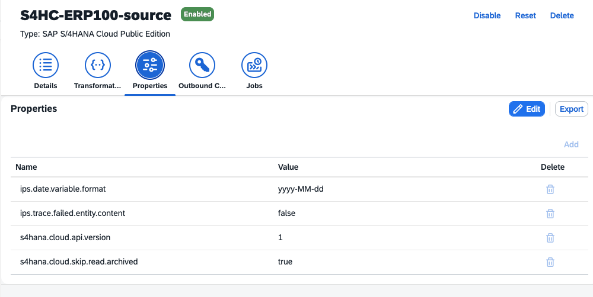
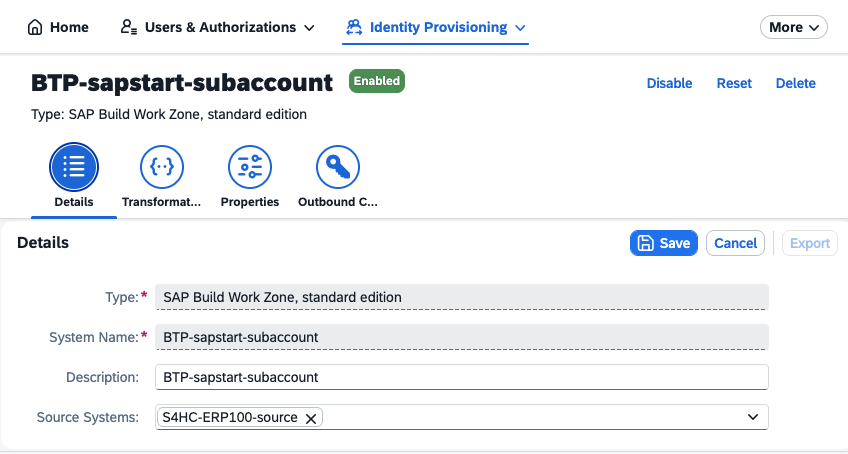
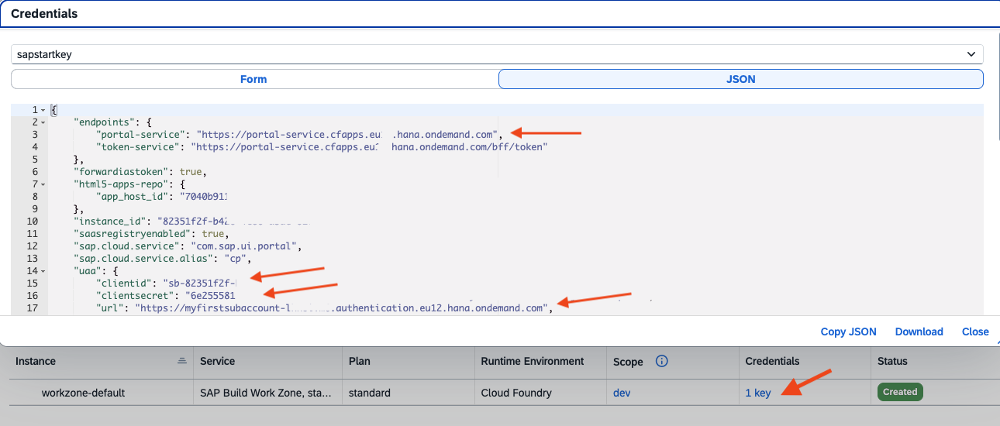
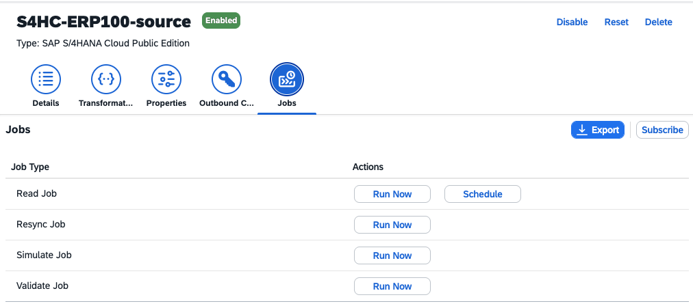
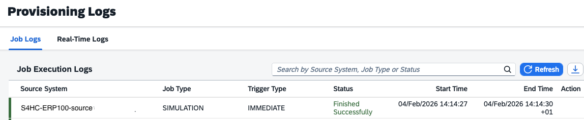
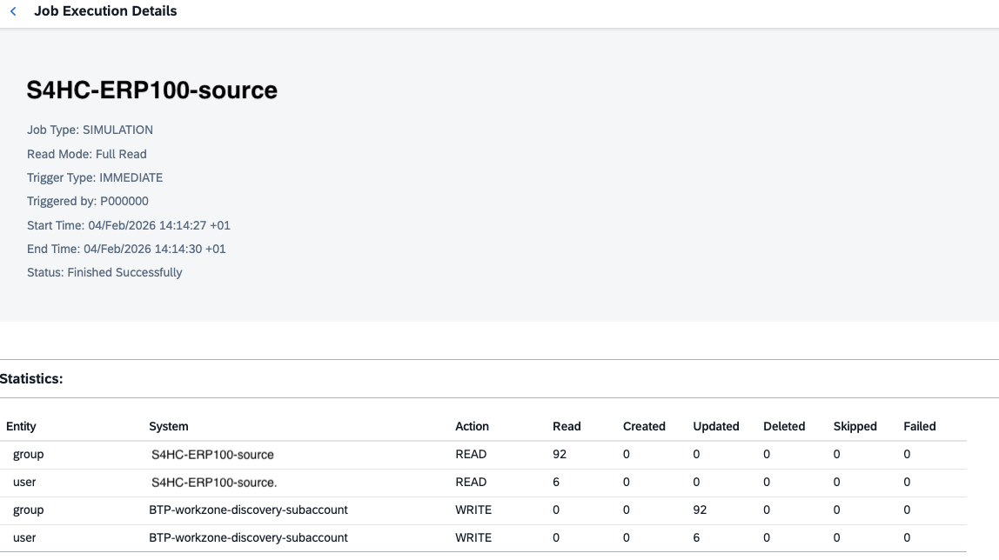

# Set Up Identity Provisioning for SAP Build Work Zone

Configure the Identity Provisioning service to provision business users, roles (which are considered as groups), and user assignments from SAP S/4HANA Cloud Public Edition as a source system to SAP Build Work Zone, standard edition as a target system.

For more information, see [SAP Help Portal](https://help.sap.com/docs/start/sap-start/configure-identity-provisioning-service-764db24a49b8472cb794479c29548ac7?locale=en-US&version=LATEST) 

#### Prerequisites

- Make sure you are a tenant administrator for your Cloud Identity Services tenant.

- Make sure you have a Communication Arrangement SAP_COM_0193 for Scenario "Identity Provisioning Integration". For more information about Communication Arrangements in S/4HANA Cloud, see [SAP Help Portal](https://help.sap.com/docs/SAP_S4HANA_CLOUD/0f69f8fb28ac4bf48d2b57b9637e81fa/fab3fd449cf74c6384622b98831e989e.html?version=LATEST&locale=en-US).

### Create a S/4HANA Cloud Source System


1. Open your Cloud Identity Services tenant and go to "Identity Provisioning" --> "Source Systems".

    If you have "SAP Initiated" S/4HANA Cloud Source Systems, ignore them. They are optimized for system provisioning and typically have no group transformations, required for work zone roles.

2. Choose "Add".

    Provide Type, Name, and Description. Click "Save".
    
    

3. Go to "Transformations". You see pre-configured transformations for "user" (S4 Business Users) and "group" (S4 Business Roles) are in place. These transformations manage the mappings. You can use a graphical editor or a JSON editor. Keep the values.

    

4. Go to the tab "Properties". You see a couple of properties pre-configured.

    

5. Add the following values. Replace User, Password, and URL with your values.
   
    Make sure to use the technical user from your Communication Arrangement SAP_COM_0193 for the "Identity Provisioning Integration" scenario. 

    |  Name | Value |
    |-------|-------|
    | Authentication | BasicAuthentication	|
    | User | USER_SAP_COM_0193 |
    | Password | *************	|
    | ProxyType	| Internet |
    | Type | HTTP |
    | URL | https://mys4hanacloud-api.s4hana.cloud.sap |

    Add the following optional properties. They are helpful for tracing Provisioning Jobs, esp. if sth. fails. Keep the standard values and set to "true" if required.

    |  Name | Value |
    |-------|-------|
    | ips.trace.created.entity	        | true	|
    |ips.trace.created.entity.content   | false	|
    |ips.trace.failed.entity	        | false	|
    |ips.trace.failed.entity.content	| false	|
    |ips.trace.skipped.entity	        | false	|
    |ips.trace.skipped.entity.content	| false	|
    |ips.trace.updated.entity	        | true	|
    |ips.trace.updated.entity.content	| false	|

6. Save your settings.

For more information, see [SAP Help Portal](https://help.sap.com/docs/cloud-identity-services/cloud-identity-services/sap-s-4hana-cloud?version=LATEST&locale=en-US).


### Create a BTP Target System

1. Open your Cloud Identity Services tenant and go to "Identity Provisioning" --> "Target Systems". Click "Add".

    Select "Type: SAP Build Work Zone, standard edition". Provide Name, Description, and the Source System you just created.

    

2. Go to "Transformations". You see pre-configured transformations for "user" and "group"  are in place. These transformations manage the mappings. You can use a graphical editor or a JSON editor. Keep the values.

3. Go to the tab "Properties". You see a couple of properties pre-configured. Keep these values.

    

5. Add the following values. Replace OAuth2TokenServiceURL, User, Password, and URL with your values.
   
    Take these values from your **service key** from your SAP Build Work Zone **Instance**.

    |  Name | Value |
    |-------|-------|
    | OAuth2TokenServiceURL	| https://myfirstsubaccount.authentication.eu10.hana.ondemand.com.oauth/token |
    | Password	| ************ | 
    | ProxyType	| Internet	| 
    | Type	| HTTP	| 
    | URL	| https://portal-service.cfapps.eu10.hana.ondemand.com	| 
    | User	| sb-12344567-122345678|portal-cf-service!b164 | 


    These properties are optional and control the maximum number of users, groups that can be deleted:

    |  Name | Value |
    |-------|-------|
    | ips.delete.threshold.groups | 20	|
    | ips.delete.threshold.users |	20	|


    

6. Save your settings.

For more information, see [SAP Help Portal](https://help.sap.com/docs/cloud-identity-services/cloud-identity-services/sap-build-work-zone-standard-edition?version=LATEST&locale=en-US).


### Run a Provision Job

Provide users and groups (roles) to your SAP Build Work Zone service.

1. Open your Cloud Identity Services tenant and go to "Identity Provisioning" --> "Source Systems" and select your S/4HANA Cloud Source Systems. Select "Jobs".

    

2. Click "Simulate Job" --> "Run Now". Wait a couple of seconds and go to "Identity Provisioning" --> "Provisioning Logs".

    Click on the last entry.

    

3. This was a successful simulation job. 92 roles and 6 users read and updated.

    

4. Click "Read Job" --> "Run Now" (or "Resync Job" if you have already run a successful Read Job).

   Wait a couple of seconds and go to "Identity Provisioning" --> "Provisioning Logs".

   A successful Read or Resync Job should have the same "Finished Successfully" log as the Simulate Job. In addition, you can now download the Entity Logs for this job.

   

5. If you set ips.trace.created.entity.content and ips.trace.updated.entity.content to "true", you can see all users and groups that have been created or updated. 

    For example, one of the 92 group entries:
   
    ```
    group:e34bced9-...,
    system=BTP-workzone-discovery-subaccount,
    content={"externalId":"BR_ADMINISTRATOR",...}...
    ```

#### Result

1. Go to the BTP Subaccount and open your SAP Build Work Zone Service. 

   In Work Zone Site Manager, navigate to "Settings" --> "Identity Provisioning".

   In the Site Manager, you cannot list all users. Search for your user and check the successful role assignment.    

    


2. You are now able to see the "Products" Tiles in your SAP Start Site (if not, log off and log on, or restart your browser).

    

3.  Click on it. You should be forwarded to your S/4HANA backend home page.

