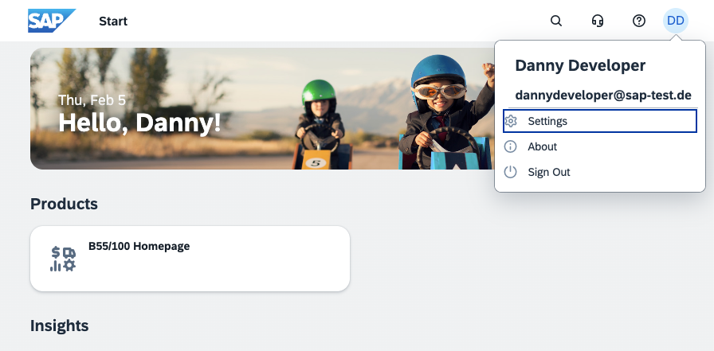
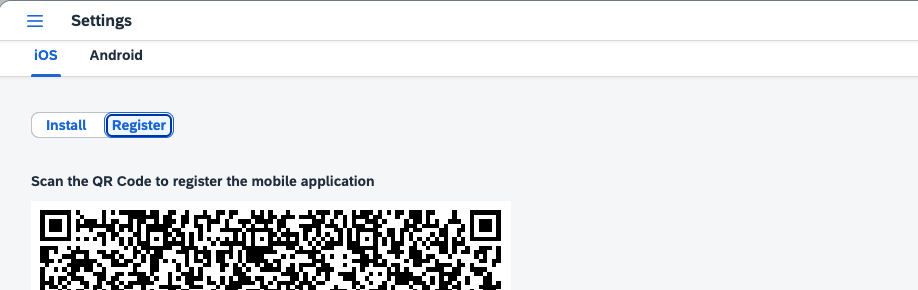
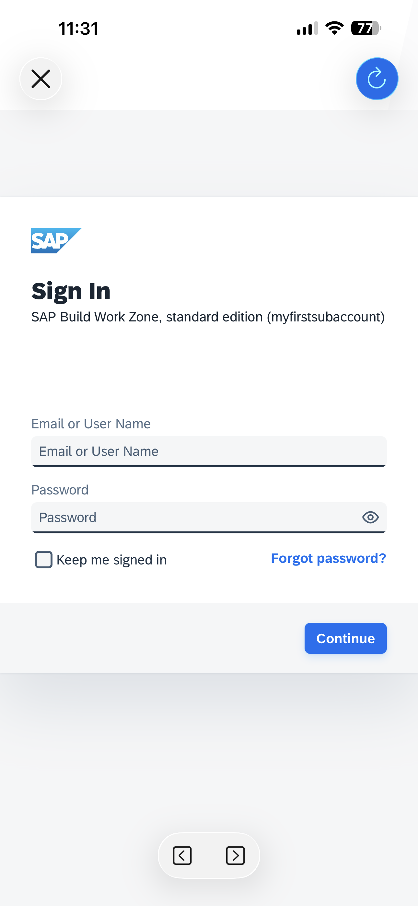
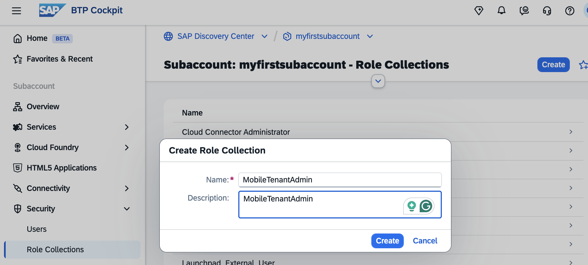
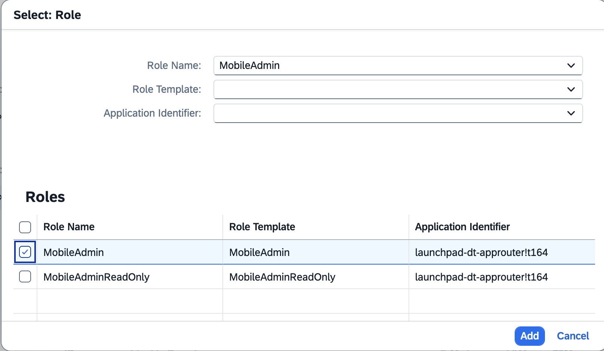

# Set Up SAP Mobile Start

SAP Mobile Start provides business information from SAP Start, SAP Build Work Zone, standard edition, and SAP Build Work Zone, advanced edition. It runs on iOS, iPadOS, and Android devices, as well as on watchOS and Wear OS devices, and on Apple Vision Pro.

#### Prerequisites

This mission requires that you have successfully set up **SAP Start** and Identity Provisioning for SAP Build Work Zone. It uses the "SAP Start" Site, which is already enabled for SAP Mobile Start.

### Download and Register SAP Mobile Start

For more information and alternative set-ups for the SAP Mobile Start app, see SAP Help Portal [SAP Mobile Start - User Guide](https://help.sap.com/docs/mobile-start/user-guide/installing?locale=en-US&version=LATEST).

#### Procedure for SAP Start Site

1. Open your SAP Start Site. Click your User, then select "Settings".

    

2. Scan the QR Code. You get forwarded to your App Store. Download the app.

    

3. Once downloaded, you can scan the QR Code to register your app.

    

4. The link opens your app. Depending on your setup, you may need to authenticate with the Custom IdP in your SAP Build Work Zone.

    

5. Create a Pass Code for your app. 

    

6. Enter your Mobile Start App. Add your favorite apps to your Favorites.

    

### Manage Mobile Settings

To configure SAP Mobile Start, first set up and configure roles for your mobile admins in your Subaccount.

For more information about SAP Mobile Start administration, see SAP Help Portal [SAP Mobile Start - Administration Guide](https://help.sap.com/docs/mobile-start/mobile-start-administration-guide/overview?version=LATEST&locale=en-US).

1. Enter your Subaccount. Navigate to "Security" --> "Role Collections". Create a new Role Collection "MobileTenantAdmin".

    

2. Click on the new Role Collection. In the details page, click "Edit".

    In the "Roles" section, select the role "MobileAdmin". Click "Add" and "Save".

    

3. Go to "Users". Assign the new Role Collection to your User.

    

4. Enter your SAP Build Work Zone Site Manager. Go to "Settings" --> "Mobile Settings". Enter the SAP Mobile Services admin cockpit.

    

5. Go to Registered Devices. You see, your device has been registered.

    Optional: send a notification to your device. 

     

6. Go to Settings and review your Settings. For more information about Mobile Services Admin Cockpit, see SAP Help Portal[SAP Mobile Start – Administration Guide](https://help.sap.com/docs/mobile-start/mobile-start-administration-guide/overview?version=LATEST&locale=en-US).

     

 

Congratulations, you finished the initial setup of SAP Mobile Start.
