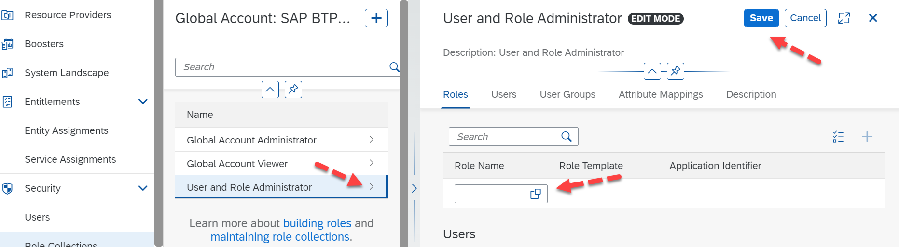
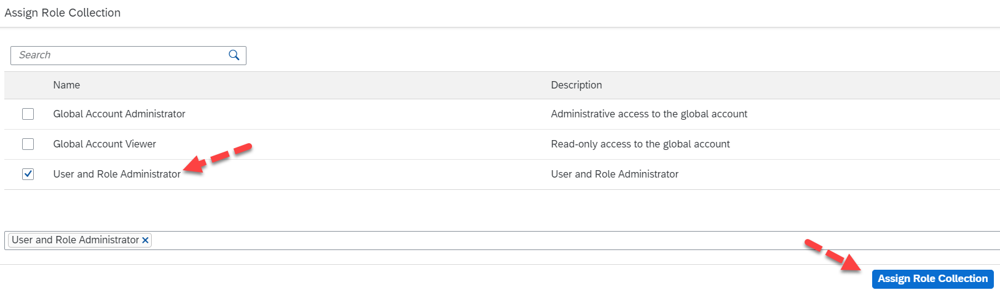

## Understanding the [Roles and Role Collections](https://help.sap.com/docs/btp/sap-business-technology-platform/roles-and-role-collections)

**Roles** 

Users require authorizations to perform tasks within SAP BTP. Service-specific roles show up in your SAP BTP cockpit for assignment after a service is activated. For example, activating SAP Business Application Studio, Workzone, Build Services, and so on, will make the subsequent access roles available.  

**Role Collections** 

Role Collections are one or a group of roles that can be created from scratch or copied that are created by the SAP BTP Services. These role collections help to group roles and assign them to users easily. Similar role collections are created for both the Global Account Administrator and Global Account Viewer roles.  

First, examine the Global Roles created by default when provisioning your Global Account. Navigate to **Security** -> click on **Role Collections**.

 

 
 

 

Image 1</b> 

For a Global Account Administrator, there are [4 different Roles](https://help.sap.com/docs/btp/sap-business-technology-platform/role-collections-and-roles-in-global-accounts-directories-and-subaccounts?q=System%20Landscape%20Administrator%20) that have been grouped: 

| Role Name  | Description |
| --- | --- |
| Global Account Admin | Includes read-write authorizations for updating the global account, setting entitlements, and creating, updating, and deleting subaccounts. |
| Global Account Usage Reporting Viewer | Includes read-only authorizations for viewing global account usage information.|
| System Landscape Administrator | Includes read-write authorizations for registering SAP systems and assigning SAP systems to formations.|
| User and Role Administrator | Includes read-write authorizations for trusted identity providers, role collections, roles, and users.|

As an organization, you may decide to give all these roles to one user, or you may decide to assign a security expert only to manage **User and Role Administration** or a **System Landscape Administrator** role for an integration expert.   

### Assigning “User and Role Administrator Role” 

Let us take the example to assign a user only a few roles, for example, to manage only the **User and Role Administrator**. This role is created by default, to achieve this requirement we need to create a role collection.  

Within your BTP Global Account, click on **Security** -> click on **Role Collection** -> Click on Create “**New Role Collection**” and enter the Name & Description as “**User and Role Administrator**” and click on Create. 

 

 
 

 

Image 2</b> 

Now that the Role Collection is created, remember that we still need to assign a Role. Expand the role collection **User and Role Administrator** -> click on **Edit**. 

 

 
 

 

Image 3</b> 

Now click on the Role Name selection window, select the role **User and Role Administrator**, and click on **Add** -> **Save** the settings.  

 

 
 

 

Image 4</b> 

Tip: Many Roles are created by default by the BTP account. We recommend looking at each of these roles. For more information about the default roles for the BTP Global Account cockpit, please refer to [here](https://help.sap.com/docs/btp/sap-business-technology-platform/role-collections-and-roles-in-global-accounts-directories-and-subaccounts?q=System%20Landscape%20Administrator%20).  

You have now created a new role collection. Let us assign this to a new user. Create a new user by navigating to **Security** -> **Users** -> **Create** -> Enter the email address in **User Name** and **E-Mail** and click on **Create**.  

Expand the new user that you created and click on **Assign Role Collection** -> select the role “**User and Role Administrator**” and click on **Assign Role Collection**.

 

 
 

 

Image 5</b> 

Now, you can request that the new user you have created log in. In this case, you have created a new user for my secondary email address and assigned the **User and Role Administration** role. 

As detailed above, this will only allow the user to create or manage the user roles, and other access to the BTP Global Account is completely restricted, as shown below. 

 

 
 

 

Image 6</b> 

A similar approach can be considered for your Default Identity Provider, including Directory roles, Subaccount Roles, etc.  

