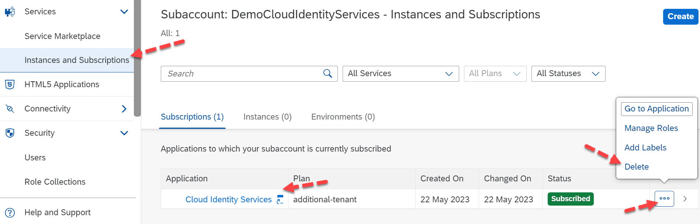

## Deleting your SAP Cloud Identity Services - Optional 

In a few cases, if you decide that you have created the IAS tenant and no longer wish to use it, you can proceed with deleting the service.  

Note: Only a subaccount administrator has the authorization to delete the services.  

Before deleting, ensure that the services are not linked to other subaccounts. If you have any users in the tenant, please take a backup of the users, roles, and any essential information.  

To delete the services, you can navigate to your **Subaccount** -> click on **Services** -> click on **Instances and Subscriptions** -> look for **SAP Cloud Identity Services** and click on the **Actions** (3 dots) button and select **Delete** (Note: If you delete your tenant all data will be lost and there are no recovery options).

 

 
 

 

Image 1</b> 

You may also verify if your IAS tenant got deleted at [SAP Cloud Identity Services – Tenant management](https://help.sap.com/docs/identity-authentication/identity-authentication/viewing-assigned-tenants-and-administrators)
