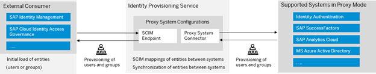

## Learn About Identity Provisioning  

The identity provisioning service ensures the synchronization of entities (users, groups, roles) between a source system and one or more target systems, essentially automating identity lifecycle processes. It also supports the use of proxy systems for indirect connections between a system supported by Identity provisioning and an external application that uses SCIM 2.0 API to consume identities from the proxy system. 

 

 
 

 

Image 1</b> 

### System Types 

**Source Systems**  

A source system is a connector used for reading entities (users, groups, roles). A source system can be on-premises or cloud-based, SAP or non-SAP, and typically represents the corporate user store where identities are currently maintained. The identity provisioning service reads the entities from the source system and creates or updates them in the target systems.  

For the full list of supported source systems please visit the [SAP Help Documentation](https://help.sap.com/docs/identity-provisioning/identity-provisioning/source-systems). 

Target Systems  

A target system is a connector used for writing entities. Target systems are usually cloud-based systems where identity provisioning creates or updates the entities taken from the source system. Target systems can be connected to single or multiple source systems.  

For the full list of supported target systems please visit the [SAP Help Documentation](https://help.sap.com/docs/identity-provisioning/identity-provisioning/target-systems).

 

 
 

 

Image 2</b> 

**Proxy Systems**  

A proxy system is a special connector used for hybrid scenarios by exposing any identity provisioning supported backend system as an SCIM 2.0 service provider which can be consumed by any SCIM 2.0 compatible client application, without making a direct connection between them. 

  

 
 

 

Image 3</b> 

For the full list of supported proxy systems please visit the [SAP Help Documentation – Proxy Systems](https://help.sap.com/docs/identity-provisioning/identity-provisioning/proxy-systems).  

While you add each of these systems, we need to configure Properties, Transformations, Outbound Certificates, and Jobs.  

**Transformations**  

For every system supported by the Identity Provisioning service, there is an initial transformation logic that converts the specific JSON representation of the entities from/to one common JSON. During the provisioning job, the source system reads its entities, and then using the configured read transformation, converts the source system-specific JSON to the common JSON format. Then the common JSON format is passed to the target system which then applies the write transformation.  

Administrators can change the transformation behavior by using one of two editors provided, the graphical edition or JSON (text) editor. For more information on how to use Transformations see the [SAP Help Documentation – Transformations](https://help.sap.com/docs/identity-provisioning/identity-provisioning/transformations). 

**Properties**  

Properties help you consume the way your identities are read from a source system or provisioned to a target one. They can also filter which entitles and attributes to be read or skipped during the provisioning job. Properties can be categorized as standard, credential, default, parametrized, or internal. For more information see the SAP Help Documentation – Property Types. 

**Add a System** 

The process to add Source, Target, and Proxy systems is the same. The maximum number of source systems you can add is 20 and the maximum number of target systems you can add is 50. If your business requires additional systems, you may create an SAP Support ticket via SAP4Me using component BC-IAM-IPS to request one.  

When you add a Source, Target, or Proxy system it is created with default properties and transformations.  

 

 
 

 

Image 4</b> 

For more information on adding systems visit the [SAP Cloud Identity Services – Identity Provisioning Community](https://community.sap.com/topics/cloud-identity-services/identity-provisioning). 

**Job Logs** 

Job logs show vital information about the state of your jobs. They can help you to 

- **Manage Provisioning Job Logs** helps to view, and analyze your jobs and you can either download or delete them. By default, logs are kept for 7 days, you can change this to 14 or 30 days 
- **Search and View Provisioning Job Logs** display information about the execution of provisioning jobs. It requires certain prerequisites/configurations for the job logs to be displayed 
- **Manage Job Notifications** allows to set up e-mail notifications on the status of the jobs, such as success or failure  

For more information on Job logs see the [SAP Help Documentation – Search and View Job Logs](https://help.sap.com/docs/identity-provisioning/identity-provisioning/search-and-view-provisioning-job-logs).  

**Tenant Reset**  

Administrators have the option to reset the Identity Provisioning tenant. This option should be used with caution as it will delete all systems you have set up for this tenant along with relevant job execution logs. If there is a need to reset a tenant but you want to add back the systems after the reset, you can export the systems prior to the reset and import them back in after the reset. For more information see [SAP KBA 3307713](https://me.sap.com/notes/0003307713) – How to Restore Identity Provisioning Systems after a Tenant Reset.
