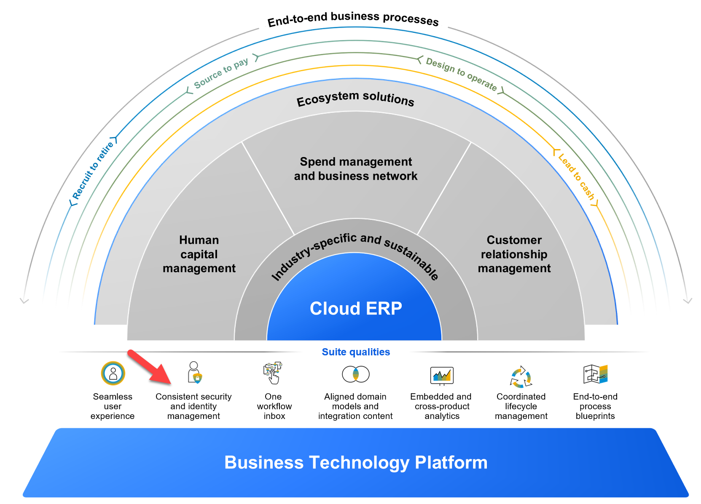
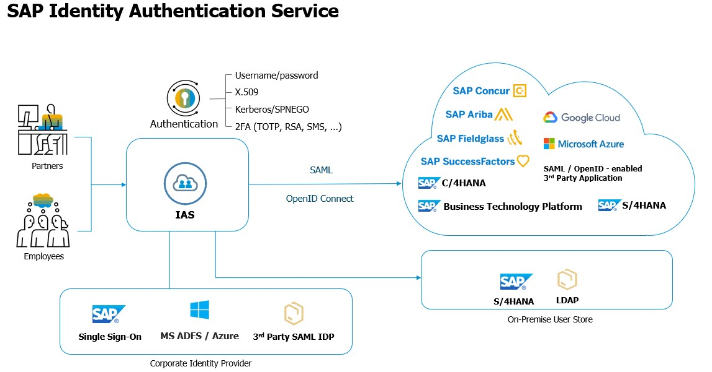
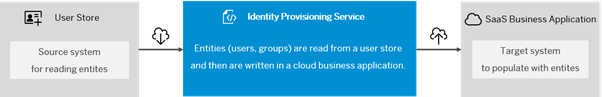

## What is SAP Cloud Identity Service? 

SAP Cloud Identity Services is a group of services from the SAP Business Technology Platform (SAP BTP), which enable you to integrate identity and access management (IAM) between systems. The goal is to provide a seamless single sign-on (SSO) experience across systems while ensuring that system and data access is secure. 

As you start your journey with the SAP Business Technology Platform or SAP Cloud Portfolio of services, users might have to remember multiple credentials, manage different logins, provisioning, etc., which can be an arduous task. SAP Cloud Identity Services allows you to reduce the manual administration efforts for user management and identity provisioning to enable seamless access to your systems without disruption. SAP Cloud Identity Services is part of the Intelligent, sustainable enterprise helping you to achieve Consistent Security and Identity Management. 

 

 
 

 

Image 1</b> 

                                                            
We recommend designing your identity and access management landscape around our reference architectures. Whether you are starting from scratch or if you want to migrate an existing solution, we provide target architectures for what we believe is the best solution. For more information, please see [Scenario Recommendations](https://help.sap.com/docs/SAP_CLOUD_IDENTITY/b95c3d5bab324a3a8409eee5267a5b75/9fc378782ba14f2b8ed1cf2f05c45405.html) in the help documentation.  

Identity Authentication and Identity Provisioning are the core Identity Access Management services of SAP BTP, together covering a large portion of the identity lifecycle.  

[Identity Authentication Services (IAS)](https://help.sap.com/docs/IDENTITY_AUTHENTICATION/6d6d63354d1242d185ab4830fc04feb1/27882717f44b445fa287936c6f43dc1f.html) 

The IAS services help to achieve a secured authentication of all the cloud users and help in setting up authentication mechanisms such as Single Sign On (SSO). Authentication can be considered in multiple ways such as Two Factor Authentication, One-Time Password-Based Authentication, Certifications Based Authentication, Kerberos/SPNEGO, etc... The Cloud IAS system can also help to Configure Risk-Based Authentication to enforce authentication and you can also connect your existing Corporate Identity Providers to delegate the authentication process.  

SAP has been working on these services for a long time for all cloud applications and we have been offering IAS to all our customers at no additional charge as part of your cloud purchases. For example, if you are using any of the SAP cloud services like SAP S4HANA Cloud or SAP SuccessFactors your company would have activated SAP IAS for user management.  

 

 
 

 

Image 2</b> 

[Identity Provisioning Services (IPS)](https://help.sap.com/docs/IDENTITY_PROVISIONING/f48e822d6d484fa5ade7dda78b64d9f5/2d2685d469a54a56b886105a06ccdae6.html) 

The IPS services on the other hand help manage and automate the lifecycle of a user and their access to the cloud or on-prem systems. This service enables customers to set up faster and more efficient administration of user onboarding and offboarding. SAP IPS can be enabled by a BTP Account Administrator. 

 

 
 

 

Image 3</b> 

We will be looking at each of these services in detail in this mission to help you get started with the basics. For additional reading on SAP IAS and SAP IPS please check out [this blog](https://blogs.sap.com/2020/02/19/the-cloud-enterprise-security-suite-cloud-identity-services/). 
