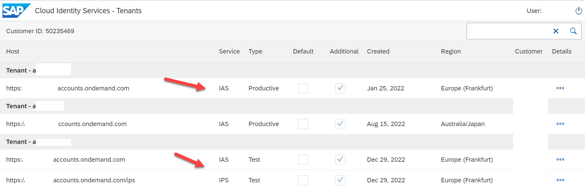

## Where and how to find your Existing Cloud Identity Services 

In the previous lesson, we learned that SAP Identity Authentication Services (IAS) is commercially included for all SAP branded cloud solutions sold under the General Terms and Conditions for SAP Cloud Services, and all applications running on SAP BTP.  

SAP recommends cloud services to its customers and many customers have started using SAP IAS for user management. If you bought SAP Solutions prior to the SAP Business Technology Platform, your company has tenants available for additional use. SAP created a public website, Cloud Identity Services - Tenants where you can check if the IAS services are already active. You can log in to [Cloud Identity Services - Tenants](https://iamtenants.accounts.cloud.sap/), a public website to check what your company has in place.

 

 
 

 

Image 1</b> 

Image 2 below gives the details showing that the customer has more than 2 IAS systems provisioned with 3 IAS and 1 IPS service for consumption.  

 

 
 

 

Image 2</b> 

These service activations are customer specific with flexible options. In some of the scenarios, customers may have activated multiple IAS tenants based on the cloud services purchased from SAP. As a best practice, SAP recommends having two tenants, one for Test and the other for productive usage, regardless of how many tenants have been provisioned.  
