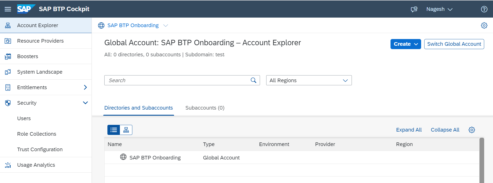

## SAP BTP Cockpit Overview 

As you are starting your journey with SAP BTP Security concepts (Default Identity Providers or Cloud Identity Services), we aim to make this mission easy for new customers to get started.  

If you recently purchased an SAP BTP enterprise license, you could check out our mission  “[Get Started with SAP BTP Enterprise Account](https://discovery-center.cloud.sap/missiondetail/3019/3016/)” and you may visit [SAP Business Technology Platform Onboarding Resource Center](https://support.sap.com/en/product/onboarding-resource-center/business-technology-platform.html).  

Note: There are many ways to work on security topics. Specifically, SAP Cloud Identity Services, it could have been provisioned to you via multiple SAP Cloud licenses, for example, SAP SuccessFactors. For the duration of this mission, we are focusing on security when it comes to the SAP Business Technology Platform.  

Here, we are looking at a new SAP BTP account to get started with a new customer and we need access to the SAP BTP Account as a Global Account Administrator.  

 

 
 

 

Image 1</b> 

In the previous sections, we also shared the details on how to identify any existing Cloud Identity Services for your company, in case you have the service up and running, you may use the existing service and move to the next step.   

Use the link to find your [Cloud Identity Services - Tenants](https://iamtenants.accounts.cloud.sap/).
