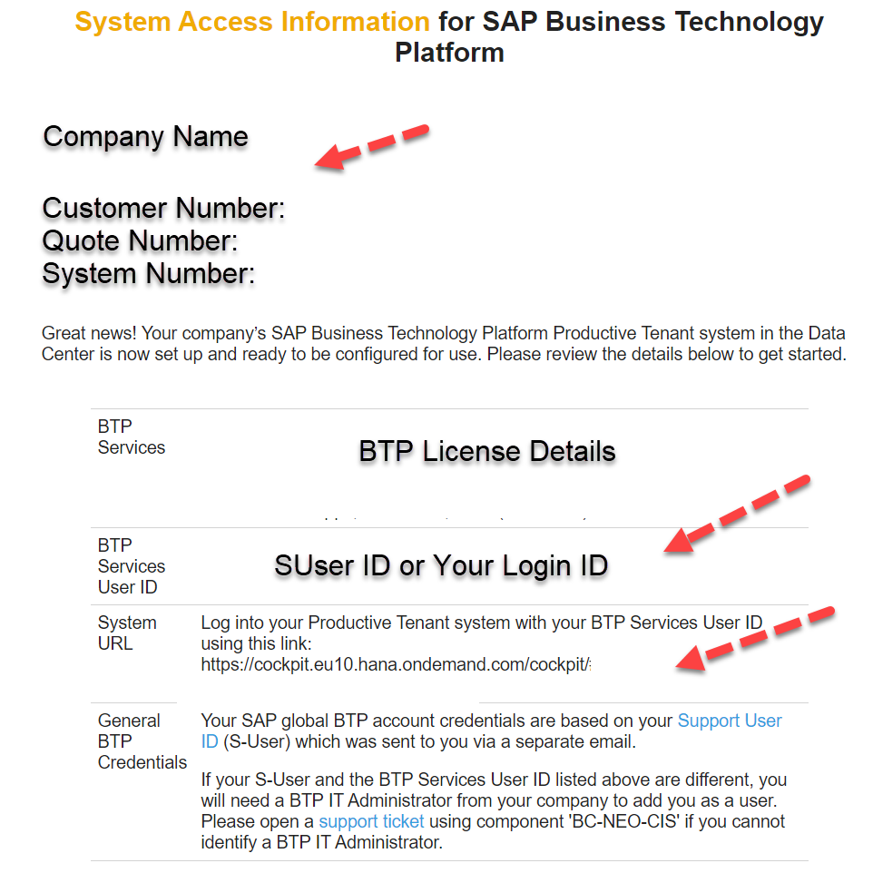
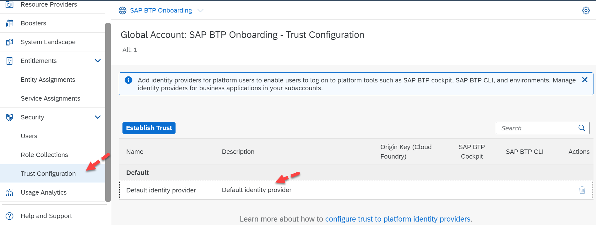

## SAP BTP Default Identity Provider 

As you get access to your SAP BTP Global Account, you will have users (both platform and business users) who will require access and need user management, generally known as **Identity Access Management (IAM)**. SAP BTP offers a service called **SAP BTP Default Identity Provider** to take care of the Authentication and Authorization of users.  

When an SAP BTP Global Account is provisioned, the welcome email and the login details are sent to your organization's contact person with **Global Account Administrator** authorization. The sample login details are shown below:

 

 
 

 

Image 1</b> 

The Welcome email consists of your  

- Customer Number generally known as Customer ID, required while contacting SAP for support   
- Current BTP licenses purchase information  
- Your SAP BTP Login ID / S-User ID for initial access. (SAP provides access to SAP BTP Cockpit to one user/the contact IT Person, and we recommend adding an additional Administrator to your [Global Cockpit](https://sapvideoa35699dc5.hana.ondemand.com/?entry_id=1_2rwksj99).) 
- System URL for your BTP Cockpit and  
- General information about Support User and how to reach SAP in case of login issues 

Once you log in to your SAP BTP Cockpit, you can navigate to **Security -> Trust Configurations**. This will help you to identify your **Identity Provider**.

 

 
 

 

Image 2</b> 

