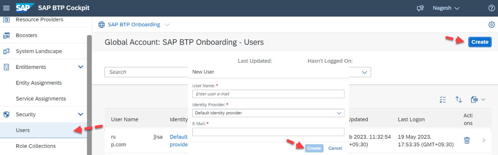
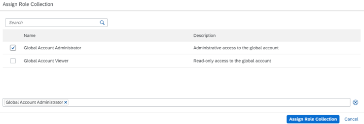

## Adding users to Default Identity Provider 

With initial access to the SAP BTP Cockpit as a Global Account Administrator, it is your responsibility to manage the SAP BTP Global Account. We recommend adding a secondary global account administrator in case of emergency or sharing your workload within your organization.  

To add, click on **Security** -> **Users** -> click on **Create** and enter your **Email Address** in the **User Name** section and the **E-Mail** section. The **Identity Provider** will be the **default identity provider** as we have not activated any custom SAP Cloud Identity Services in the system yet. Click on Create once the details are entered. 

 

 
 

 

Image 1</b> 

Once the User is created, expand the selection and click on **Additional Options **(the three dots) and select **Assign Role Collection**, now select the role – **Global Account Administrator** and click on **Assign Role Collection**.  

 

 
 

 

Image 2</b> 

At the Global Account level, there are only 2 roles created by default that can be assigned to a user as shown in the above image.  
