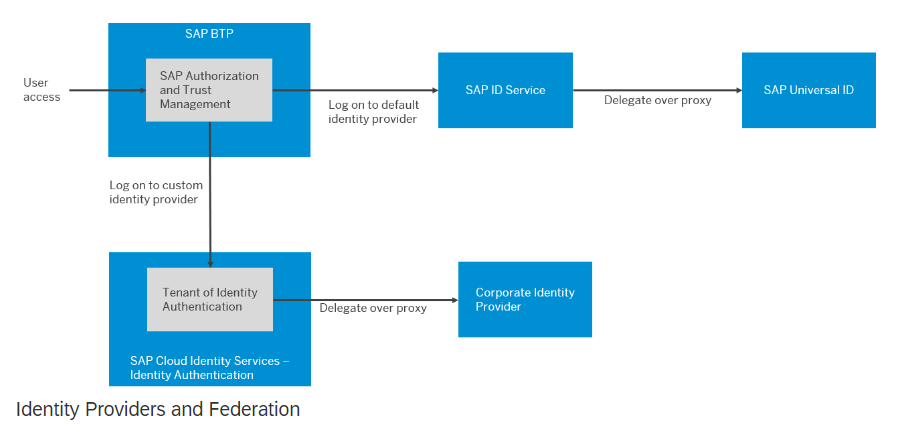

## SAP Universal ID 

The Universal IDs are used to manage the users of official SAP sites including all your SAP Developer and Community sites. This is how your SAP BTP Default Identity Provider works to validate your login credentials for authentication and allows you to log in to BTP. The image below illustrates the use of overall Default IDP and custom IDP authentication mechanisms. 

 

 
 

 

Image 1</b> 

The SAP ID service acts as a proxy for SAP Universal ID when users log on with their e-mail addresses. In case you are completely new to SAP and do not have a Universal ID, you may create one [here](https://account.sap.com/core/create/register?redirectURL=https%3A%2F%2Fcockpit.eu10.hana.ondemand.com%2Fcockpit%2F). Once the users are created in the Universal ID, they can be added to SAP BTP Global Accounts and Subaccounts.  

With SAP ID services, you may also activate Multifactor Authentication, please refer to this [link](https://help.sap.com/docs/btp/sap-business-technology-platform/default-identity-provider) for more details. 
 
