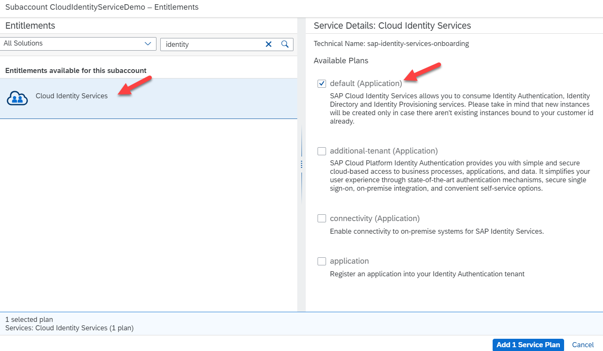
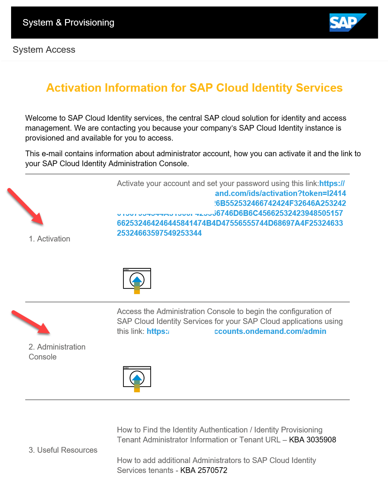

## Activate your SAP Cloud Identity Services 

In the previous sections, we looked at the SAP ID Services and Default Identity Providers. Now we will focus on activating your Custom Identity Provider which is your SAP Cloud Identity Services to get access to IAS and IPS.  

**Caution**: In case you already have an active SAP Cloud Identity Services you may skip this step. You can simply establish trust in your SAP Cloud Identity Services to use them which is discussed in the next chapters. 

Caution: In case you already have the SAP, Cloud Identity Services are active, t similar process helps to assign the service to your SAP Subaccount

### Getting started:

- To activate your Cloud Identity Services on SAP BTP, we need a subaccount to be created. SAP Cloud Identity Services runs on several underlying Infrastructure-as-a-service technologies and regions and can be activated on our cloud partner service providers such as AWS (Amazon Web Services), Microsoft Azure, or GCP (Google Cloud Platform). You may refer to [Regional Availability](https://help.sap.com/docs/identity-authentication/identity-authentication/regional-availability?q=data%20center) before you choose/create your subaccount.   

- Log in to your SAP BTP Global Account, click on the Create Button, and select Subaccount. Enter the required details as shown in image 2 and click on Create 

- Once your subaccount is created, assign the required entitlements. To do this, click the **Entitlements** -> click on **Entity Assignments** -> select your **subaccount in my case, DemoCloudIdentityService**

 

 
 

 

Image 1</b> 

Click on **Configure Entitlements**, and then click on **Add Service Plans**, a new window should pop up. Select the service SAP Cloud Identity Services, choose the service **Default (Application)** click on **Add 1 Service Plan**, and then **Save** the service plan.  

The **default** plan would be the first option to select since we are creating the service for the first time and the **additional tenant** is used while you are creating additional services for your BTP Cockpit. Choose the other services as required. 

 

 
 

 

Image 2</b> 

- Navigate to your SAP Subaccount **DemoCloudIdentityService** -> click on **Services** -> click on **Service Marketplace** -> click on **SAP Cloud Identity Services** and click on **Create** 

 

 
 

 

Image 3</b> 

- In the new window, select your plan **default** and click on **Next**

 

 
 

 

Image 4</b> 

- The next screen gives you the option to create either a **TEST** tenant or a **PRODUCTIVE** tenant. We will select the option **TEST** for our first setup and click on **Next**.

 

 
 

 

Image 5</b> 

- Click on **Create** on the **Review page** 

 

 
 

 

Image 6</b> 

- You should be able to see the new pop window – creation in progress. Click on **View Subscription** the page navigates to **Instances and Subscription**, and you should be able to see the service **Cloud Identity Service** with the status **Subscribed**.

 

 
 

 

Image 7</b> 

- Once the service is active, you should receive an email on the new service with the **Activation Email** and the **System Access** information.

 

 
 

 

Image 8</b> 

- Click on the **Activation link** and set your initial password to log in to the system. You should now be able to see your SAP Cloud Identity Services active with Identity Authentication Services and Identity Provisioning Services with other options.

 

 
 

 

Image 9</b> 

This completes the section on activating your SAP Cloud Identity Services. 
