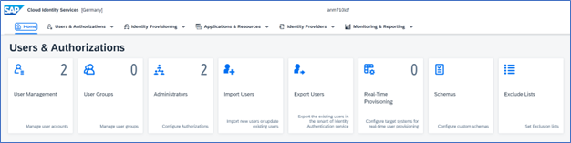
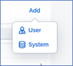
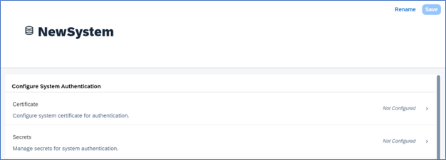
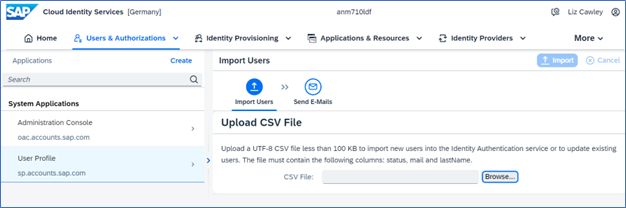
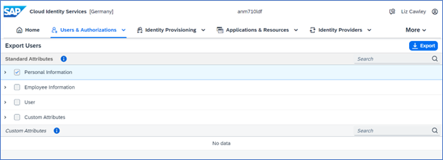

  ## Users and Authorizations  

Now that your tenant has been properly provisioned initial access is designated to one user as the tenant administrator. Due to security reasons, it is this person’s exclusive responsibility to add additional administrators to the tenant. As a best practice, SAP recommends always having at least two administrators defined. 

**Administrators** 

Login to your Cloud Identity Services tenant https://<tenant ID>.accounts.ondemand.com/admin  

In the Users & Authorizations Section, select the Administrators tile

 

 
 

 

Image 1</b> 

 You can add Administrators or Systems and assign the following Authorization Roles: 

 | Authorization	| Description | User | System |
| --- | --- |--- |--- |
| `Manage Applications` | Configure applications via the admin console. | X | X |
| `Manage Corporate Identity providers` | Configure the identity providers via the admin console.  | X | X |
| `Manage Users` | Manage, import, and export users via the admin console.  | X | X |
| `Read Users` | Retrieve user data and import users via the admin console and SCIM REST API of identity authentication. | X | X |
| `Manage Groups ` | Create, edit, and delete user groups via the admin console.  | X | X |
| `Manage Tenant Configuration` | Manage tenant configuration and authorization assignment to users. | X | X |
| `Manage Identity Provisioning` | Configure identity provisioning. This authorization grants the main IPS_ADMIN role.  | X | |
| `Access Proxy System API` | Permission to access API for provisioning identities via proxy systems. | | X |
| `Access Real-Time Provisioning API` | Permission to access API for real-time provisioning of identities.  | | X |
| `Access Identity provisioning Tenant Admin API` | Permission to access tenant API for running provisioning jobs.  | | X |

**Add a User:**

- Add > **User**
  
 

 
 

 

Image 2</b> 

- Enter an **Email address**, **First Name**, and **Last Name** > Select **Roles** > **Save**  

 

 
 

 

Image 3</b> 

**Add a System:**

A system can also be added as an administrator in the administration console. This system can receive the same roles and perform the same actions as a human administrator. Note: the system name initially entered cannot be changed after it is created and help you **manage/set up trust** with Identity Authentication.  

- Add > **System**

 

 
 

 

Image 4</b> 

- Enter a system name 
- Select the required Roles 
- Configure the authentication method (either Certificate or Secret) > Save your entries

 

 
 

 

Image 5</b> 

For more information on Adding Administrators see the [SAP Help Documentation](https://help.sap.com/docs/identity-authentication/identity-authentication/add-administrators).  

**To delete an Administrative User or System in SAP IAS (Identity Authentication Services)**  

- Select the user or system and remove all their Authorizations 
- Once the authorizations are completely removed the user or system will automatically be removed from the list.  
- Reference [SAP KBA (Knowledge Base Articles) 3275785](https://me.sap.com/notes/0003275785)

**User Management**  

Tenant administrators are responsible for managing user accounts via the administration console for SAP Cloud Identity Services.  

**Types of users**

|  |  |
| --- | --- |
| Customer | External users that are customers of the company |
| Employee | Internal company users, mainly users with long-term contracts |
| Partner | External users from a partner company |
| Public | External users that are not controlled by the company |	
| External | External users can be temporary hired employees or need access to learning and training materials. |
| Onboardee | An employee user that needs a different authentication because for example, the user might not exist in the corporate identity provider. |

The User Management tile enables administrators to  

- Create users in the Administration console via the Add option or a CSV file import  
- Search for users via the full list or use filters  
- List and Edit User details including user type, name, email, etc. 
- Delete, Deactivate, block, or unblock users  
- Manage User Group Assignments  
- Unlock passwords in the event the password-locked period is set to unlimited  
- Send reset password emails  
- Set initial password  
  - Restrict user attribute values via exclude lists  

**User Groups** 

A user group is a collection of users. Tenant administrators can optionally choose to create user groups for users who share something in common, for example, departments or similar tasks.  

The User Groups tile enables administrators to  

- Import user groups via CSV file  
- Create a new Group 
- List and Edit user groups  
- Add and Remove users to a group  
- Assign and Unassign groups to/from a user  
- Delete user groups  

**Import Users**  

As an administrator assigned the Manage Users role, you have the option to import new users or update existing users with a CSV file. You can do this with a Full User profile or for a specific application. The Import option allows you to create user profiles without passwords in Identity Authentication. When you do this, the users will receive emails with instructions on how to activate their account and log into the application for which they were imported.  

Note: You will need to Configure a trusted service provider as a prerequisite. For more information see [Configure Trust](https://help.sap.com/docs/identity-authentication/identity-authentication/configure-trust) in the SAP Help Documentation.

 

 
 

 

Image 6</b> 

[See import CSV File with Full User Profile](https://help.sap.com/docs/identity-authentication/identity-authentication/import-csv-file-with-full-user-profile)

[See import Users for a Specific Application](https://help.sap.com/docs/identity-authentication/identity-authentication/import-or-update-users-for-specific-application)  

**Export Users**  

As an administrator assigned to the Manage Users or Read Users role you have the option to export all tenant users in your Identity Authentication tenant including other administrators and their supported SCIM attributes.  

 

 
 

 

Image 7</b> 

 
**Real-Time Provisioning**  

While we learn about User creation and Import options, Administrator may still have to assign the Application access either manually or may have to wait for the scheduled jobs to be run. Once the roles are assigned, users will be able to access the applications.  

Real-Time provisioning is one of the options that allows you to synchronize newly created or updated users from source to target systems without running manual or scheduled jobs in Identity Provisioning. This feature comes in handy for scenarios requiring synchronous provisioning, like user self-registration that needs immediate system access. Once the new users are created, or imported, we need to run manual or scheduled jobs to provide the users to make the applications accessible to the newly added users.  

You can look at the options:

- [Configure Identity Provisioning Target Systems for Real-Time User Provisioning](https://help.sap.com/docs/identity-authentication/identity-authentication/configure-identity-provisioning-target-systems-for-real-time-user-provisioning)  
- [Provision Users to Target System](https://help.sap.com/docs/identity-authentication/identity-authentication/provision-users-to-target-systems)  
- [Delete Target System](https://help.sap.com/docs/identity-authentication/identity-authentication/delete-target-system) 

For more information please visit – [Real-Time Provisioning: Identity Authentication](https://help.sap.com/docs/identity-provisioning/identity-provisioning/real-time-provisioning-identity-authentication) 

**Schemas**  

A schema defines security permissions by user groups. SAP provides a list of pre-defined read-only schemas for you to leverage. Additionally, an administrator can import or manually create a custom schema. The maximum number of customer schemas per tenant is 20 and each schema can contain up to 20 attributes. 

For more information see [Manage Custom Schemas via Administration Console.](https://help.sap.com/docs/identity-authentication/identity-authentication/manage-custom-schemas-via-administration-console?q=schema)  

**Exclude Lists**  

Using exclude lists you can restrict the values that can be set on the [first name, last name, email,](https://help.sap.com/docs/identity-authentication/identity-authentication/restrict-user-attributes-values-via-exclude-lists?q=exclude) and [password](https://help.sap.com/docs/identity-authentication/identity-authentication/configure-password-exclude-list?q=exclude) of a user.

