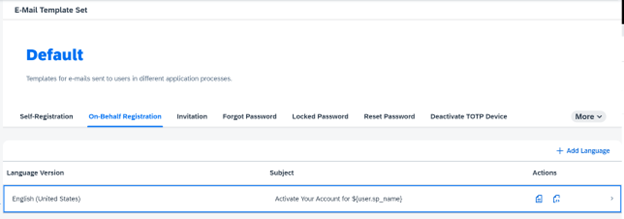
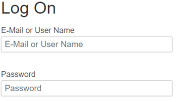
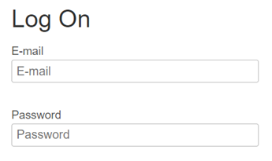
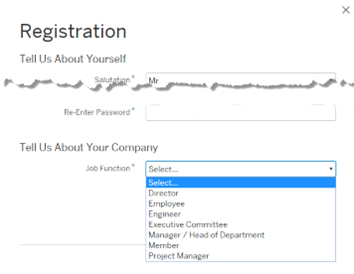

## Learn about Applications & Resources   

SAP Cloud Identity Services offers enhanced features so that administrators can provide a comprehensive and secure experience to users of their applications and tenants.  

**Applications** 

The Applications section helps to provide access to your BTP Apps or Services that you plan to give access to and validate the authorizations. It also provides a few options like branding according to your company's requirements. The Applications are categorized into 3 types,  

- **Bundled Applications** are recognized as Identity Authentication as SAP Applications and 
- **Charged Applications** are third-party apps 

Note: Identity Authentication identifies the type of Application by the URI or SAML2.0 endpoints, and if not maintained it will be recognized as Charged Application.  

- **System Applications** give access to two types of applications known as Administration Console and User Profile, (previously known as SAP Cloud Identity). The Admin Console contains configurations options of **Admin Console** along with expiring certificates, system notifications, etc... and **User Profile** contains details of the Profile Page.  

For full details of Application Types, please visit the [help page](https://help.sap.com/docs/identity-authentication/identity-authentication/application-types?q=charged%20applications). 

Now that you understand the Application Types, there are multiple options for Configuring Applications. You can create multiple applications and configure them as per your project requirements and manage the application access. Some of the main configurations could be to authenticate via SAML 2.0 or OpenID Connect and establish Trust in SAP BTP Cockpit for the applications. Other configurations can include App Type, Display Name, Home URL, App’s Web Page, Modify/Delete Apps, configure Trust, Manage Authentication, Configure API, Branding and Styling, etc. We recommend seeing the list of configuring applications [here](https://help.sap.com/docs/identity-authentication/identity-authentication/configuring-applications).   

**Tenant Settings**  

The SAP Cloud Identity Services are initially configured with the default settings. The Tenant Settings allows you to Administer and choose your customization as per your requirements. Some of the most commons configurations would be using Custom Domain settings, Session Timeout, Initial Password, and E-mail Link Validity, Password Recovery / Recovery Pin setup, Tenant SAML 2.0 or OpenID connect configurations, etc. You can find the list of activities that can be considered in the [help portal](https://help.sap.com/docs/identity-authentication/identity-authentication/configuring-tenant-settings).  

**Terms of Use Documents** 

A Terms of Use Document is a legal document that lets you establish the rules of engagement with your site or application. In SAP Cloud Identity Services, administrators can configure a custom term-of-use document. Tasks an administrator can perform include:  

- Creating a new term-of-use document 
- Adding a new language to existing terms of use document  
- Adding a latest version to a term-of-use document 
- Defining terms of use document for an application 
- Viewing and editing an existing term-of-use document 
- Deleting a term-of-use document 

For a list of supported languages and configuration details see [Configuring Terms of Use](https://help.sap.com/docs/identity-authentication/identity-authentication/configuring-terms-of-use) SAP help documentation.  

**Privacy Policy Documents**  

A privacy policy provides a detailed explanation of how you plan to use any personal information collected when users visit your site or application. In SAP Cloud Identity Services, administrators can configure a custom privacy policy document. Tasks an administrator can perform include: 

- Creating a new private policy document 
- Adding a new language to an existing private policy document 
- Adding the latest version to a private policy document 
- Defining a private policy document for an application  
- Viewing and editing an existing private policy document 
- Deleting a private policy document 

For a list of supported languages and configuration details see [Configuring Privacy Policies](https://help.sap.com/docs/identity-authentication/identity-authentication/configuring-privacy-policies) SAP help documentation. 

**E-Mail Template Sets**  

There are many reasons an administrator of SPA Cloud Identity Services would need to email users including: 

- Self-registration email template via a registration page  
- On-behalf registration email template for situations where someone else registers the user on their behalf  
- Invitation e-mail template for when a user invites another user for registration via the invitation REST API 
- Forgot Password e-mail template for when users forget their password and require reset instructions  
- Locked password e-mail template for when a user locks themselves out by exceeding the allowed number of log-on attempts.  
- Reset password e-mail template for when a user needs instructions to reset their password. 
- Deactivate TOTP Device when a user requested to receive a passcode via email for two-factor authentication. 
- Email OTP Code for when a user requests a code for two-factor authentication 
- Sending security alert is used when the users' password is changed, or reset, the e-mail or login name has changed, or when TOTP or Web TFA devices are activated or deactivated.  

Tasks an administrator can perform include: 

- Creating a new e-mail template set 
- Viewing an e-mail template document  
- Edit or add an e-mail template set  
- Defining an e-mail template set for an application  
- Delete an e-mail template set  
- Allowed placeholders per e-mail template set
 
 

 
 

 

Image 1</b> 

For configuration details see [Configuring E-Mail Templates](https://help.sap.com/docs/identity-authentication/identity-authentication/configuring-privacy-policies) SAP help documentation. 

**Password Policies**  

SAP Cloud Identity Services gives the flexibility for the customers/enterprise administrators to create custom password policies with a certain set of requirements while choosing a password. By default, you can either work with **Standard**, **Enterprise**, or **Custom** password policy. This is one of the good and easy-to-follow topics and is most widely implemented. The complete details can be found [here](https://help.sap.com/docs/identity-authentication/identity-authentication/configuring-password-policies?q=password%20policy).  

**Custom CSS** 

SAP provides two branding styles administrators can choose between for the end-users screens, such as sign-in, registration, and upgrade. If you would prefer to apply your company's own branding you can apply a custom CSS theme.  

For more information see the [Use a Custom CSS](https://help.sap.com/docs/identity-authentication/identity-authentication/use-custom-css?q=cusotm%20CSS) SAP help documentation. 

**Tenant Texts and Master Data**  

Both Tenant Texts and Master Data support the developer community to customize or implement custom configurations in addition to the default console provided by SAP Cloud Identity Services. Developers can use REST API to call these APIs and modify them according to their requirements.  

**Tenant Texts** can change the predefined texts and messages for end-users screens available per tenant in the Identity Authentication.  

Example: The log-on screen has the options for E-Mail or Username: 

 

 
 

 

Image 2</b> 

The same screen can be modified to only E-Mail as shown below:

 

 
 

 

Image 3</b> 

Like any other REST API, developers can benefit from the API Response to work with it effectively and you can find the list of all the pre-defined [Tenant Texts here](https://help.sap.com/docs/identity-authentication/identity-authentication/change-tenant-texts-rest-api?q=tenant%20texts#loio66ad80a6bbaf4fc3911232f7cc9a7de6). 

On the other hand, **Master Data** provides the opportunity to change/modify the predefined master data in each of the resources in identity authentication. For example, during registration SAP Provides a list of details for Job Functions which can be modified according to your requirements.

 

 
 

 

Image 4</b> 

You can find the list of predefined Master Data Text in the Applications section or on the [help portal here](https://help.sap.com/docs/identity-authentication/identity-authentication/change-master-data-texts-rest-api?q=tenant%20texts). 
