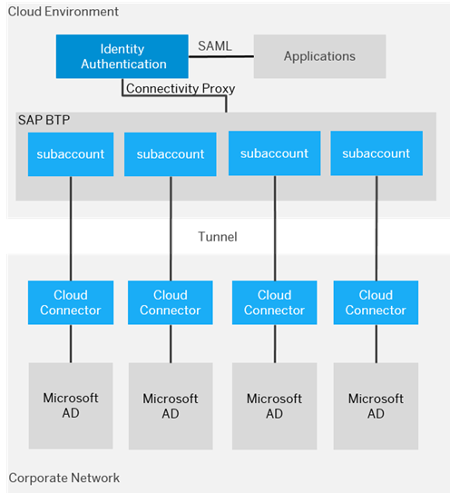
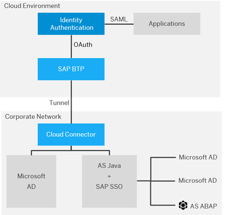
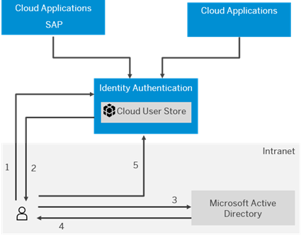
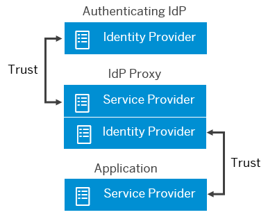
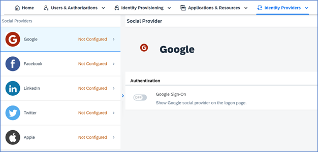
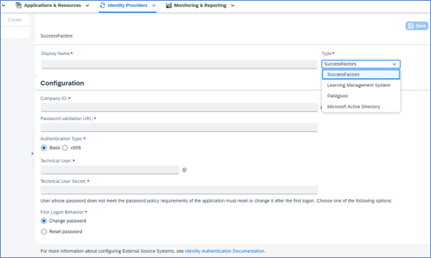

## Learn about Identity Providers  

SAP provides **SAP Identity Authentication, SAP ID Services, and Bring Your Own Identity Provider** options as the identity provider for authentication and single sign-on for users in the cloud. This service provides customers with controlled cloud-based access to business processes, applications, and data thereby simplifying the user experience. SAP understands that companies may have other preferred scenarios for users to log in to applications, for example, social identity providers, integration with existing customer landscapes, or external source systems. In this section of the mission, we will explore all the options in detail.  

**Corporate Identity Providers**  

SAP Identity Authentication can be integrated with existing customer landscapes and supports several types of delegated authentication, including corporate user store, Kerberos authentication, and identity provider proxy.  

**Corporate User Store**  

Integration between Identity Authentication and the corporate user store allows users to authenticate with their corporate credentials from the corporate user store without the need to use another set of credentials for their cloud access. Depending on your SAP BTP environment you can configure this option in two ways: 

- Cloud Foundry Environment - **Recommended approach 
  - Identity Authentication can connect with Microsoft Active Directory corporate user store via the connectivity proxy component and the SAP Cloud Connector.  
  - [Configure a corporate user store with SAP IAS in the Cloud Foundry Environment](https://help.sap.com/docs/identity-authentication/identity-authentication/corporate-user-store-cloud-foundry-environment#loio9942ede4fae84934a8eb184a0015c305)

 

 
 

 

Image 1</b> 

- Neo Environment – Limited scope, consult the SAP Help Documentation for specific details  
  - Configure corporate user store for applications in the Neo environment to allow users to authenticate with their corporate credentials without the need to use another set of credentials.  
    - Microsoft Active Directory  
    - SAP NetWeaver AS JAVA  
  - Configure a Corporate User store with SAP IAS in the Neo Environment
 
 

 
 

 

Image 2</b> 

**Kerberos Authentication**  

Kerberos authentication allows users to log on to an application in a corporate network without a username and password. This type of authentication requires the following systems: 

- Web Client  
- Key Distribution Center (KDC)  
- SAP Identity Authentication 

[Configure Kerberos Authentication](https://help.sap.com/docs/identity-authentication/identity-authentication/configure-kerberos-authentication)

 

 
 

 

Image 3</b> 

**Process overview**: 

1. The user tries to access an application from the browser. The browser sends a request to SAP IAS 
2. IAS responds with a 401 unauthorized code  
3. The browser requests a Kerberos ticket from Microsoft Active Directory  
4. Microsoft AD responds with a ticket  
5. The browser sends the ticket to SAP IAS  
6. SAP IAS validates the ticket, checks whether the user exists in the user store, and authenticates the user 

**Corporate Identity Provider**  

If you are a company with an on-premises user store you can configure SAP Identity Authentication to use the corporate user store in addition to its own cloud user store. In this situation, SAP Identity Authentication acts as a proxy to delegate the authentication to a corporate identity provider. Creating a proxy enables you to create structures of trust relationships that simplify the management of your applications. 

Identity authentication acting as a proxy can use a SAML 2.0 or an OpenID Connect identity provider as an external authenticating authority for the application.  

[Configure Trust with SAML 2.0 Corporate Identity Provider](https://help.sap.com/docs/identity-authentication/identity-authentication/corp-idp-configure-trust-with-saml-2-0-corporate-identity-provider)  

[Configure Trust with OpenID Connect Corporate Identity Provider](https://help.sap.com/docs/identity-authentication/identity-authentication/corp-idp-configure-trust-with-openid-connect-corporate-identity-provider)

 

 
 

 

Image 4</b> 

**Social Identity Providers**

By configuring a social provider, users can log on to applications with their social media credentials by linking their accounts in SAP Identity Authentication to the social media account. SAP Identity Authentication uses the OAuth protocol for single sign-on via one of the predefined social providers: 

- [Apple](https://help.sap.com/docs/identity-authentication/identity-authentication/configure-apple-as-identity-provider) 
- [Facebook](https://help.sap.com/docs/identity-authentication/identity-authentication/configure-facebook-as-identity-provider) 
- [Google](https://help.sap.com/docs/identity-authentication/identity-authentication/configure-google-as-identity-provider) 
- [LinkedIn](https://help.sap.com/docs/identity-authentication/identity-authentication/configure-linkedin-as-identity-provider) 
- [Twitter](https://help.sap.com/docs/identity-authentication/identity-authentication/configure-twitter-as-identity-provider)

 

 
 

 

Image 5</b> 

**Source Systems** 

If your company has users that log on to SAP SuccessFactors, SAP Learning Management, and SAP Fieldglass they can be migrated to and use SAP Identity Authentication without the need to change their existing passwords. Passwords are migrated only once during a user’s first successful login after the confirmation of the source system scenario in SAP Identity Authentication.  

Migrate user passwords from: 

- [SAP SuccessFactors systems](https://help.sap.com/docs/identity-authentication/identity-authentication/configure-source-system-to-migrate-user-passwords-from-sap-successfactors-systems-to-identity-authentication)  
- [SAP Learning Management System](https://help.sap.com/docs/identity-authentication/identity-authentication/configure-source-system-to-migrate-user-passwords-from-sap-learning-management-system-to-identity-authentication)
- [SAP Fieldglass](https://help.sap.com/docs/identity-authentication/identity-authentication/configure-source-system-to-migrate-user-passwords-from-sap-fieldglass-to-identity-authentication)  

 

 
 

 

Image 6</b> 
 

Note:  

Security setup is a huge topic and can be set up in multiple ways. We recommend carefully viewing your [Integration Scenarios](https://help.sap.com/docs/SAP_CLOUD_IDENTITY/b95c3d5bab324a3a8409eee5267a5b75/f4d660fec3f74eb09e9951aac81f3a48.html?q=corporate) and looking at the recommendations on our [SAP Help page](https://help.sap.com/docs/SAP_CLOUD_IDENTITY/b95c3d5bab324a3a8409eee5267a5b75/ae915d60107447f397b3de1a1cd498f5.html?q=corporate).
