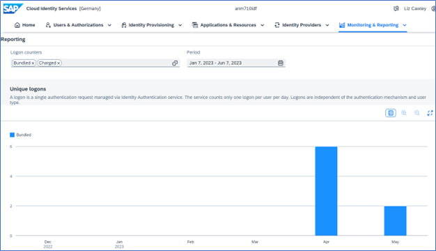
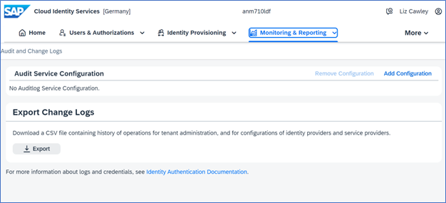

## Learn about Monitoring and Reporting   

Within your SAP Cloud Identity Services tenant, you have many options available to get usage statistics, access audit logs, export change lots, or get support in the event things go wrong. 

**Reporting** 

From the Reporting tile in the Administration home page, you can see the number of user logon requests. Only one logon request per user per day is recorded. The default statistical information shows the usage of bundled, charged, and system applications for the last six months, however, this can be modified.  

For more information see [View Usage Statistics](https://help.sap.com/docs/identity-authentication/identity-authentication/view-usage-statistics)

 

 
 

 

Image 1</b> 

**Audit and Change Logs** 

Tenant administrators can access the audit logs for changes in personal data, and successful, and failed authentications in identity authentication. Since Identity Authentication is offered in both the Cloud Foundry and Neo environments the process to configure the logs varies: 

- [Access Audit Logs (AWS and Azure infrastructure – Cloud Foundry)](https://help.sap.com/docs/identity-authentication/identity-authentication/access-audit-logs-aws-azure-infrastructure) 
- [Access Audit Logs (SAP infrastructure – Neo)](https://help.sap.com/docs/identity-authentication/identity-authentication/access-audit-logs-sap-infrastructure) 

Additionally, you can export the change logs to an Excel file.

 

 
 

 

Image 2</b> 

**Troubleshooting Logs** 

Administrators can filter and view troubleshooting logs directly in the administration console for SAP Cloud Identity Services. For more information see the [SAP Help Documentation](https://help.sap.com/docs/identity-authentication/identity-authentication/view-troubleshooting-logs). 
