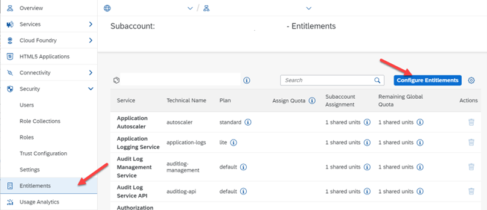
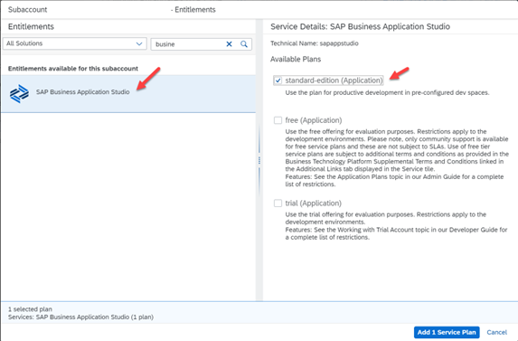
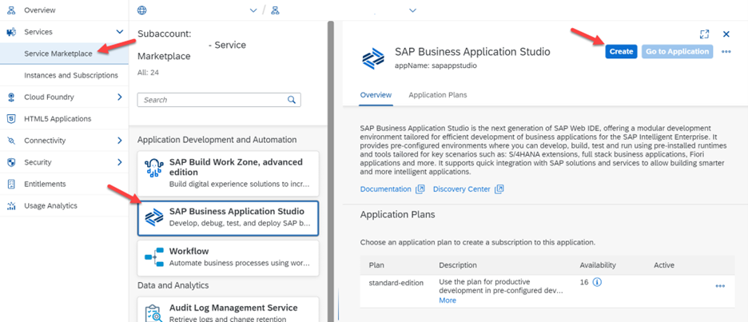
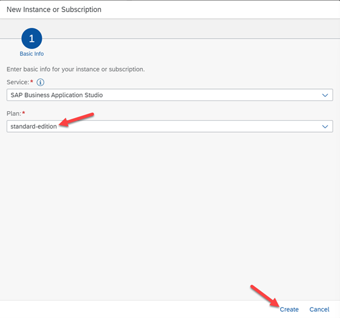
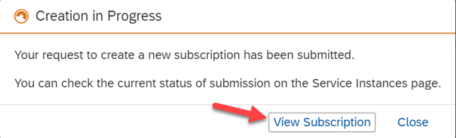
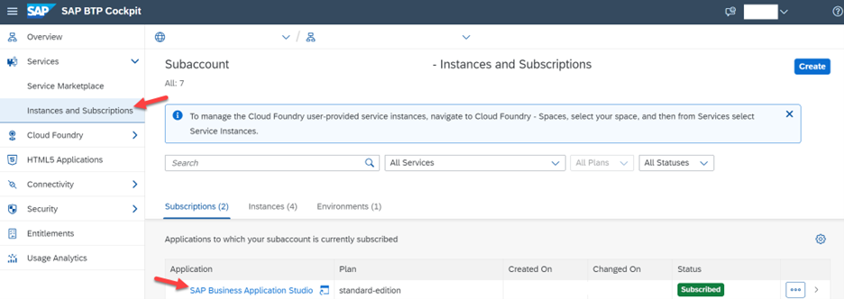
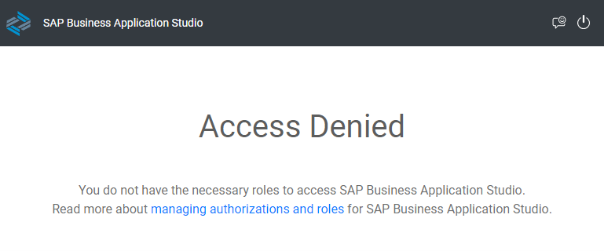
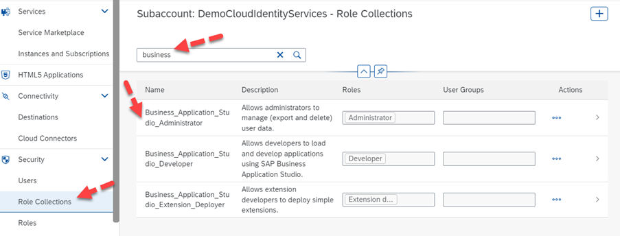
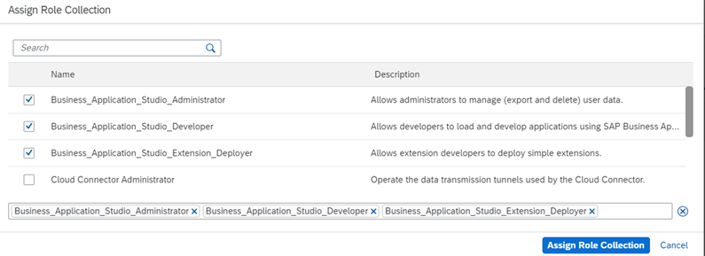
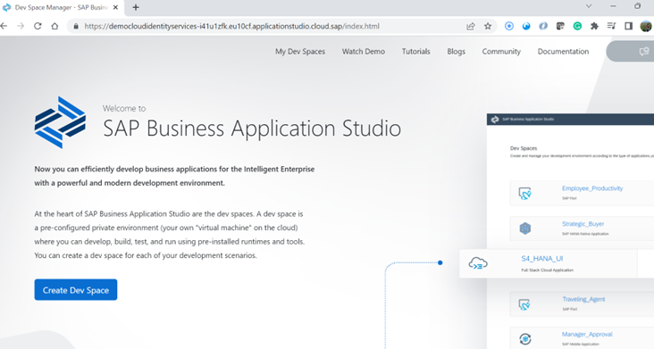

## Activate SAP Business Application Studio 

As discussed in the previous section, we shall work with SAP Business Application Studio, Default Identity Provider, and assign the required roles to get access.  

**Add entitlements to your BTP subaccount** 

To set up access to SAP Business Application Studio, we need to add the entitlements to these services to the subaccount. 

Note: We are using the existing subaccounts that we created for activating the IAS tenants in the previous sections. Based on your project plan, you may prefer to create a subaccount based on service availability. Please refer to Data Center availability in the [SAP Discovery Center](https://discovery-center.cloud.sap/serviceCatalog/business-application-studio).  

- Log in to your SAP BTP Global Account. Navigate to your subaccount.  

- Assign the entitlements for SAP Business Application Studio and SAP Build Work Zone (standard edition) to your subaccount. To do this, click on **Entitlements** -> Click on **Configure Entitlements**, and then click on **Add Service Plans**. A new window should pop up.

 

 
 

 

Image 1</b> 

- Select the service, **SAP Business Application Studio, standard-edition (Application)** service plan. If you are trying out SAP Business Application Studio for evaluation purposes, choose the **free (Application)** or **trial (Application)** service plan as applicable -> click on **Add 1 Service Plan** and save the settings.  

In our scenario, I have selected a productive license and it will be charged as per my license plan.

 

 
 

 

Image 2</b> 

**Activate SAP Business Application Studio** 

- Navigate to your SAP BTP subaccount -> click on **Services** -> click on **Service Marketplace** -> click on **SAP Business Application Studio** and click on **Create**.

 

 
 

 

Image 3</b> 

- In the new window, select the **standard-edition** plan and click **Create**.

 

 
 

 

Image 4</b> 

- You will see a new pop-up window – Creation in Progress. Click on **View Subscription** to navigate to **Instances and Subscriptions**. The service SAP Business Application Studio can be seen with the status **Subscribed**.

 

 
 

 

Image 5</b> 

- Once the status of the service is **Subscribed**, it is available for development. Every service that we activate in SAP BTP creates new roles to support the administrative task.

 

 
 

 

Image 6</b> 

- For SAP BAS we have 3 roles that get automatically activated and listed in the role's sections. Until these roles are assigned, we will not be able to access the service. In case we try to access it, we will have an error Access Denied.  

The following in the screen without assigning any roles.

 

 
 

 

Image 7</b> 

**Role Assignment using Default IDP** 

Navigate to the Security option and select **Role Collections**, and search for “**Business_Application_Studio**”. You should be able to see 3 roles that are created upon activation of BAS, and they should be assigned to the user to access the BAS Studio.

 

 
 

 

Image 8</b> 

Now, let us go ahead and assign the roles to the User. Click on **Users** -> select the user that you would like to assign the roles -> click on the Additional Options (3 dots) and select **Assign Role Collection** -> Select the roles required for the user and save the settings.

 

 
 

 

Image 9</b> 

Now the user should be able to access the Business Application Studio.  

 

 
 

 

Image 10</b> 

Note in this setup, we have not used a Custom Identity Provider or the SAP Cloud Identity Services. The users are still authenticated via the SAP Default Identity provider and the roles that are assigned to them.
