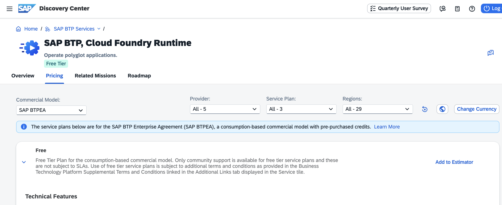
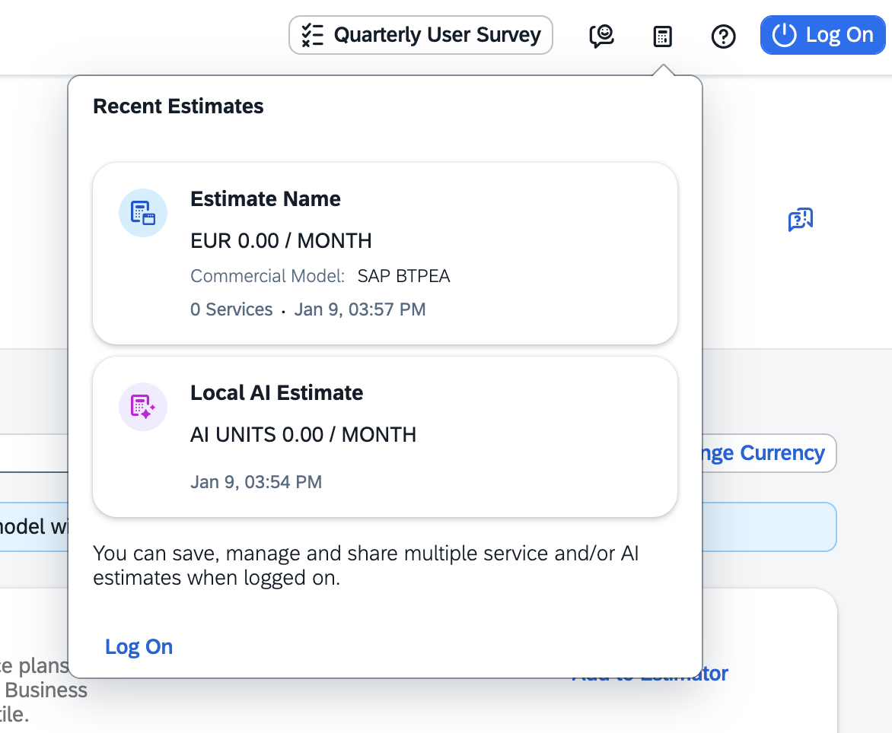
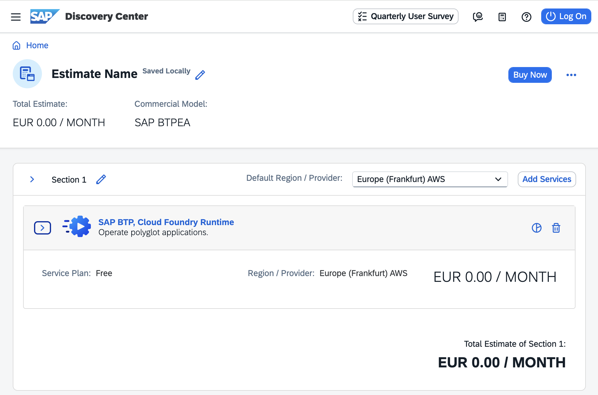

## Fundamentals of SAP Business Technology Platform

## Basic Platform Concepts of SAP Business Technology Platform

Important: SAP BTP offers two distinct types of global accounts: "Enterprise" and "Trial." Enterprise and Trial Accounts are different.

Enterprise accounts are paid, production-ready environments with full features, scalability, and support, designed for real business operations with no time limits. Enterprise Accounts are provided with minimal pre-configuration.

SAP BTP Trial accounts are free, time-limited (e.g., 90 days) environments for learning and testing, with limited resources and no SLAs, partly pre-configured, ideal for developers to explore. 

The core difference lies in purpose (exploration vs. production), duration (limited vs. indefinite), cost (free vs. paid), and support (no SLA vs. guaranteed).

Always be aware of which global account type you are using and for which account type the documentation or information you are using is intended. 

This mission is about Enterprise Accounts.

### SAP BTP Enterprise Accounts

SAP BTP Enterprise accounts are typically associated with a single SAP customer or partner contract and contain the purchased entitlements to platform resources and services. For example, "RISE with SAP" includes an SAP BTP Enterprise Account. 

However, it's also possible to create a SAP BTP Enterprise Account for personal exploration. For example, you can order a stand-alone SAP BTP Pay-As-You-Go license in [SAP Store](https://store.sap.com/dcp/en/product/display-9999951781_live_v1/sap-business-technology-platform). 

For an overview of available services for SAP BTP Enterprise Accounts, see [SAP Discovery Center, Services](https://discovery-center.cloud.sap/viewServices?regions=all)

For more information, see [SAP Help Portal - SAP BTP Enterprise Accounts](https://help.sap.com/docs/btp/sap-business-technology-platform/enterprise-accounts?locale=en-US).

## Commercial Models for SAP BTP Enterprise Accounts

SAP BTP offers two different commercial models for enterprise accounts.

- Consumption-based commercial model: Your organization receives access to all current and future services that are eligible for this model. You have complete flexibility to turn services on and off and to switch between services as your business requires throughout the duration of your contract. This commercial model is available in different options: SAP BTP Enterprise Agreement (SAP BTPEA), Pay-As-You-Go for SAP BTP, and the older Cloud Platform Enterprise Agreement (CPEA).

- Subscription-based commercial model: Your organization subscribes only to the services that you plan to use. You can then use these services at a fixed cost, irrespective of consumption. 

You can use both commercial models, either in separate global accounts or in the same global account, depending on your business needs.

For more information on pricing, see [SAP BTP Pricing Options](https://www.sap.com/products/technology-platform/pricing.html#pricing-options) and [SAP Help Portal - Commercial Models](https://help.sap.com/docs/btp/sap-business-technology-platform/commercial-models?locale=en-US&version=LATEST).

For more information about supported services, depending on the license agreement, see Discovery Center services:

- [BTPEA services](https://discovery-center.cloud.sap/viewServices?regions=all&commercialModel=btpea&provider=all).
- [Pay-As-You_go services](https://discovery-center.cloud.sap/viewServices?regions=all&commercialModel=payg&provider=all)
- [CPEA services for existing agreements](https://discovery-center.cloud.sap/viewServices?regions=all&commercialModel=cpea&provider=all)
- [Subscription services](https://discovery-center.cloud.sap/viewServices?regions=all&commercialModel=subscription&provider=all)

#### SAP BTP Enterprise Agreement (BTPEA)

BTPEA is an evolution of the existing Cloud Platform Enterprise Agreement (CPEA) commercial model. BTP services can be utilized when demand arises and can be retired when no longer needed.

- Your organization makes a prepaid investment in cloud credits for the contract duration with an annual commitment to consume SAP BTP services.
- This model is suitable for customers who have well-established and planned use cases and who want the flexibility of turning services on and off and switching between services without the commitment of being tied to a single service throughout the duration of the contract.
- You receive a monthly balance statement that provides information about the usage consumption of each service and the corresponding costs. The total monthly cost is deducted from your cloud credits balance.
- This model has a minimum investment entry, and volume-based discounts are available.
- You are billed annually in advance. Any overages are billed in arrears at the list price.
- You can top up your cloud credits at any time to prevent overages.
- You get access to new SAP BTP services that are added to the consumption-based service catalog.

BTPEA global accounts do not support the SAP BTP NEO environment.

#### Cloud Platform Enterprise Agreement
     
Cloud Platform Enterprise Agreement (CPEA) is the predecessor of SAP BTPEA. 

**Certain restrictions apply**. See the Frequently Asked Questions section in https://www.sap.com/products/technology-platform/pricing.html.

#### Pay-As-You-Go for SAP BTP (PAYG)**

With PAYG, you can start using cloud services in your production environment with no upfront cost, no minimum usage requirements, and no financial commitments. 
Contract auto-renews every three months with monthly billing. 

- You have the same access to all the services that are available in SAP BTPEA, but with a highly flexible zero-commitment model – you pay nothing upfront, and there is no minimum usage requirement or annual commitment.
- You pay only for the SAP BTP services that you want, when you use them.
- You are billed monthly in arrears.
- Service charges are non-discountable.
- This low-risk model is suitable for customers with use cases that are not well defined and are interested in running a proof-of-concept in a productive environment. This model offers the flexibility to turn services on and off, as well as switch between services, as needed throughout the contract duration.

 

#### Subscription-based commercial model

Your organization subscribes only to the services that you plan to use. You receive a fixed price and a specified period (typically 1 to 3 years) for access to your subscribed SAP BTP services.

Under this commercial agreement:

- You are entitled to use only the subscribed services.
- To access additional services, at an extra cost, you can modify your contract via your sales representative or account executive.
- You pay a fixed cost, regardless of the consumption of subscribed services.
- You pay in advance when the contract period starts.
- Your organization can renew the subscription at the end of the contract period.

 

### Optional: Using SAP BTP Enterprise Accounts with Free Service Plans

Some services in SAP BTP Enterprise Accounts are **Always Free**, indicating that the service plan is free of additional charges, as it is already included in your overall SAP BTP contract. 

Some services in SAP BTP Enterprise Accounts are available as **Free Tier**. Free Tier **service plans** are a way for developers and users to explore and build on specific SAP BTP **services** with no time limits, offering persistent, productive usage of selected services with defined free capacities, unlike the time-bound 90-day Trial Account. It's accessed via a Pay-As-You-Go (PAYG) or SAP BTP Enterprise Agreement (BTPEA) / Cloud Platform Enterprise Agreement (CPEA) licenses, allowing for testing, prototyping, and migration of projects to production, with options to upgrade to paid plans as usage grows. 

For an overview of available Always Free & Free Tier services, visit [SAP Discovery Center, Services](https://discovery-center.cloud.sap/viewServices?regions=all&commercialModel=all&provider=all&quickFilter=freetierservices).

For more information about free services, see [SAP Help Portal - Trial Accounts and Free Tier](https://help.sap.com/docs/btp/sap-business-technology-platform/trial-accounts-and-free-tier?version=LATEST&locale=en-US).

If you want to try out an SAP pay-as-you-go account with free tier service plans, follow the tutorial [Set Up an SAP BTP Account for Tutorials](https://developers.sap.com/group.btp-setup.html).

>Note: Not all services are available with a free service plan, and not all free service plans are available in all regions and with all providers. 

>Note: Be cautious when activating services in all scenarios. Do not activate any services in Enterprise Accounts if you **strictly want to avoid costs** and are unsure if the service and its service plan are free. In this scenario, consider using a BTP Trial Account first to become familiar with BTP service configuration.

 

#### Example: SAP BTP, Cloud Foundry Runtime with Free Service Plan

1. Open SAP BTP, Cloud Foundry Runtime in [Discovery Center, Services](https://discovery-center.cloud.sap/serviceCatalog/cloud-foundry-runtime?region=all&tab=service_plan)

2. Navigate to the tab "Pricing".

3. Select the commercial model, where free service plans are available, e.g., "PAYG" or "SAP BTPEA".

   

4. Open the description for Service Plan "Free". Compare to the description for "Standard", esp. the price information.

5. Click on "Add to Estimator" (optional: Reset your estimate beforehand).

6. Click on the small calculator icon and select your estimate.

   

7. Check the calculated service estimate.

   

 

### Optional: Using SAP BTP Trial Accounts for Single Users

A trial account lets you try out SAP BTP for free for 90 days. The services provided for the trial account allow for the restricted use of platform resources and services. Access is open to everyone. Trial accounts are intended for personal exploration, your own non-productive testing, and evaluation of the services in accordance with SAP BTP trial terms and conditions. A SAP BTP trial account must not be used for production use or team development. You are not permitted to use the trial account in any productive or commercial manner.

The setup and configuration of BTP services in the Trial Account typically differ from those in Enterprise Accounts.

For an overview of available Trial Account services, visit [SAP Discovery Center, Services](https://discovery-center.cloud.sap/viewServices?regions=all&commercialModel=trial&provider=all).

For more information about Trials Accounts, see [SAP Help Portal - Trial Accounts and Free Tier](https://help.sap.com/docs/btp/sap-business-technology-platform/trial-accounts-and-free-tier?version=LATEST&locale=en-US).

If you do not have a SAP BTP Trial Account and wish to explore one, see [Start your free trial of SAP Business Technology Platform](https://www.sap.com/products/technology-platform/trial.html). 

For developers and single users who want a jump start, you can start on the [Welcome to SAP BTP Trial](https://cockpit.hanatrial.ondemand.com/trial/#/home/trial) page. 

For Trial Accounts, you can also follow the tutorial [Get a Free Account on SAP BTP Trial](https://developers.sap.com/tutorials/hcp-create-trial-account.html) in the [SAP Developer Center](https://developers.sap.com/).
