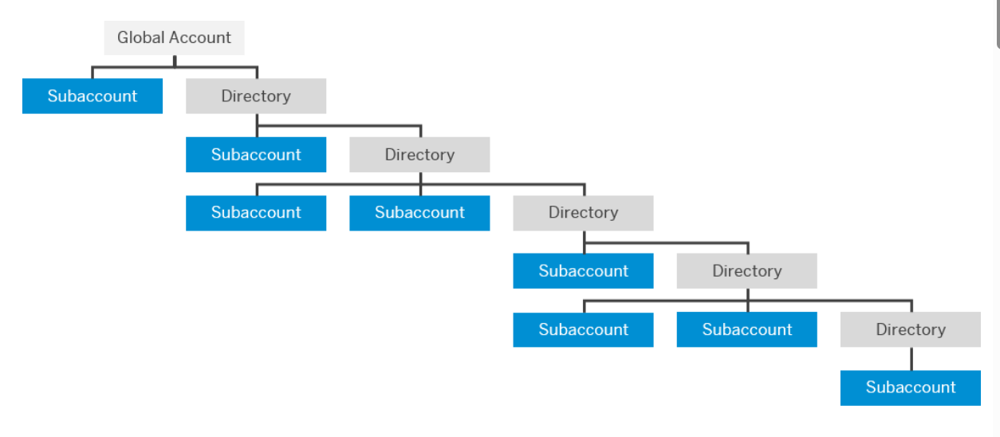
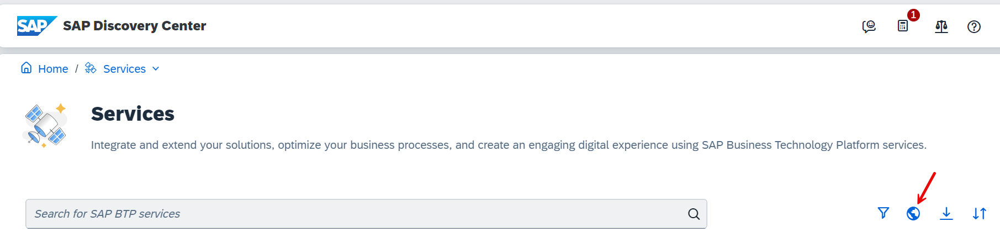

# SAP BTP Account Model

Accounts are structured according to global accounts, subaccounts, and directories.

Global accounts are **region- and environment-independent**.

### SAP BTP Global Account

A global (enterprise) account is the realization of a contract you made with SAP. 

A global account is used to manage global account members, subaccounts, entitlements, and quotas. You receive entitlements and quotas for platform resources per global account, and then distribute them to the subaccount for actual consumption. 

A global account can contain one or more subaccounts in which you run applications and services. 

Global Accounts are managed using the **SAP BTP Cockpit**. For more information and alternatives to manage your global Account, see [SAP Help Portal - Account Administration](https://help.sap.com/docs/btp/sap-business-technology-platform/account-administration?locale=en-US&version=LATEST).

### SAP BTP Subaccounts and Regions

A global account can contain one or more subaccounts in which you deploy applications, use services, and manage your subscriptions. Subaccounts within a global account are independent of one another.

The entitlements and quotas purchased for a global account must be assigned to the individual subaccounts.

Each subaccount is associated with one **region** and one **provider** running in that region. Each region represents a geographic location (for example, Europe or US East) where applications, data, or services are hosted.

Regions are provided by the Infrastructure-as-a-Service (IaaS) partner Amazon Web Services (AWS), Microsoft Azure, Google Cloud, and Alibaba Cloud. The third-party region providers operate the infrastructure layer of the regions, whereas SAP operates the platform layer and Cloud Foundry.

>For each subaccount, you select exactly one region (that is, one data center) and one provider.

For an overview of all available regions, see [Discovery Center](https://discovery-center.cloud.sap/viewServices?provider=all&regions=all&showFilters=true).

Click the small world icon in the filter bar.

As a result, you will see an overview map for Regions and Providers.

### Environments

[Environments](https://help.sap.com/docs/BTP/65de2977205c403bbc107264b8eccf4b/15547f7e7ecd47ee9fa052b0e18c7b0a.html?locale=en-US) constitute the actual platform-as-a-service offering of SAP BTP that allows for the development and administration of business applications.

Infrastructure Providers such as AWS, Azure, GCP, or Alibaba Cloud provide the [Multi-Cloud Foundation](https://help.sap.com/docs/BTP/b017fc4f944e4eb5b31501b3d1b6a1f0/06b6fb3d45d040429e36f0359d2fe1f2.html?locale=en-US), which comprises three different environments:

- Cloud Foundry environment, the Platform-as-a-Service (PaaS) technology for many BTP services 
- Kyma environment, a Kubernetes runtime to build cloud-native Kubernetes-based extensions 
- ABAP environment

The SAP data center provides the NEO Environment with a limited set of services.

To use an environment in a subaccount, you need to enable it by creating an instance of that environment, as explained later in the mission. 

>**Note:** Not all Services, Applications, or Environments are available in all Regions and on all Providers. Different Providers, Environments, and Regions may offer different sets of available services.

#### Entitlements and Quotas

When you purchase an enterprise account, you're entitled  to use a specific set of resources, such as the amount of memory that can be allocated to your applications. For more information, see [SAP Help Portal](https://help.sap.com/docs/btp/sap-business-technology-platform/entitlements-and-quotas?locale=en-US). 

SAP BTP services always have an associated **Service Plan**. The service plan defines the amount of resources the service may consume.

For example, [SAP BTP, Cloud Foundry Runtime](https://discovery-center.cloud.sap/serviceCatalog/cloud-foundry-runtime?region=all&tab=service_plan) offers, in the commercial model CPEA, the service plan "**Free**" with a limited resource allocation of 4 GB of memory. The service plan "**Standard**" allows you to choose the amount of memory you want to allocate.

Entitlements are purchased and managed at the global account level, from which they are distributed to subaccounts that consume them.

Some BTP services, such as Cloud Foundry Runtime, require an explicit "Quota" for a subaccount, which means a specific amount of the available entitlement is allocated to a particular subaccount.

When you remove quotas from a subaccount, they become available again at the global account level and can be assigned to other subaccounts.

 
