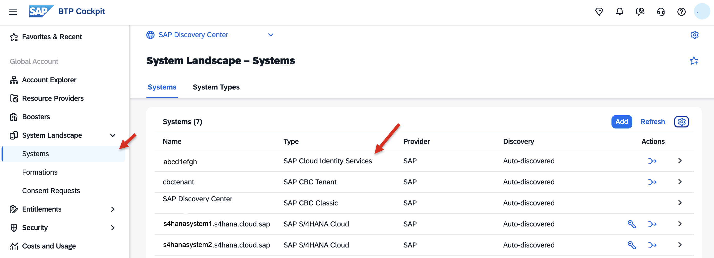
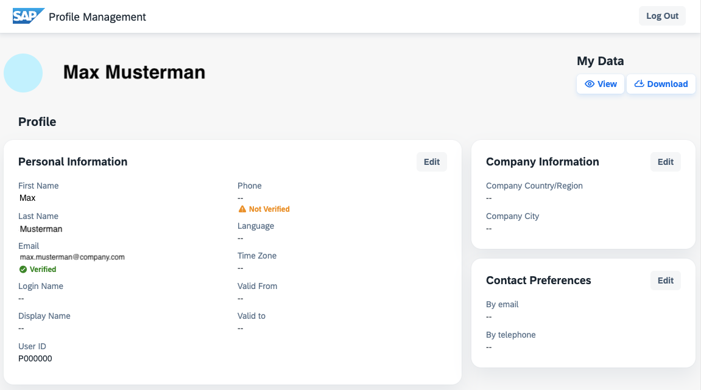
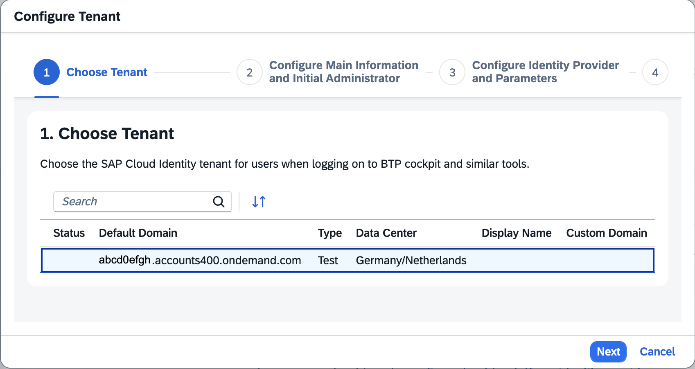
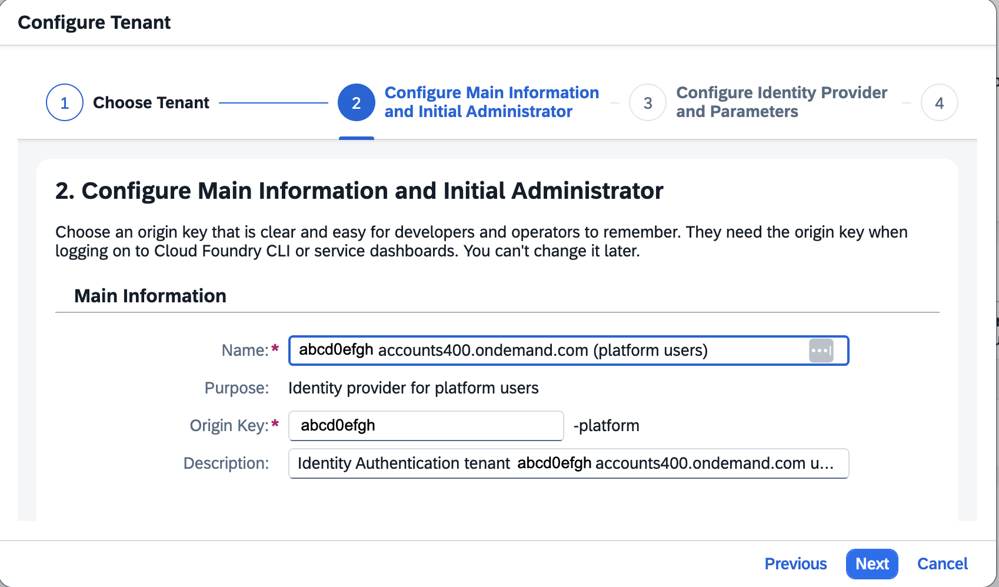
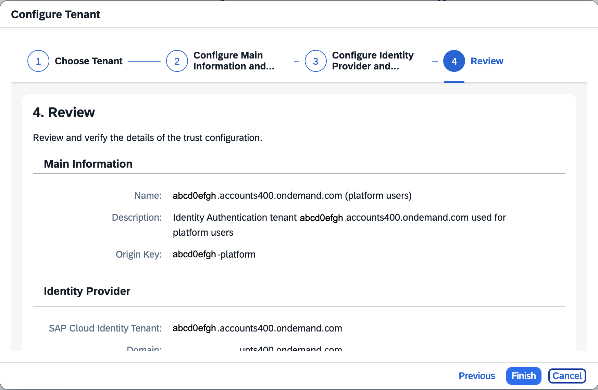
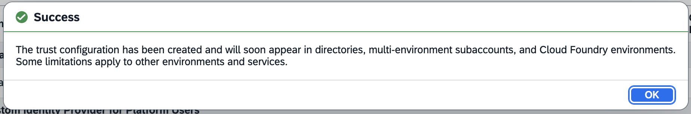
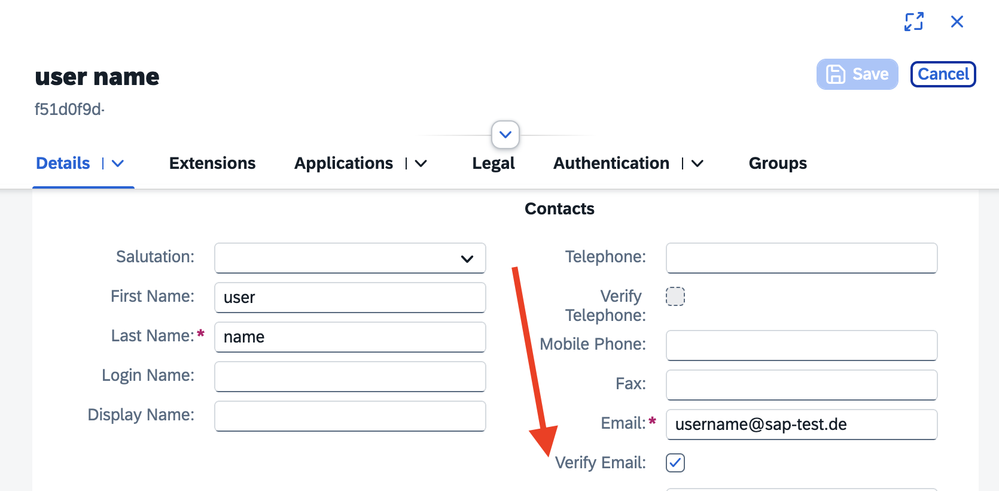
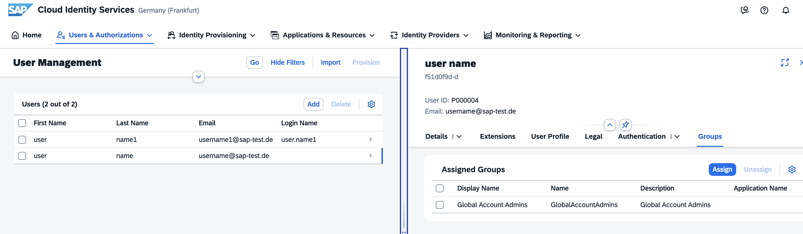
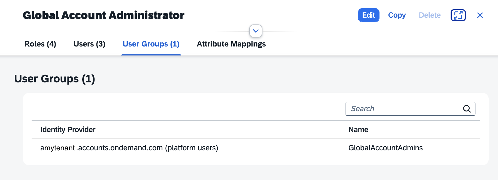

# Managing Authentication and Authorization in a Global Account

This page describes the tasks administrators of SAP BTP must perform to ensure user authentication and assign authorization information to users and user groups.

For more information, see SAP Help Portal, [Security Administration: Managing Authentication and Authorization](https://help.sap.com/docs/btp/sap-business-technology-platform/security-administration-managing-authentication-and-authorization?locale=en-US&version=LATEST).

## Users and Role Collections

### User Account

A **user account** corresponds to a particular user ID in an **identity provider**. The user is always stored in an external identity provider, such as the default identity provider "SAP ID service" or a custom identity provider, such as a SAP Cloud Identity Services custom tenant. 

A username alone doesn't uniquely identify a user account, since users with the same username can exist across different identity providers. A specific user is identified by the combination of user name and identity provider. Different user accounts can have different assigned role collections and, therefore, different authorizations. 

For example, if you have the same user ID in the default and the custom identity provider, you determine which user account is used by selecting the identity provider for authentication.

For more information, see [SAP Help Portal - Working with Users](https://help.sap.com/docs/btp/sap-business-technology-platform/working-with-users?locale=en-US&version=LATEST).

### Role Collections

SAP BTP provides a set of role collections to establish administrator access to your global account and its subaccounts.

Role collections group individual roles. Roles grant authorizations for resources and services. Your administrators assign these role collections to other users to create new administrators. 

Role collections can be assigned to users or "user groups". User groups can only be assigned to users of a custom identity provider.

Role collections are account-specific. Role collections that exist in the global account don’t exist in the subaccounts. 

In a new Global Account, you just have 2 Role Collections:

- Global account administrator and
- Global account viewer

Note: As a Global Account Administrator, you can also add yourself to Subaccounts.

For more information, see [SAP Help Portal - Working with Role Collections](https://help.sap.com/docs/btp/sap-business-technology-platform/working-with-role-collections?locale=en-US&version=LATEST).

## Default Identity Provider

The "SAP ID service" is the default identity provider for SAP BTP. You can start using it without further configuration. The default identity provider will work independently from your custom identity provider. 

You have to add ("Create") users from the default identity provider individually in the SAP BTP global account and assign role collections.

Optional: Log in to [SAP ID service](https://account.sap.com/sam/landing) and check your user account and credentials in SAP ID Service.

   

For more information, see [SAP Help Portal - Default Identity Provider](https://help.sap.com/docs/btp/sap-business-technology-platform/default-identity-provider?locale=en-US&version=LATEST).

### Add additional Global Account Administrators using Default Identity Provider

Using the default identity provider, you can only add Email IDs with an SAP Account as Global Account Administrators.

For example, S-Users can authenticate with the SAP ID service, which is the default identity provider for SAP BTP. You can start using it without further configuration. 

1. Choose your global account to which you want to add members.

2. In the navigation area, choose "Security" --> "Users".

3. Choose "Create".

   

4. Enter the e-mail address, and choose the default identity provider. Ensure that the Email ID is associated with an S-user.

   Choose "Create".

   

6. Click on the new user. In the detail window, click on "Role Collections" and "Assign Role Collections".

7. Add the required role, "Global Account Administrator" or "Global Account Viewer". 

   

You can delete users provided by the default identity provider, but you cannot delete the default identity provider itself. It will work independently of your custom identity provider.

For more information, see [SAP Help Portal - Add Members to Your Global Account](https://help.sap.com/docs/btp/sap-business-technology-platform/add-members-to-your-global-account) and the Knowledge Base Article 2669325 (requires authentication in SAP for Me) [How to add a user as a SAP Business Technology Platform Global Account Administrator](https://me.sap.com/notes/2669325).

 

## Custom Identity Provider for your Global Account

SAP recommends that you use a custom tenant of SAP Cloud Identity Services. Using SAP Cloud Identity Services eases integration with other SAP solutions. You can also use SAP Cloud Identity Services as a proxy to your corporate identity provider.

SAP Cloud Identity Services are a set of services within the SAP Business Technology Platform (SAP BTP) that enable you to integrate identity and access management across systems. The goal is to provide a seamless single sign-on experience across systems while ensuring secure, protected system and data access. 

SAP Cloud Identity Services include Identity Authentication, Identity Provisioning, Identity Directory, and Authorization Management.

For more information about Cloud Identity Services, see [SAP Help Portal - What Are Cloud Identity Services?](https://help.sap.com/docs/cloud-identity-services/cloud-identity-services/what-is-identity-authentication?locale=en-US&version=LATEST)

### Locate your Cloud Identity Services

Locate your Cloud Identity Services custom tenant in your System Landscape, or refer to the "Activation Information for SAP Cloud Identity Services" email if your user account was set up by an administrator. 

1. Locate your CIS in System Landscape.

   

   If you do not have or find a Cloud Identity Services tenant, see SAP Help Portal [Get Your Tenant](https://help.sap.com/docs/cloud-identity-services/cloud-identity-services/get-your-tenant?locale=en-US&version=LATEST).

2. Click the System URL or email link to access your user profile. The URL should be sth. like https://abcd0efgh.accounts.ondemand.com/.

      

3. If you are a tenant administrator, you can access the admin UI by adding /admin: https://abcd0efgh.accounts.ondemand.com/admin.

      

 

### Establish Trust and Federation of Custom Identity Providers for Platform Users

You can establish trust between your Global Account and your Cloud Identity Services (CIS) in your Global Account.

>Note: If you establish trust on the Global Account level, Cloud Identity Services will provide the users of your CIS tenant as so-called **Platform Users** on all levels, global account, directories (if you have one), multi-environment subaccounts, and Cloud Foundry environments! 

Platform Users are users who access the BTP "Platform", which means BTP Cockpit or BTP Command Line Interface, usually handling tasks such as entitlement management, environment configuration, and security settings. However, platform user authorizations depend on the assigned role collections. 

Platform users are distinct from **Business Users**, who are assigned on the Subaccount level and use BTP applications.

For more information about Platform Users, see [Platform Users](https://help.sap.com/docs/btp/sap-business-technology-platform/platform-users?locale=en-US&version=LATEST).

#### Procedure

1. Navigate to "Security" --> "Establish Trust".

   

2. Select your cloud identity services tenant you want to use.

   

3. Configure the name for the Customer Identity Provider for Platform Users 

   
   
4. Select the domain you want to use. Default is "accounts.ondemand.com".

   

5. Review your configurations and click "Finish".
   
   

6. On successful completion, you get a success message:

   
   
7. Check the results. You can now create user accounts with users from the customer identity provider.

   

### Manage Platform Users

If you want to access your BTP cockpit with a Platform User from SAP Cloud Identity Services, you must provide BTP the Identity Provider you want to use with the idp parameter.

For example (replace "tenant" with your host name): https://cockpit.btp.cloud.sap/cockpit/?idp=tenant.accounts.ondemand.com

Otherwise, BTP will use the default identity provider: https://accounts.sap.com

#### Optional: Add a User to your Custom Identity Provider

For testing purposes, you can use the sap-test.de domain, for example, `<username>@sap-test.de`. Do not use any other existing or nonexisting domains. Replace username with a value of your choice.

You can add the user to a User Group. In this example, named `GlobalAccountAdmins`. 

1. As a Cloud Identity Services tenant administrator, open your admin UI for the tenant.

2. Open "Users & Authorizations" --> "User Management".

3. "Add" a User. Choose "Set initial password" as you cannot send him an activation email. 

   

4. Click on the new user to edit the details.

   Check "Verify email". Otherwise, CIS might try to verify the dummy email address.

   

5. Assign a User Group. If you assign role collections to this user group in SAP BTP, the user will already have the required authorizations after the first login. 

   

5. Use a new browser.

   Log in with your new user `username@sap-test.de` in your custom identity provider https://tenant.accounts.ondemand.com/ui/protected/profilemanagement (replace `tenant`).

   Change your password. Check your user profile.

   

6. Go to your BTP Cockpit and authenticate with an active Global Account Administrator.

   Navigate to "Security" --> "Role Collections" and select the role collection "Global Account Administrator".

7. Select "User Groups" and add the user group "Global Account Admins" from your CIS tenant to the role collection.

   All users belonging to this user group will now have "Global Account Administrator" authorizations!

   

8. Use a new browser and access your BTP Cockpit with your test user.

   https://cockpit.btp.cloud.sap/cockpit/?idp=tenant.accounts.ondemand.com

9. Check your authorizations. For example, you might add yourself to a Subaccount as Subaccount Administrator.

   

Congratulations!
