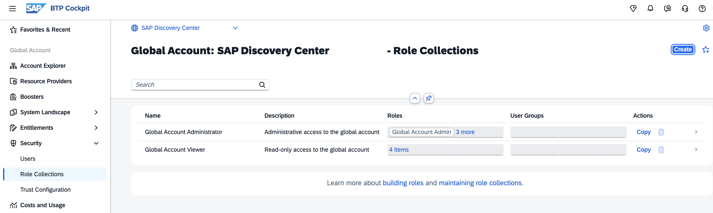
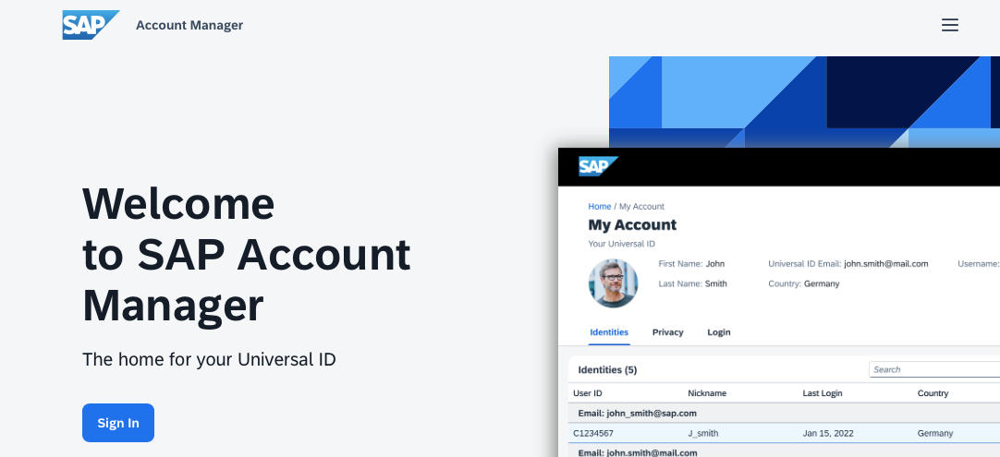
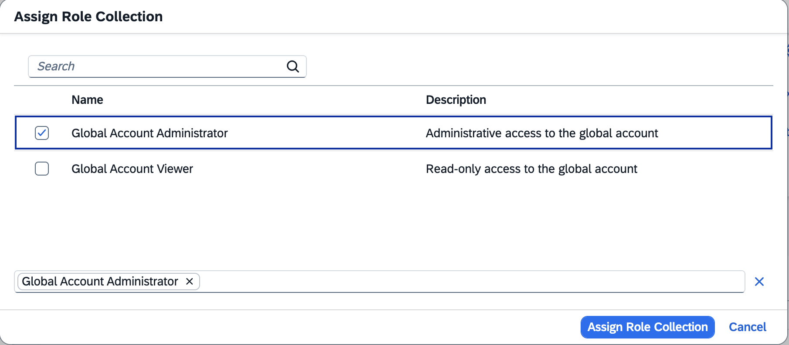

# Global Account Security 

### SAP BTP User Account

A **user account** corresponds to a particular user in an identity provider. The user is always stored in an external identity provider, such as a custom tenant of SAP Cloud Identity Services or the default identity provider. 

A username alone doesn't uniquely identify a user account, since users with the same username can exist across different identity providers. A specific user is identified by the combination of user name and identity provider. Different user accounts can have different assigned role collections and, therefore, different authorizations.

SAP BTP distinguishes between platform users (account management, custom development, and operations) and business users (for the applications).

Users in the Global Account are referred to as **Platform Users**. They are the users who have full access and provide permissions at the global account, directory, or subaccount level. As a Global Account Administrator, you can add additional users to your Global Account. 

**Business users** utilize the applications deployed to a **SAP BTP Subaccount**. For example, the end users of services, such as SAP Build Work Zone, or end users of your custom applications, are business users. 

For more information, see [SAP Help Portal - Working with Users](https://help.sap.com/docs/btp/sap-business-technology-platform/working-with-users?version=LATEST&q=shadow+user&locale=en-US).

### Role Collections

SAP BTP provides a set of role collections to establish administrator access to your global account and its subaccounts.

Role collections group authorizations for resources and services. Your administrators assign these role collections to other platform users to create new administrators. Role collections consist of individual roles. 

Role collections are account-specific. Role collections that exist in the global account don’t exist in the subaccounts. 

In a new Global Account with Subaccount, you just have 2 Role Collections:

- Global account administrator and
- Global account viewer

### Default Identity Provider

All users of SAP BTP are stored in an external identity provider, either in the "default identity provider" or in a custom identity provider, such as a custom tenant of "SAP Cloud Identity Services". 

When a user authenticates, SAP BTP forwards the request to the identity provider. SAP BTP holds a copy of this user (shadow user), and you can assign roles or role collections to this user. You can use the default and a custom identity provider in parallel.

The "SAP ID service" is the default identity provider for SAP BTP. You can start using it without further configuration. The default identity provider will work independently from your custom identity provider. 

Log in to [SAP ID service](https://account.sap.com/sam/landing) and check your user account and credentials in SAP ID Service.

   

### Add additional Global Account Administrators using Default Identity Provider

You can only add Email IDs associated with an S-user as Global Account Administrators.

S-Users can authenticate with the SAP ID service, which is the default identity provider for SAP BTP. You can start using it without further configuration. 

For more information, see [Knowledge Base Article 2669325 - How to add a user as a SAP Business Technology Platform Global Account Administrator](https://me.sap.com/notes/2669325) (requires authentication in SAP for Me).

1. Choose your global account to which you want to add members.

2. In the navigation area, choose "Security" --> "Users".

3. Choose "Create".

   

4. Enter the e-mail address, and choose the default identity provider. Ensure that the Email ID is associated with an S-user.

   Choose "Create".

   

6. Click on the new user. In the detail window, click on "Role Collections" and "Assign Role Collections".

7. Add the required role, "Global Account Administrator" or "Global Account Viewer". 

   

You can delete shadow users provided by the default identity provider, but you cannot delete the default identity provider itself. It will work independently of your custom identity provider.

For more information, see [SAP Help Portal - Add Members to Your Global Account](https://help.sap.com/docs/btp/sap-business-technology-platform/add-members-to-your-global-account).

 

