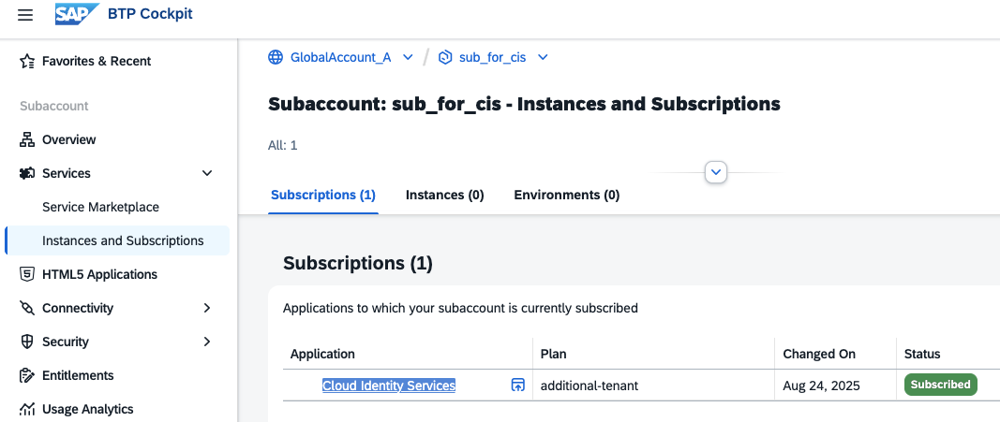

# Prepare SAP Cloud Identity Services 

SAP Cloud Identity Services are a set of services in SAP Business Technology Platform (SAP BTP) that enable you to integrate identity and access management across systems. The goal is to provide a seamless single sign-on experience across systems while ensuring secure access to systems and data. SAP Cloud Identity Services include Identity Authentication, Identity Provisioning, Identity Directory, and Authorization Management.

For more information, see [SAP-Help Portal - What Are Cloud Identity Services?](https://help.sap.com/docs/cloud-identity-services/cloud-identity-services/what-is-identity-authentication?locale=en-US&version=LATEST).

## SAP Cloud Identity Services Tenants

A tenant refers to your instance of SAP Cloud Identity Services (CIS).

A CIS tenant is delivered to you in 2 ways:

 - As a "Public Cloud System" as part of a bundle, a group of preconfigured SAP cloud solutions and Cloud Identity Services, sold together. For more information, see [Bundles](https://help.sap.com/docs/cloud-identity-services/cloud-identity-services/bundles?locale=en-US&version=LATEST).
   You receive an invitation email to your tenants, and you can see them in [SAP for Me](https://me.sap.com/) under "Systems & Provisioning".
   
 - As part of a self-service request, via a subscription in the SAP BTP cockpit.

### Tenant Types

Identity Authentication provides one **productive** and one **test tenant** per customer, regardless of the number of contracts signed that include or bundle Identity Authentication. The productive and test tenants are identical, differing in the naming. The test tenant is also the default identity provider for the test landscape. A customer cannot change the tenant type.

Additional productive or test tenants beyond the initial ones must be purchased separately. 

A **trial tenant** is intended solely for testing purposes. It's free and offers a limited trial period. You have to subscribe to Cloud Identity Services in your SAP BTP Trial Account in order to get one.

For more information, see [SAP-Help Portal - Tenants](https://help.sap.com/docs/cloud-identity-services/cloud-identity-services/tenant-model-and-licensing?locale=en-US&version=LATEST).

https://help.sap.com/docs/cloud-identity-services/cloud-identity-services/get-your-tenant?locale=en-US&version=LATEST

### View Tenants assigned to your Customer ID 

View all your SAP Cloud Identity Services tenants that are assigned to your customer ID.

#### View Tenants in SAP BTP System Landscape

The System Landscape page in the SAP BTP cockpit is the SAP BTP user interface for the Unified Customer Landscape. It lists SAP and third-party systems associated with the specified global account. 

SAP Cloud Identity Services tenants associated with your Customer ID should be "auto-discovered" and added to the system landscape list. For more information, see [Maintaining Unified Customer Landscape](https://help.sap.com/docs/btp/sap-business-technology-platform/maintaining-unified-customer-landscape?locale=en-US&version=LATEST).

#### View Tenants in the SAP CIS Tenants application

1. Access the "SAP Cloud Identity Services - Tenants application" via the following URL:https://iamtenants.accounts.cloud.sap/Information 

2. Sign in with your S-user.   
   Note: If you do not sign in with an S-user, you will get a "HTTP Status 500 - Internal Server Error" response.

3. You can view the Cloud Identity Services tenants that are assigned to your customer ID and their tenant administrators.

#### View Tenants in SAP for Me as Customer IT Contact

As Customer IT Contact, you can view your CIS tenants and tenant administrators in SAP for Me. 

1. Enter [SAP for Me](https://me.sap.com/). From the sidebar, select "Systems & Provisioning" → "Systems" tab. 

2. In the Public Cloud Systems card, filter by Cloud Service and restrict to the service Identity Authentication.  

3. In the System columns, click the system number of an SAP Cloud Identity Services system to enter the system details page for that system.  
   On the system details page, under the General tab, the SAP Cloud Identity Services Administrators card lists the administrators' names and e-mail addresses. With Super Administrator rights, you can also add more administrators here.

### Get a Tenant via Self-Service Request in SAP BTP Cockpit

If no CIS tenant is assigned to your Customer ID, or you want to get an additional tenant, you can request a tenant via Self-Service Request in SAP BTP Cockpit.

The request can be either:

- A subscription of "Cloud Identity Services" in a customer-managed Subaccount with the Service Plan "default", if the default tenant has not yet been provided, or  

- A subscription with the Service Plan "additional-tenant" for one additional tenant per Subaccount. You must be entitled to an additional tenant, or

- A Subscription with Service Plan "trial" for SAP BTP trial accounts.

Choose a Subaccount that you do not plan to delete. Offboarding of your CIS tenant is triggered if the subscription to the Cloud Identity Services is deleted in the SAP BTP cockpit. The tenant will also be deleted if it is no longer in use.

Bundled and self-requested tenants differ in the way you get them; from a technical and functional perspective, they have no differences.

For more information, see [SAP Help Portal - Get Your Tenant](https://help.sap.com/docs/cloud-identity-services/cloud-identity-services/get-your-tenant?locale=en-US&version=LATEST)

### Procedure

1. Access the SAP BTP cockpit and your Subaccount.

2. Choose "Entitlements", search for "cloud identity services". In this example, you are entitled to 
   
   - the "default" service plan.
   - one "additional-tenant" service plan.
   - connectivity (for on-premise systems)

   

3. Optional: If you are entitled on the Global Account level, but not on the Subaccount level, choose "Edit" --> "Add Service Plans" and add the missing service plans for your Subaccount.

4. Navigate to "Services" --> "Instances and Subscriptions".

   Click "Create".

5. In the pop-up dialog, select "Cloud Identity Services" for "Service".

   Select the "Plan" "Subscriptions" --> "default" (or additional-tenant if you already have a default plan).

   Select "Next".

   

6. Choose "PRODUCTIVE" or "TEST". If you are not sure, select "TEST".

    

7. Select "Next", "Review", and "Create". Creating an instance might take a while.

8. Once created, you will receive an onboarding email to set the password for your user. 

   You can now access the CIS admin UI from your Subaccount Subscription.

    

