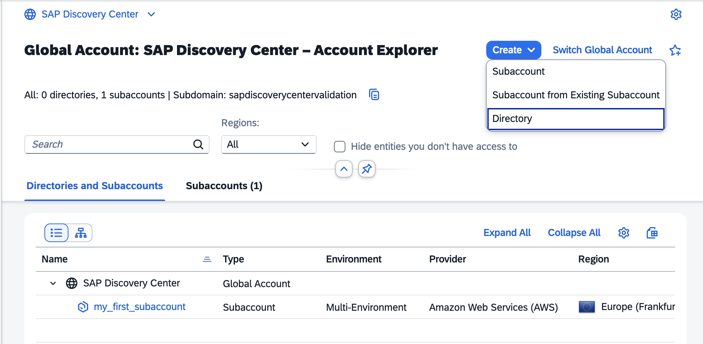
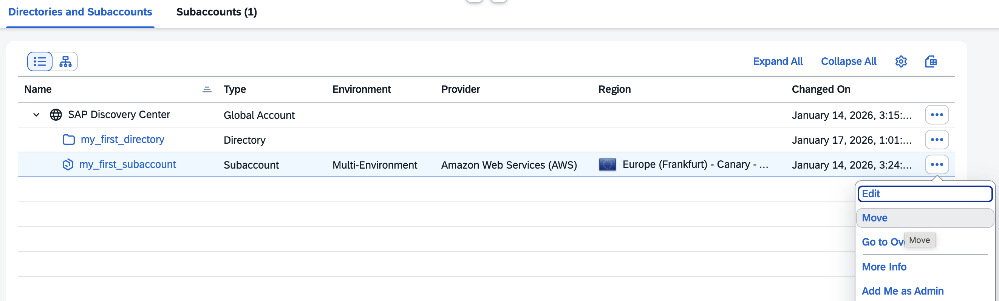
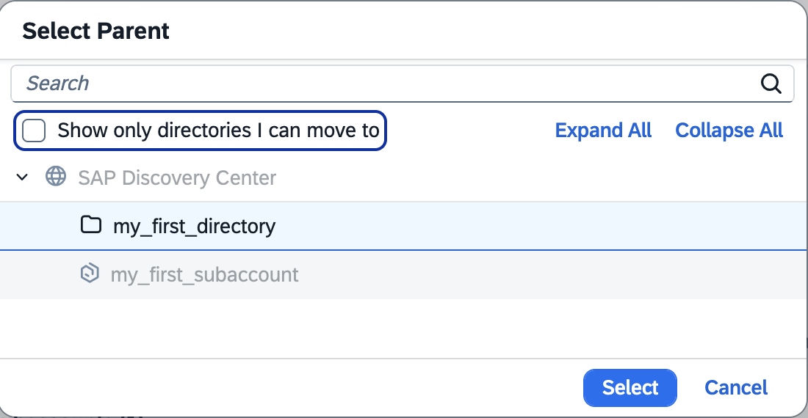
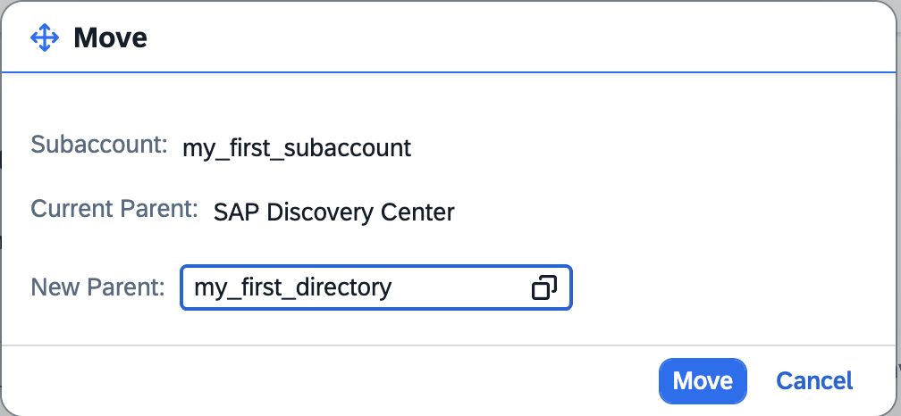
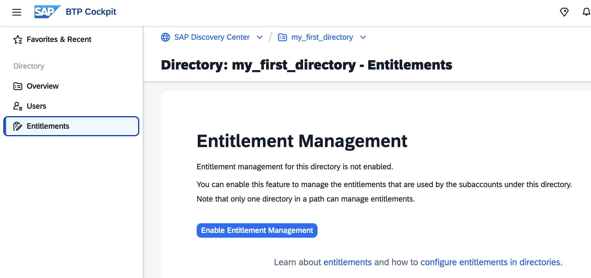

# Optional: Managing Directories Using the Cockpit

You can organize and manage your subaccounts according to your technical and business needs by using directories in the SAP BTP cockpit.

Creating directories can be useful if you have to manage a large set of Subaccounts and you want to structure them, or you want to assign "Directory Administrators", who manage the entitlements of the Subaccounts, while the Global Account Administrators distribute the entitlements only on the directory level.

You can also delete directories if no longer needed.

### Procedure

In your global account, navigate to the Account Explorer page.

1. In the Create dropdown, choose Directory.
 
   You can also select the `...` Actions menu button of your global account to create a directory.

   

2. In the Create Directory dialog box, enter a display name for your new directory, for example `my_first_directory`.  
   Choose a parent, either your global account or another directory.

   Optional: Under Advanced --> Labels, you can assign labels to the directory for filtering directories. Subaccounts in this directory's path also inherit these labels. You can also add labels later.
   
   Optional: You can enable entitlement and user management for the directory and its subaccounts. Leave empty for now; you can enable both after creating the directory.

   

3. Review the details of your directory and choose Create to finalize the process. Your directory will be created.

#### Add a subaccount to the directory.

You can manage your Account Explorer Hierarchy by adding subaccounts to the directory. This can be useful if you have to manage a larger set of Subaccounts.

1. in the `...` Action menu of your Subaccount, click "Move".

   

2. Select your directory.

   

3. Select your Subaccount and select your new parent - your directory.

   Click "Move".

   

4. As a result, the Subaccount has now moved under the directory.

   

### Optional: Managed Directory

#### Enable Entitlement Management (Managed Directory)

With this feature, you can manage and assign entitlements on the directory level. 

<!--   -->

Services, which are [Always Free](https://discovery-center.cloud.sap/servicessearch/Always%20Free?showFilters=true&regions=all), are auto-assigned to the directory and the directory's Subaccounts.

Enabling entitlement management for a directory that already contains subaccounts will automatically assign any existing assignments and quotas (for the subaccounts) to the directory.

All other services, service plans, and service-plan quotas can only be consumed by the directory's Subaccounts if you assign them from your Global Account to the directory first. 

This picture shows a Global Account with an entity assignment to a test directory and a test subaccount.

The commercial model of the Global Account is "Subscription", so some Cloud Foundry Service Plans require quota. Note: The limit of quota in the directory is the maximum that the directory's Subaccounts are allowed to consume.

Note: You can enable entitlements only for one directory in a path. Hence, directory entitlement management will not be allowed for other directories below or above this directory.

If you don't enable this feature, the subaccounts assigned to this directory inherit the entitlements and quotas from the global account.

You can also turn off the Entitlement Management feature if it is no longer needed.

### Optional: Enable User Management (Managed Directory)

>Note: The user management feature can be enabled only in combination with the entitlement management feature on the same directory.

You can only add Platform Users. You can assign the role collections "Directory Administrator" or "Directory Viewer" to the directory user

If you don't enable this feature, all Global Account Administrators can manage the directory.

Note: Only one directory in a path can manage users and entitlements. Hence, directory user management and entitlements management will not be allowed below or above this directory.

You can also disable the User Management feature if no longer needed.

### Delete a directory

You can only delete a directory that does not contain any subaccounts or subdirectories.
