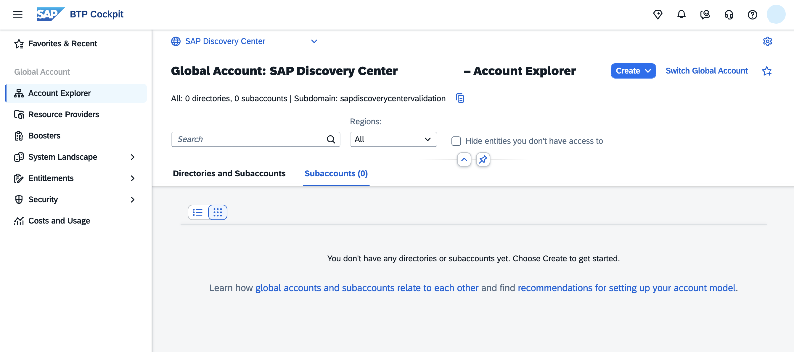
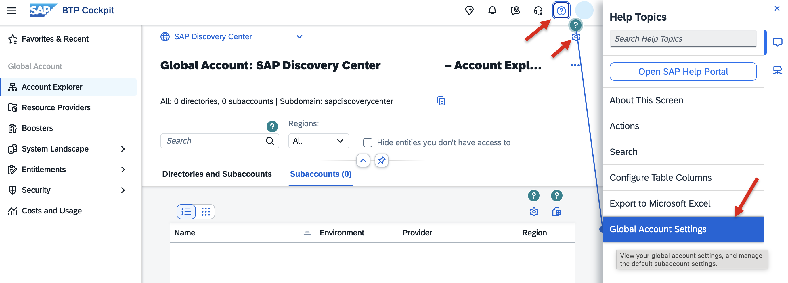
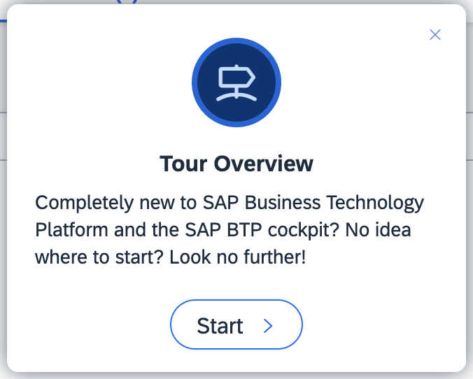
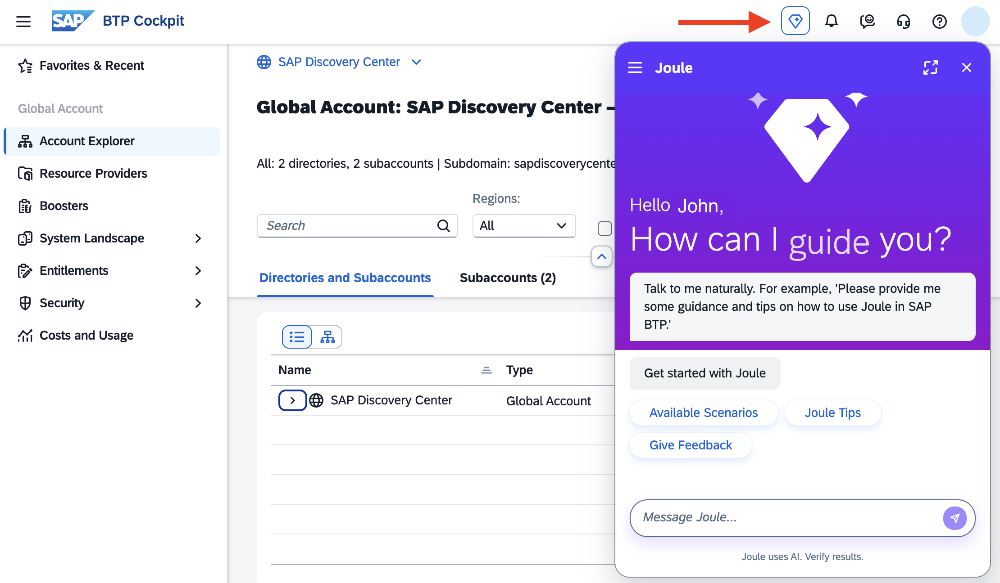
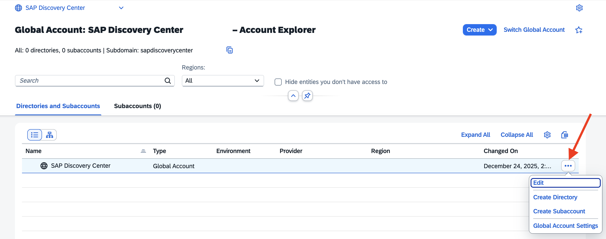
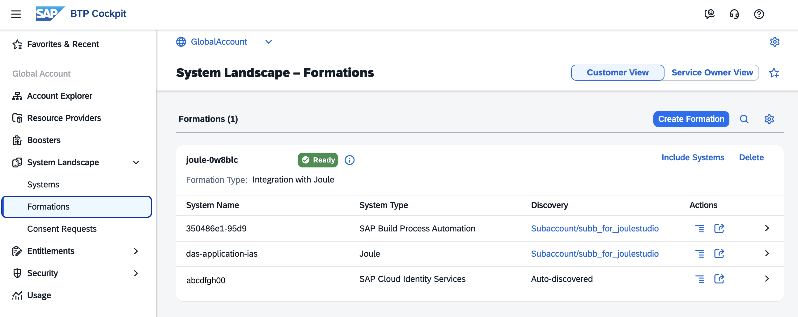
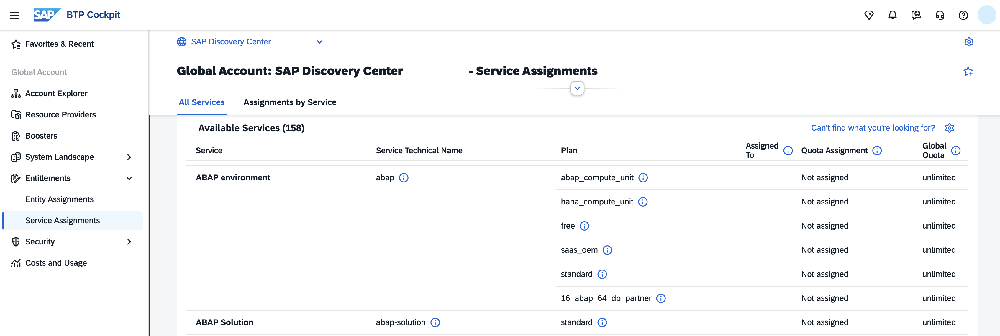

# Manage your SAP BTP Global Account

A SAP BTP global account is used to manage global account members, subaccounts, resources, entitlements, and quotas. 

## Access your SAP BTP Cockpit

SAP BTP cockpit is the central Web-based user interface for administrators. Use the cockpit to manage resources, services, security, and perform actions on cloud applications.

The highest level displayed in the SAP BTP cockpit is your global account. 

Navigate to https://cockpit.btp.cloud.sap to access the cockpit. Depending on your geographic location, this URL redirects you to the closest regional cockpit URL.

When you have only one Global Account, logging in automatically directs you to your Global Account and the Account Explorer page.

When you have multiple Global Accounts, a pop-up appears that lets you select your Global Account first.

Depending on your geographic location, you can also choose one of the following gateways to access your SAP BTP cockpit. These gateways only define where you access the cockpit from. They don't restrict access to resources running in other regions in any way:

- Americas: https://amer.cockpit.btp.cloud.sap
- Asia-Pacific, Oceania: https://apac.cockpit.btp.cloud.sap
- Europe, Middle-East, Africa: https://emea.cockpit.btp.cloud.sap
- EU-Access: https://eu-access.cockpit.btp.cloud.sap (restricts processing of personal data to EEA/Switzerland)

After a successful login, you will be directed to your global account home page in the SAP BTP Cockpit.

For more information about your **SAP BTP Cockpit** of your Global Account, see SAP blog [SAP BTP Cockpit – Global Account Technical Overview](https://blogs.sap.com/2022/01/04/sap-btp-onboarding-series-sap-btp-cockpit-global-account-technical-overview/).

### Open Context Help for the Cockpit

"Get Help" offers context-aware help for the current Cockpit page.

#### Help Topics

1. Click on the small question mark icon. The context-aware "Help Topics" open. 

2. Stay on "Help Topics". Click on "Global Account Settings".  
   It shows you where you find the "Settings" icon.

   

3. Optional: Try out other Cockpit pages and their Help Topics.

#### Guided Tours

1. Click on the second tab (Guided Tours) of the Help screen.

   

2. Click on "Getting Started". A short Guided Tour starts. Click through the steps and take your tour.

   

3. Optional: Try out other Cockpit pages and their Guided Tours.

### Enable Joule in SAP BTP Cockpit

1. Open "Global Account Settings" in Cockpit.

2. Have a look at "General" Information about your account.

3. Click "Joule". Activate Joule and save.

   

4. You can now open Joule in your Cockpit by clicking the small diamond icon in your Cockpit.

   

## Managing Global Accounts using the Cockpit

### Account Explorer

In the Account Explorer, you can create and manage Subaccounts and Directories. 

A global account can contain one or more subaccounts. Subaccounts in a global account are independent of each other. 

In subaccounts, you deploy applications, use services, and manage your subscriptions. You can use them to manage members, authorizations, and entitlements.

With directories, you can organize and manage your subaccounts according to your technical and business needs.

A directory can contain other directories and subaccounts to create a hierarchical structure. Using directories to group other directories and subaccounts is **optional**.

#### Change the Display Name of your Global Account

Global account administrators can change the global account name in the Account Explorer.

1. In the Account Explorer view, click on Directories and Subaccounts, select the table view, and then select the global account for which you'd like to change the display name and select the "Edit" pencil on its tile towards the right of the screen.

2. A new dialog shows up with the mandatory Display Name field that is to be changed.

3. Enter your name and save your changes.

   

### Resource Providers

SAP BTP allows you to connect your global account in the SAP BTP cockpit to your provider account from a non-SAP cloud vendor, and consume remote service resources that you already own and which are supported by SAP through this channel.

For more information, see [SAP Help Portal - Managing Resource Providers](https://help.sap.com/docs/btp/sap-business-technology-platform/managing-resource-providers?locale=en-US&version=LATEST)

### Boosters

Boosters are multi-step forms (also known as wizards) that enable you to activate and consume services on SAP BTP. Using a booster eases the setup of BTP services compared to manual subscription and configuration.

You can access them directly from your global account in the SAP BTP cockpit by choosing Boosters in the navigation menu. 

Click on a booster to see what this booster can set up for you. Check the tabs "Overview", "Components", and "Additional Resources".

You will execute a booster later in this mission.

 

### System Landscape

The **Unified Customer Landscape** service provides capabilities for automated integration and extensibility of SAP and third-party systems. You maintain your Unified Customer Landscape service with the **System Landscape** page in the SAP BTP cockpit.

The System Landscape page of the SAP BTP cockpit provides a visual overview of the SAP and third-party systems associated with the specified global account. 

For more information, see [SAP Help Portal - Maintaining Unified Customer Landscape](https://help.sap.com/docs/btp/sap-business-technology-platform/maintaining-unified-customer-landscape?locale=en-US&version=LATEST) 

#### Systems

There are different ways to add systems in the "Systems" page: manually or automatically. If a system of your solution is associated with your global account or through a subscription in a subaccount, it will appear in the list automatically. Otherwise, you have to add your system manually. 

Systems are added to the list in one of the following ways:

 - Auto-Discovered

   Any SAP system of the supported system types associated with the same customer ID as your global account in SAP BTP will be automatically added to the system landscape list.

- Subaccount/(your-subaccount-name)

  The subscription has been discovered and automatically added to the subaccount.

- Manually-Added
  
  Specifies that the system has been manually added to the list by the global account administrator using the Add System button and completing the wizard. 

One system is significant for this mission: Your Cloud Identity Services tenant. You will need it to set up an Identity Provider. If you do not have one, you can create one later in this mission.

 

#### Formations

Formations enable you to combine "Systems", simplifying connectivity setup and providing a unified view of all components required for implementing your integration or extension scenario. 

For example, setting up "Joule Studio" requires a Formation Type "Integration with Joule" the "Systems" "Joule", "SAP Build Process Automation", and "Cloud Identity Services".

You will create a formation later in this mission.

For more information, see [SAP Help Portal - Integrating SAP Solutions](https://help.sap.com/docs/btp/sap-business-technology-platform/integrating-sap-solutions?locale=en-US&version=LATEST) 

 

### Check your Entitlements in your Global Account

When you purchase an enterprise account, you are entitled to use a specific set of resources.

An **entitlement** is your right to provision and consume a resource. In other words, entitlements are the **service plans** that you're entitled to use.

The entitlements that are available in your enterprise account are determined by the commercial model used by your global account:

- In the consumption-based commercial model, your organization buys an entitlement to all current and future SAP BTP services eligible under this model.
- In the subscription-based commercial model, your organization is authorized to use only the services you have subscribed to, as per your commercial agreement. 

#### Procedure

In the SAP BTP cockpit global account, navigate to "Entitlements" --> "Service Assignments".

- **Service** shows available BTP Services in your global account, which you can assign in Subaccounts. You can look up all available services and solutions in the [SAP Discovery Center - Services](https://discovery-center.cloud.sap/serviceCatalog?showFilters=true&regions=all).

- **Service Technical Name** shows the technical name.

- **Plan** shows the available service plans, your entitlements, you may consume. The service plan determines the cost of consumption. You can estimate your costs at [SAP Discovery Center - Estimator](https://discovery-center.cloud.sap/estimator/?commercialModel=btpea).

  The default commercial model in the estimator is "BTPEA". You can change it if you want to use a different model.

- **Assigned To** shows the entities to which you have assigned the service. Typically, the Subaccounts, where you consume the service.

- **Global Quota** is either "unlimited" or limited. If it is limited, the Global Quota displays the number of units available to the global account.

- **Quota Assignment** is either "Not Assigned" or "Assigned". If the global quota of a service is limited, it indicates how much of this quota has already been assigned to Subaccounts and consumed.

  This figure illustrates an example of a subscription-based commercial model with a limited amount of memory allocated for the Cloud Foundry Runtime.

   

 

### Security

See the next chapter.

 

### Cost and Usage

SAP BTP cockpit supports advanced usage and cost monitoring of services in your global account. You can compare usage and costs across multiple services and subaccounts, view monthly trends, and drill down into subaccounts and service plans for detailed information.

For more information, see [SAP Help Portal - Monitoring Usage and Consumption Costs in Your Global Account](https://help.sap.com/docs/btp/sap-business-technology-platform/monitoring-usage-and-consumption-costs-in-your-global-account?locale=en-US&version=LATEST)

 
