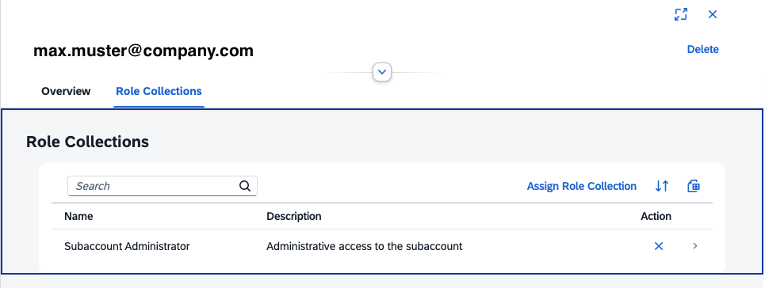

# Create a Cloud Foundry Subaccount

This part of the mission, "Get Started with SAP BTP Enterprise Account," guides you through the first steps to create your first Subaccount in your SAP BTP Global Enterprise Account and perform the initial configurations.

You need at least one subaccount in an SAP BTP Global Account to run your BTP services. 

If you have already created one subaccount using a booster, you can create a second manually. You can delete subaccounts that you no longer need.

### Create a Subaccount manually

When creating a new Subaccount, you must make fundamental decisions regarding the Hosting region, Naming conventions, Account Model, Labels, Authorizations, and other settings.

For more information about creating subaccounts, read the blog - [SAP BTP Cockpit – Global Account Technical Overview](https://blogs.sap.com/2022/01/04/sap-btp-onboarding-series-sap-btp-cockpit-global-account-technical-overview/) - section 3. If you want to learn more about account models and directories, read - [How to Determine your Account Model](https://blogs.sap.com/2021/12/17/sap-btp-onboarding-series-how-to-determine-your-account-model/).

#### Procedure

Prerequisites: You are a global account administrator.

Open SAP BTP Cockpit in your Global Account.

1. Navigate to "Account Explorer". Click the "Create" drop-down button, then select "Subaccount."
  
    

2. Specify a Subaccount name and a Subdomain name. 

   This will be part of the URL used to access the applications you subscribe to from this subaccount.
   The subdomain name must be unique across all subaccounts in the same region. 

3. Select the region (which also determines the infrastructure provider). 

4. Select a parent for your subaccount. The parent can either be the global account or a directory.

5. Optional: Specify a description, labels for search, and enable beta features.

   Check "Used for Production" only if you use the Subaccount for production purposes.

5. Select "Create". The Subaccount will be created. Enter your Subaccount.

    

   
5. A new tile appears on the Global Account page with the subaccount details. 

   Click on it and enter your Subaccount.

6. Check the Subaccount Overview page: "General", "Cloud Foundry Environment" (should be disabled), and "Entitlements" of the Subaccount.

    Note, the new subaccount is already entitled to a set of "Always Free" services, plus "Cloud Foundry Runtime".

For more information, see SAP Help Portal, [Create a Subaccount](https://help.sap.com/docs/btp/sap-business-technology-platform/create-subaccount). 

#### Check your Subaccount Administrator

1. In your Subaccount, navigate to "Security" --> "Users". 

2. You should be added as the first Subaccount User with the Default Identity Provider.

    

3. Click on it. You should have assigned the Subaccount Administrator role collection.

    

4. Optional: Add additional Subaccount Administrator.

### Enable Cloud Foundry Environment

After you have created your subaccount, you can enable Cloud Foundry capabilities. Runtimes can be either Cloud Foundry, Kyma, or ABAP. 

This tutorial enables the **Cloud Foundry runtime**. Guides for the other runtimes can be found in dedicated tutorials or missions.

#### Prerequisites

- You’re a subaccount administrator.
- You have a free Cloud Foundry quota assigned to your subaccount.

    

#### Procedure

1. Open your BTP Cockpit and enter your Subaccount.

2. Select **Cloud Foundry Environment** in the tab navigation.
  
   Check the "Enable Cloud Foundry" button.
   
    

3. A form opens. Keep the preconfigured values or change the following entries: 

    - **Plan**: One of the Service Plans you are entitled to (for this environment, you cannot change it)
    - **Instance Name**: Consider a CLI-friendly name 
    - **Org Name**: Each Cloud Foundry environment has exactly one "Organization".
   
    

6. Choose "Create".

7. The Cloud Foundry Environment will be created. Check your CF API endpoint.

8. Click on "Create Space".

    

9. Provide a Space Name. Typically, choose "dev" or "test".

    Assign yourself as Space Developer and Space Manager.

    

8. Refresh your browser, and you will see a new navigation entry "Cloud Foundry". Browse the navigation entries "Spaces", "Quotas", and "Org Members".  
    

Congratulations, you now have a configured Cloud Foundry Environment.

For more information, see [SAP Help Portal - Administration and Operations in the Cloud Foundry Environment](https://help.sap.com/docs/btp/sap-business-technology-platform/administration-and-operations-in-cloud-foundry-environment?locale=en-US&version=LATEST).

### Add Members to Subaccount

The default identity provider and application identity provider of SAP BTP is the **SAP ID service**. Trust that the SAP ID service in your subaccount is pre-configured by default, so you can start using it without further configuration. For more information about SAP ID Service, see [SAP Help Portal](https://help.sap.com/docs/BTP/65de2977205c403bbc107264b8eccf4b/default-identity-provider?locale=en-US).

For more information on how to establish trust with your custom identity provider, start the Discovery Center mission [Establish single sign-on to your cloud solutions](https://discovery-center.cloud.sap/missiondetail/3114/3151/).

#### Users

If you want to grant authorizations to users from the SAP ID service in your subaccount, you must ensure that they have a user account in the SAP ID service.

For more information, see [Working with Users](https://help.sap.com/docs/btp/sap-business-technology-platform/working-with-users). 

#### Roles and Role Collections

Roles determine which functions in the cockpit users can view and access, and which actions they can initiate.

SAP BTP offers predefined "Role Collections", which are sufficient for this mission.

For more information, see [Working with Role Collections](https://help.sap.com/docs/btp/sap-business-technology-platform/working-with-role-collections). 

#### Procedure

1. Open the SAP BTP cockpit.

2. Choose the subaccount to which you'd like to add users.

3. In the navigation pane, choose "Security" and then "Users".

4. All members currently assigned to the subaccount are shown in a list.

5. Choose `Create`.

6. Enter the user ID and e-mail address.

7. Choose the identity provider where the user is stored. The dropdown list displays the identity providers configured in your subaccount's trust configuration.

8. `Save` your changes.

You can now proceed to assign role collections to the new user. Browse the list of available Role Collections by clicking on "Role Collections".

### Delete a Subaccount

If you want to delete your subaccount, e.g., because it was a test or sandbox subaccount, you can delete unused subaccounts.

>**Note:** Only subaccount administrators can remove such content from a subaccount.

#### Procedure

1. Log in to SAP BTP Cockpit.
2. Choose the subaccount that you want to delete.
3. The subaccount doesn't contain any active subscriptions, service instances, brokers, or platforms.
4. Choose `Delete Subaccount` and confirm the operation.
