# Integrate and Extend SAP Solutions using Unified Customer Landscape

The **Unified Customer Landscape** service provides capabilities for automated integration and extensibility of SAP and third-party systems.

You maintain your Unified Customer Landscape service with the **System Landscape** page in the SAP BTP cockpit.

You can integrate several **systems** and **services** into a common business scenario. To do that, you create a **formation** in the SAP BTP cockpit that includes all systems required by the scenario. Every formation has a **formation type** related to its purpose. Using formations is a standard way to enable communication between systems.

For more information about maintaining your Unified Customer Landscape and extensibility and integration concepts, see [SAP Help Portal - Extensions](https://help.sap.com/docs/btp/sap-business-technology-platform/btp-extensions?version=LATEST&ai=true&locale=en-US). 

## Maintain your System Landscape

Access your Unified Customer Landscape via the **System Landscape** page in the SAP BTP cockpit. The System Landscape page of the SAP BTP cockpit provides a visual overview of the SAP and third-party systems associated with the specified global account. 

For more information, see [SAP Help Portal - Maintaining Unified Customer Landscape](https://help.sap.com/docs/btp/sap-business-technology-platform/maintaining-unified-customer-landscape?locale=en-US&version=LATEST) 

### Systems

There are different ways to add systems in the "Systems" page: manually or automatically. If a system of your solution is associated with your global account or through a subscription in a subaccount, it will appear in the list automatically. Otherwise, you have to add your system manually. 

Systems are added to the list in one of the following ways:

 - Auto-Discovered

   Any SAP system of the supported system types associated with the same customer ID as your global account in SAP BTP will be automatically added to the system landscape list.

- Subaccount/(your-subaccount-name)

  The subscription has been discovered and automatically added to the subaccount.

- Manually-Added
  
  Specifies that the system has been manually added to the list by the global account administrator using the Add System button and completing the wizard. 

One system is significant for this mission: Your Cloud Identity Services tenant. You will need it to set up an Identity Provider. If you do not have one, you can create one later in this mission.

#### Example: Register a S/4HANA Cloud System

If a System, for example, an S/4HANA Cloud system, is missing, you can add it manually. Use this procedure to trigger the registration process for an SAP S/4HANA Cloud system that you want to pair with your global account in SAP BTP.

1. Open BTP Cockpit and navigate to "System Landscape" --> "Systems" and click "Add".

2. In the pop-up window, select your "System Type", e.g., "SAP S/4HANA cloud", and provide a "System Name" and click "Add".

   

3. After the System has been added, a pop-up opens. Select "All Communication Scenarios".

    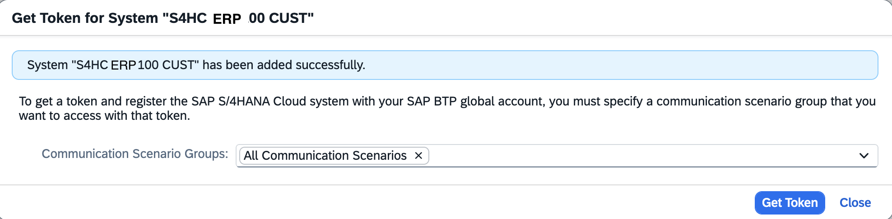

4. Select "Get Token". The token will be generated.

    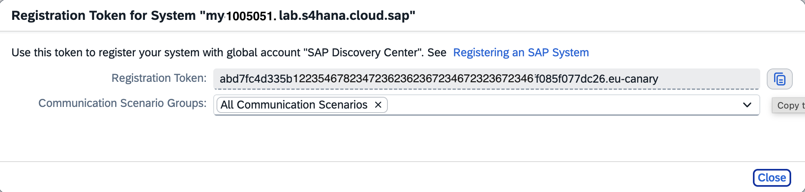

5. Optional: If the System was auto-discovered, but not yet registered, select the "Get Token" icon.

    

6. In your S/4HANA Cloud system, open the transaction "Maintain Extensions on SAP BTP".

    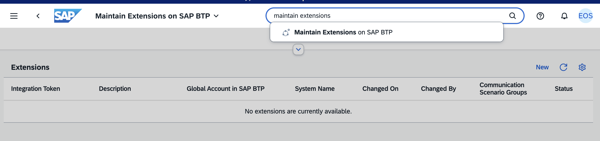

7. Paste the Extension Token from your SAP BTP System Landscape.

    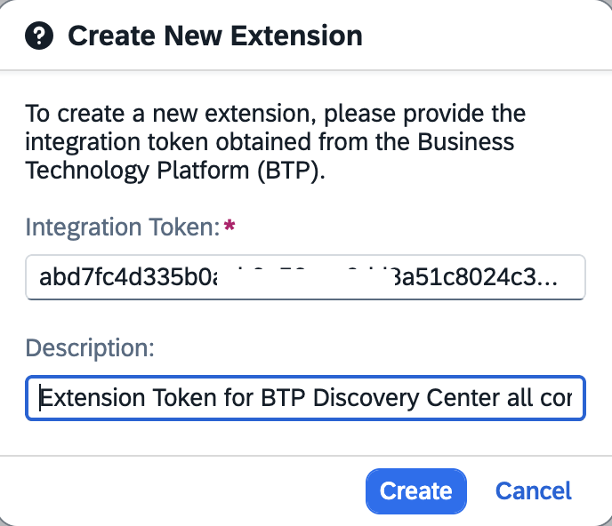

8. Result: Your S/4HANA Cloud system is registered and can be used for all communication scenarios.

    

9. Check the registration in your BTP System.

    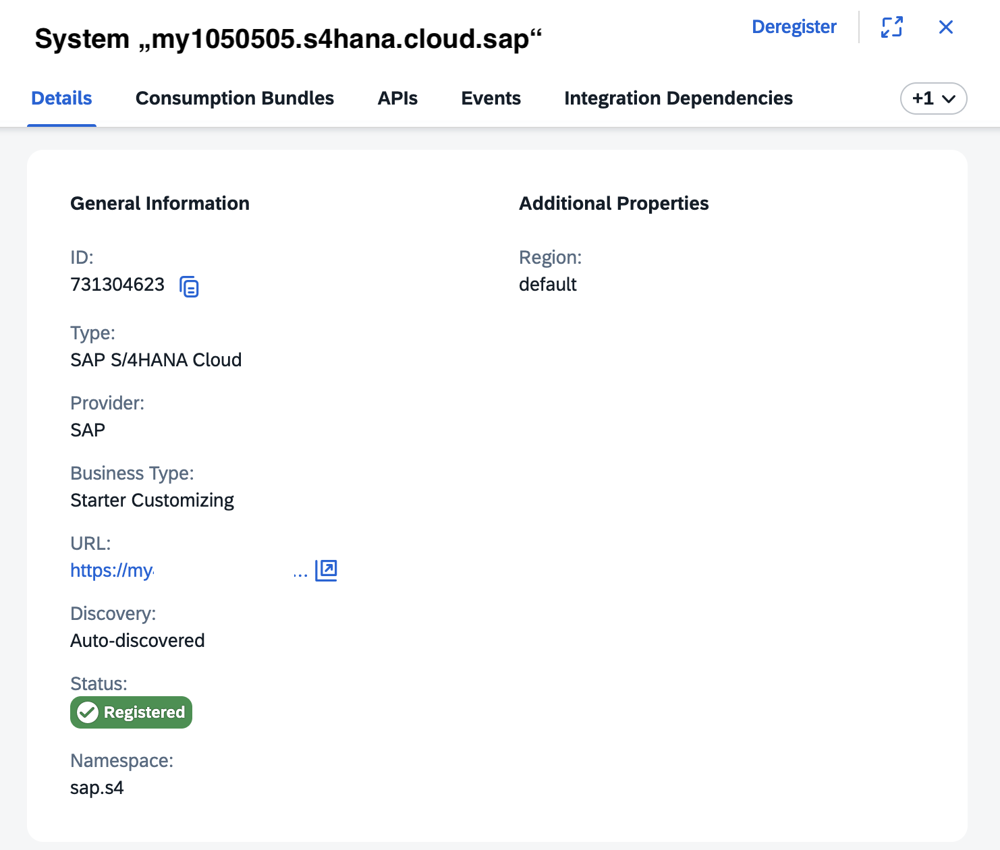

 

#### Optional: Set Up SAP S/4HANA Cloud Extensibility in SAP BTP

You connected your SAP S/4HANA Cloud system to SAP BTP. You want to make this system accessible in a SAP BTP subaccount where you plan to build extension applications.

You configure the entitlements and assign the corresponding quota and service plans to the subaccount.

1. Enter your Global Account. Choose Entitlements → Entity Assignments.

2. Select your subaccount from the value help in the Subaccounts/Directories field.

3. Choose Edit → Add Service Plans.

    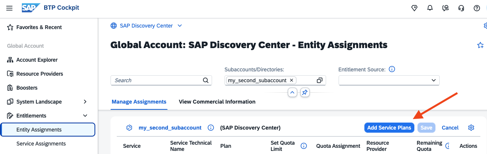

4. In the "Add Service Plans" dialog box, select the service "SAP S/4HANA Cloud Extensibility".

   In the Service Details page, select your S/4HANA Cloud system name from the dropdown list box.

   Select the "api-access" service plan for generic access to SAP S/4HANA Cloud APIs.  
   The "messaging" service plan is for consuming SAP S/4HANA Cloud events and creating event-based extensions using the event bus from SAP Event Mesh Integration.

    

6. Choose Add 1 Service Plans to add the service plan of the SAP S/4HANA Cloud Extensibility service, and do not forget to "Save".

 

### Formations

A formation is a logical grouping of "Systems" from your System Landscape that can be integrated into a business scenario. 

Formations enable you to combine "Systems", simplifying connectivity setup and providing a unified view of all components required for implementing your integration or extension scenario. 

For example, setting up "Joule Studio" requires a Formation Type "Integration with Joule", the "Systems" "Joule", "SAP Build Process Automation", and "Cloud Identity Services".

>Note: Systems included in a Formation must use the same Identity Provider. For example, your S/4HANA Cloud System and your BTP Subaccount for S/4HANA Cloud extensions must use the same IdP.

#### Create a Formation manually

In this example, you create a Formation for "SAP Start". It requires a registered S/4HANA Cloud system and a SAP Build Workzone service (Service Plan standard recommended)in a Subaccount.

1. Open your SAP BTP Cockpit. Navigate to "System Landscape" --> "Formations".  

   Select the Formation Type "SAP Start" and provide a name for the Formation and select "Next".

    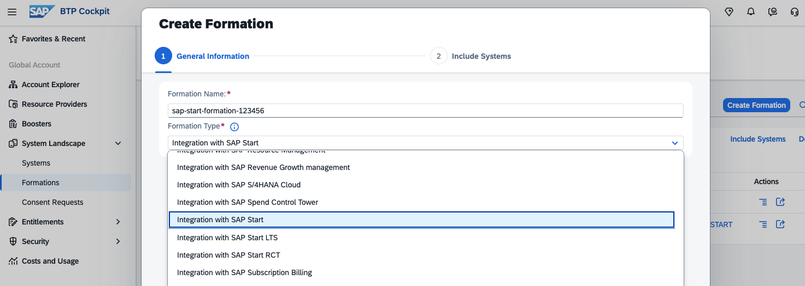

2. Include your S/4HANA System and a SAP Build Work Zone Service from a Subaccount. Both Systems require the same Identity Provider and share user accounts.

    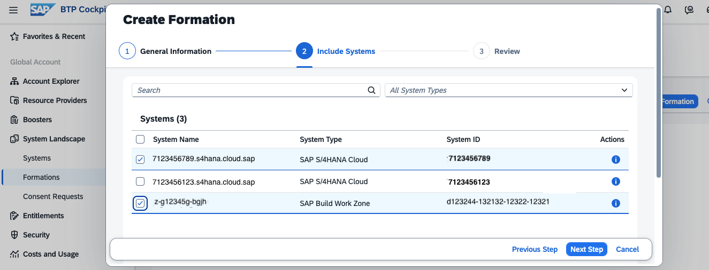

3. Review the settings and choose "Create".

    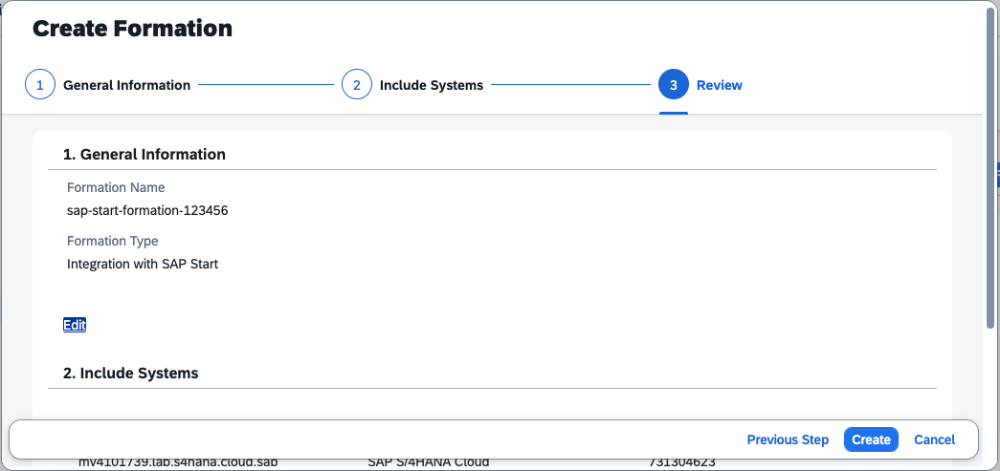

4. The formation is created through "Synchronization". This takes a while.

    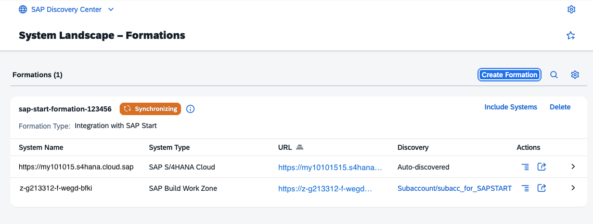

5. Once created, you access SAP Start in your Builde Work Zone subscription. 

   Note: This is just an initial configuration of SAP Start.

    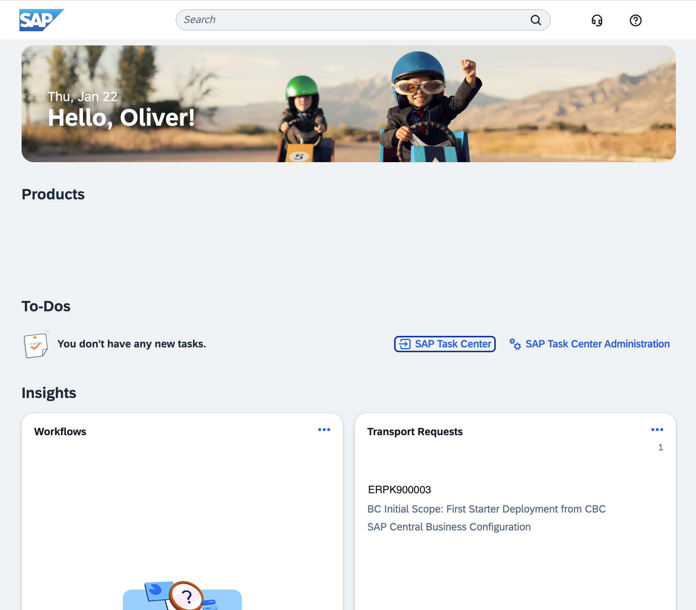

For more information, see [SAP Help Portal - Integrating SAP Solutions](https://help.sap.com/docs/btp/sap-business-technology-platform/integrating-sap-solutions?locale=en-US&version=LATEST) 

 

