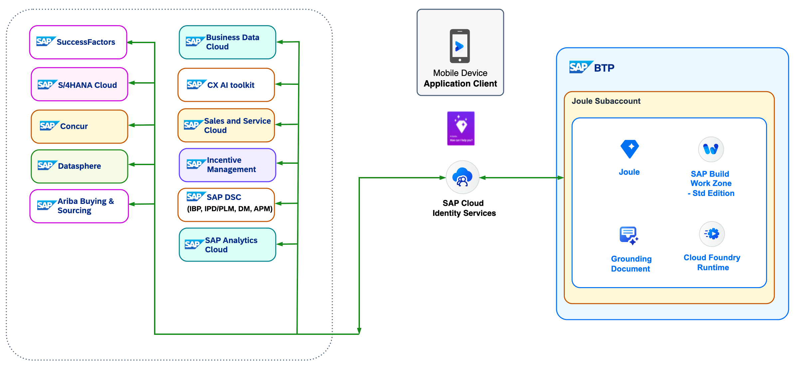

## Joule in SAP Mobile Start Architecture Diagram 

**
 Image 1: Mobile Start Architecture
**

SAP offers a harmonized mobile experience across industries that brings context specific content and real-time process handling to the fingertips of every SAP user. 

SAP Mobile Start is a native mobile app which enables key business capabilities on Apple or Android devices. It serves as a primary access point to all relevant business processes, data, and content on a mobile device. SAP Mobile Start enables you to access your responsive business apps along with other content and critical business information. It could be notifications, consolidated views on tasks, approval workflows, and business information. This allows user to perform the right action at the right moment.

SAP Mobile Start’s persona-centric strategy enables your teams to align content and tools to role specific tasks, promoting accelerated workflow automation and ensuring resilient business processes throughout. 

**Note**: SAP Mobile Start requires internet access to exchange data i.e. it does not work in offline mode. 

Joule is integrated into the SAP Mobile Start app, enabling users with smartphones or tablets to interact with SAP applications in natural language. Since its launch a few years ago, SAP Mobile Start has been designed to provide centralized access to native mobile apps, cloud applications, and tools for decision-making and getting insights. A simple chat with Joule can reveal the latest numbers or allow the human counterpart to intervene directly, using their own words to work on approval or maintenance activities. This integration radically changes how people work with SAP in many areas, from sales applications to human resources and supply chain processes. On iPhone and iPad, customers can use Siri to open and send a first questions to Joule. For example, customers can say, “Hey Siri, ask Joule in SAP Mobile Start.” Siri will respond, and they can ask their question, which is then directly transferred to Joule in SAP Mobile Start. 
