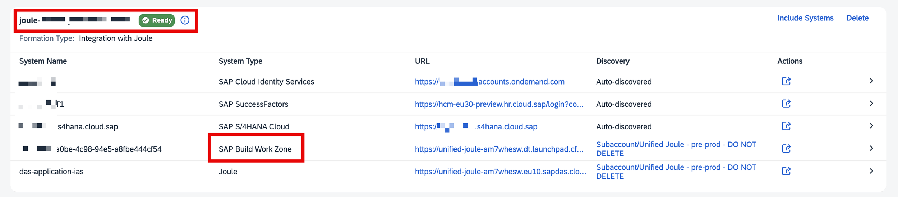

## Prerequisites

Make sure all the system prerequisites are met.

- SAP Business Technology Platform subscription and tenant (will be provided by SAP)
- Subscription of SAP Build Work Zone
- SAP Cloud application license in which Joule is available
- Joule instance connected to business systems
- SAP Cloud Identity Services

## SAP Build Work Zone, Standard Edition – Foundation plan 
### Pre-requisites: 

- If you have Joule instance, make sure to have Work Zone as a part of it. 

- If Joule instance is not there, please follow the steps given <a href="https://discovery-center.cloud.sap/missiondetail/4538/4826/?tab=projectboard">here</a>. 

- When setting up the booster, choose **SAP Build Work Zone, standard edition**(Select Integration & capabilities).

- If you skipped this, go to the SAP Business Technology Platform dashboard, locate **Systems**, select **Formations**, search for the formation name, and add the **SAP Build Work Zone, standard edition** to the subaccount.

Before starting, ensure your SAP Build Work Zone formation is listed below. If it's missing, click **Include Systems**, select your **SAP Build Work Zone**, and add it to the list.

**
 Image 1 
**