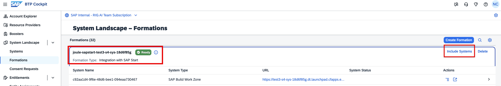
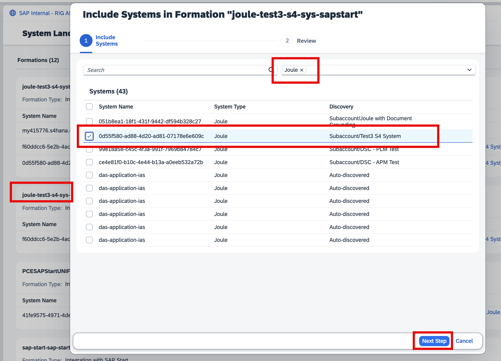
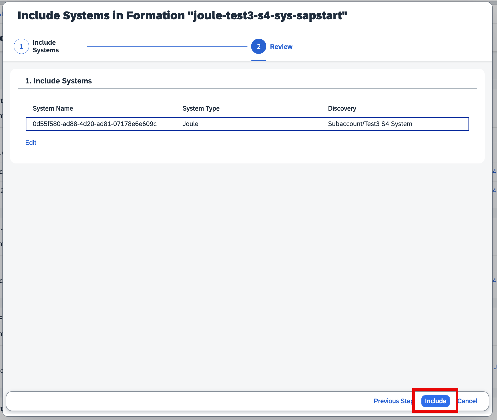
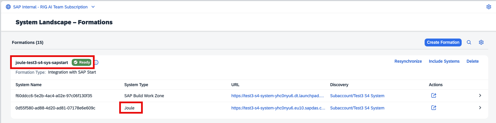

## 1. SAP Build Work Zone, Standard Edition – foundation plan 

### 1.2. Add Joule to the SAP Start Formation

To integrate Joule capabilities with the SAP Start site, we need to add Joule to the SAP Start Formation which we created earlier, and for that follow the below mentioned steps. 

- Go to your SAP BTP Global Account, click on **System**, then **Formations**, search for **SAP Start Formation**, which you had just created, and click on **Include Systems**. 
 

 
 

**
 Image 1 
**

- In the **All System Types**,filter the options to Joule, select your **Joule Subaccount**, and click on **Next Step**.

**
 Image 2 
**

- Before you add the systems details such as name, type and discovery, verify the details and click on **Include**. 

**
 Image 3 
**

- Now, you should be able to see the formation with the Joule service included. 

**
 Image 4 
**

- Once the status is **Ready**, we should be able to see the **Joule Icon** in the **SAP Start Site**. 

