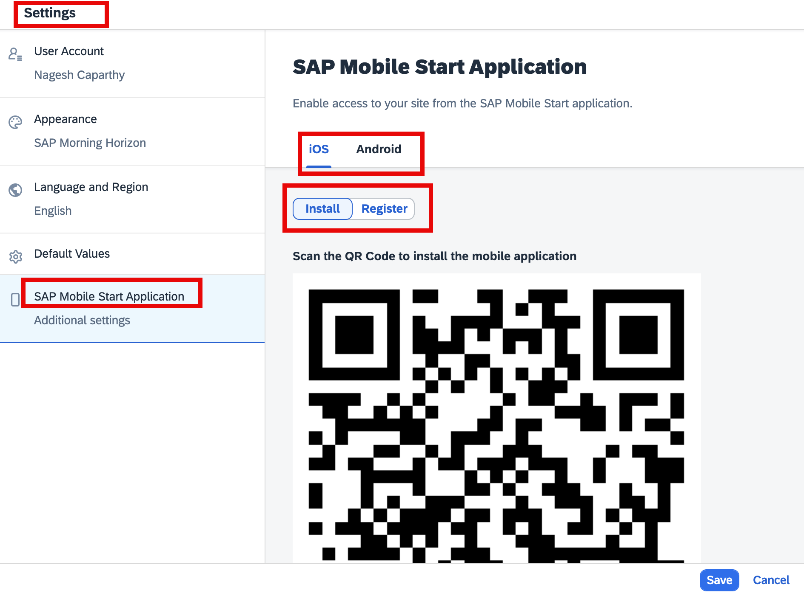
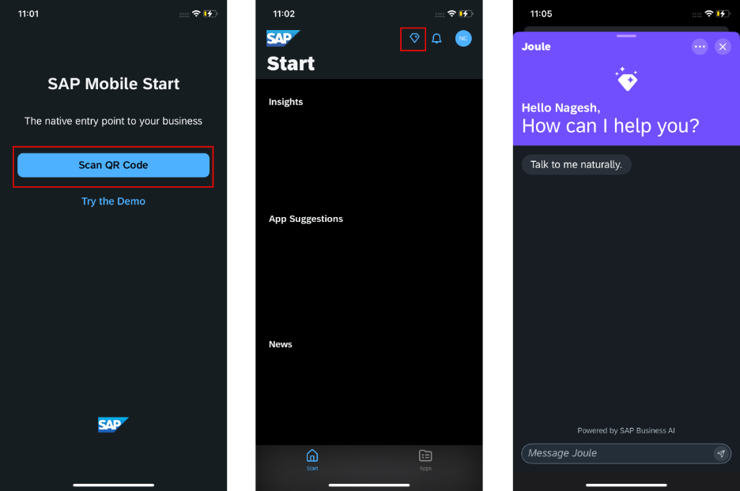

## 4. Login to Mobile Start

Once you install the SAP Mobile Start application, launch it, select **Register** from the SAP Start page, and enter your login details. 

- To use **SAP Mobile Start**, click on your profile icon next to **Joule**, then click on **Settings** -> click on **SAP Mobile Start Application**. 

**
 Image 1 
**

- This completes the setup of Joule with SAP Build Work Zone and using Joule with SAP Mobile Start.

 
 

**
 Image 2 
**