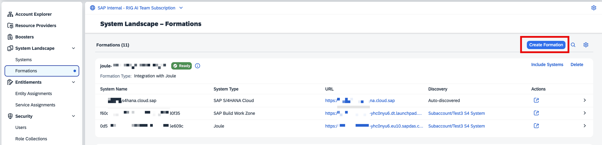
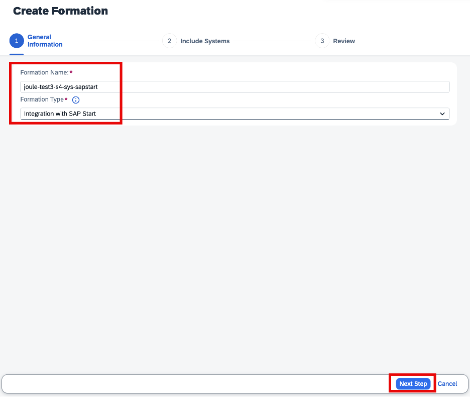
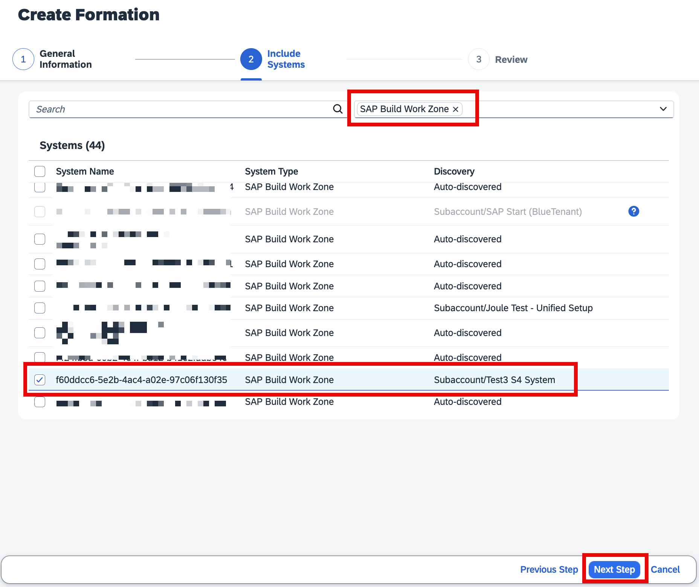
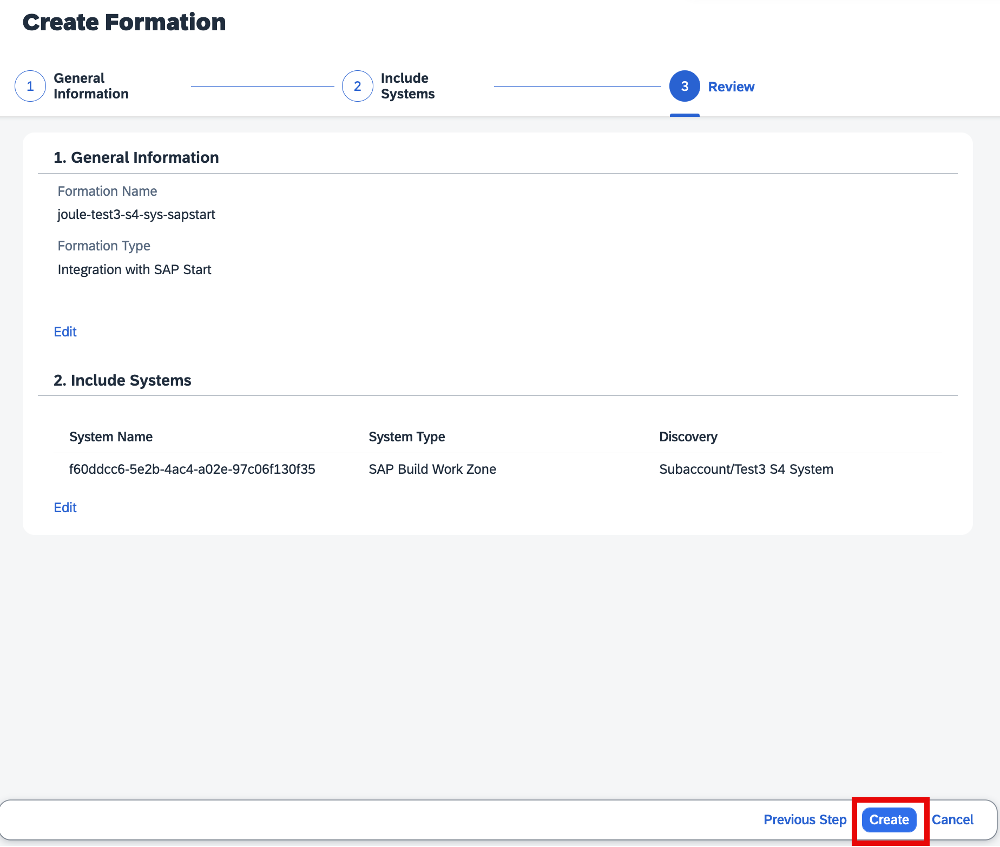
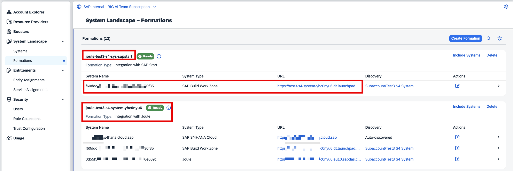
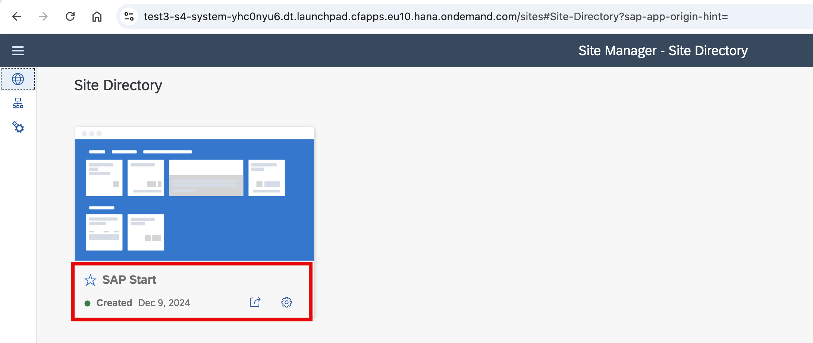

## 1. SAP Build Work Zone, Standard Edition – foundation plan 
 
### 1.1 Manual Setup of SAP Start Formation and validate the Sites 

SAP BTP offers a Booster to activate SAP Start, but this is only applicable when setting up a new subaccount. In this case, the manual method is used.
- To proceed, navigate to the SAP BTP Cockpit, go to **System Landscape**, click on **Formations**, and then select **Create Formation**. 

Image 1: Example of a subaccount with a Joule formation containing SAP S/4HANA Cloud Public Edition

- In the **Create Formation page**, input the **Formation Name** (ideally a similar name to your Joule subaccount where you are activating SAP Start), select the **Formation Type** – Integration with SAP Start as shown below, and click on **Next Step**.

 

 
 

**
 Image 2 
**

- In the next screen, filter the **"All System Types"** options to SAP Build Work Zone and choose the subaccount where you want to activate the service and click on **Next Step**. Make sure you select the SAP Build Work Zone instance that is also part of the Integration with Joule formation. 

**
 Image 3 
**

- In the last screen, recheck the settings and click **Create**.

**
 Image 4 
**

- After completing the process, the formation should appear in the **Ready** state, as displayed below.

**
 Image 5 
**

- To test this activation, go to your **Joule subaccount**, select **Instances and Subscriptions** , and launch your **SAP Build Work Zone**. You should see the **SAP Start** there.

**
 Image 6 
**

- This confirms your activation of SAP Start in your subaccount.
