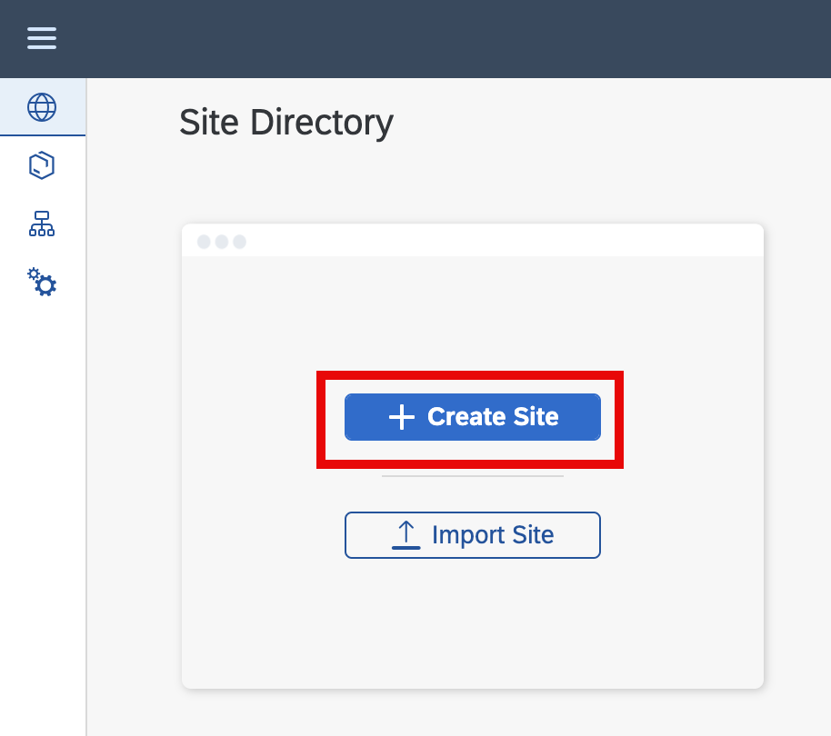
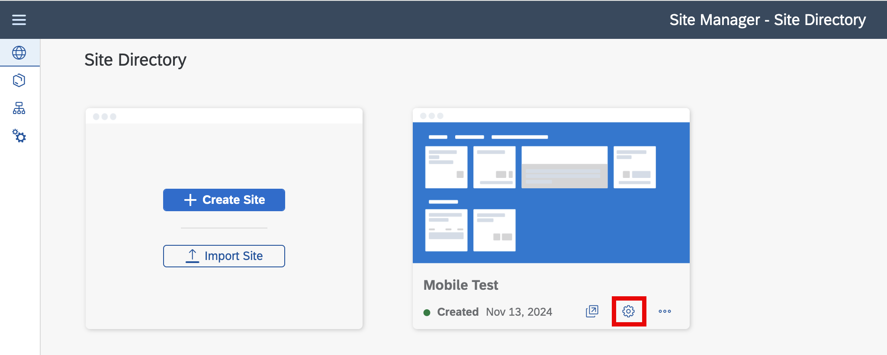
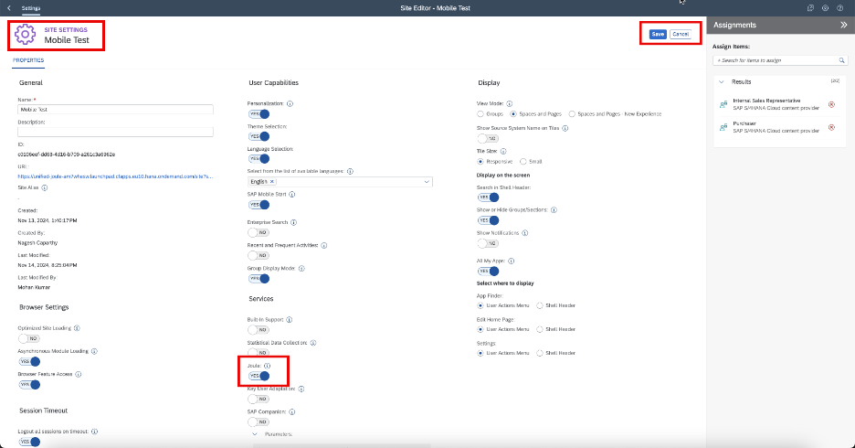
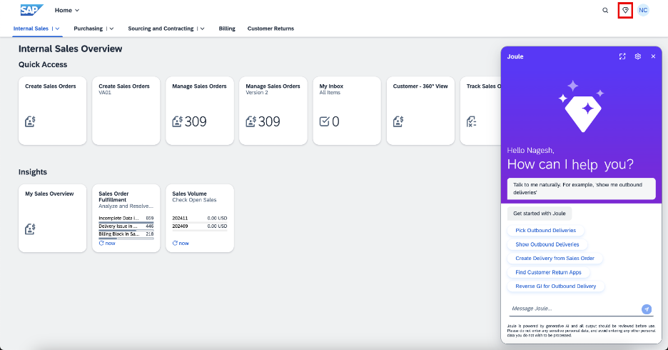

## 2. SAP Build Work Zone, Standard Edition – standard plan (skip it, if you followed the foundation plan setup) 

This process applies if you have activated the SAP Build Work Zone, standard plan with Joule, as shown in Image 1 in section Prerequisistes.  

- To activate Joule, you need a Site. If your SAP Build Work Zone is new and without any sites, you can navigate to the **Site Directory** and click on **Create Site**. 

 
 

**
 Image 1 
**

- Enter a Site Name and select **Create**. Once the site is created, proceed by clicking on **Settings**.

 
 

**
 Image 2 
**

- In the **Site Settings** screen, at the top right of the screen, click **Edit** and look for Joule under the Service option and switch the toggle button to **Yes** as shown below and save the settings.

 
 

**
 <b>Image 3</b> 
**

- Now, if you Navigate to the Mobile Test site, you should be able to see the Joule icon, which is connected to the LoB systems that you have configured as per your requirements. The image below shows the service up and running

 
 

**
 <b>Image 4</b> 
**