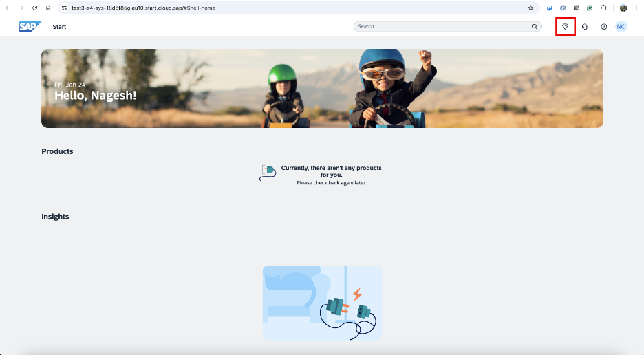

## 1. SAP Build Work Zone, Standard Edition – foundation plan 

## 1.3 Test Joule in the SAP Start Site 

- Navigate to your **SAP Build Work Zone** and launch your **SAP Start Site**. You should be able to see the Joule icon, as shown below.
   

 
 

**
 Image 1 
**

- Click on the **Joule icon** to test it. 
