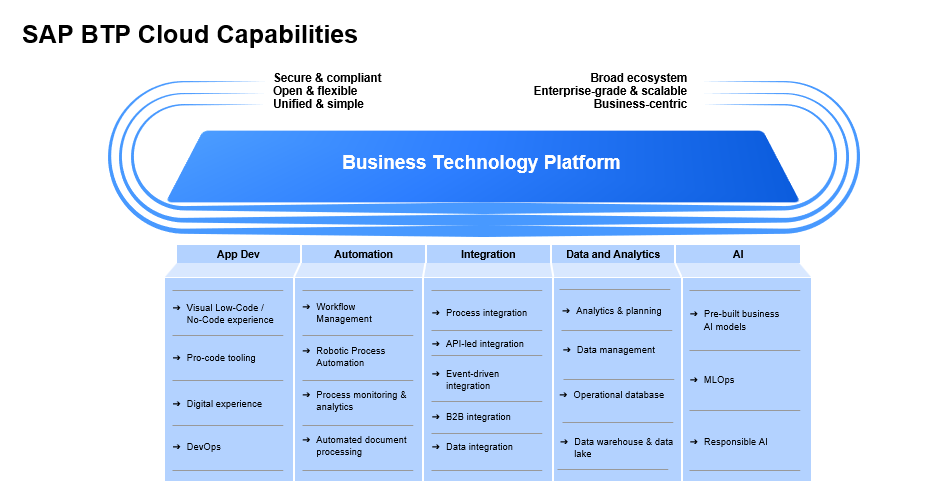

## What is Business Technology Platform?

SAP Business Technology Platform ([SAP BTP](https://www.sap.com/products/technology-platform.html)) is an integrated offering comprised of the following solution portfolios:

- Application Development and Automation with SAP Build (Low-code) and Pro-code development
- Extended Planning and Analysis
- Data and Analytics
- Integration
- Artificial Intelligence

Personalize experiences for SAP applications, innovate faster with business context and run on a trusted enterprise-grade platform.

Explore the [SAP BTP use cases](https://www.sap.com/products/technology-platform/use-cases.html?sort=title_asc) and See how BTP can help you meet your business challenges.

SAP BTP offers more than 90+ services and when you plan to use them, it is important to understand the best practices, the concept of account models & governance, subaccounts, entitlements, administration, roles, authorizations, data centers, etc.

 

 

#### Further information about SAP BTP

* [Live Sessions](https://support.sap.com/en/product/onboarding-resource-center/business-technology-platform.html) about SAP Business Technology Platform

* Visit [SAP Business Technology Platform](https://www.sap.com/products/technology-platform.html) Home Page

* SAP BTP on SAP Help Portal:
    - SAP Help - SAP BTP home page [link](https://help.sap.com/docs/BTP/65de2977205c403bbc107264b8eccf4b/144e1733d0d64d58a7176e817fa6aeb3.html?locale=en-US)
    - SAP Help - SAP BTP Getting Started [link](https://help.sap.com/docs/BTP/65de2977205c403bbc107264b8eccf4b/144e1733d0d64d58a7176e817fa6aeb3.html?locale=en-US)
    - SAP Help - Best Practices for SAP BTP [link](https://help.sap.com/docs/BTP/df50977d8bfa4c9a8a063ddb37113c43/9f2bb927464e4d1ba3d13b2d79ca9bd1.html?locale=en-US)

* SAP BTP on SAP Community:
    - SAP BTP Blogs [all BTP blogs](https://blogs.sap.com/tags/8077228b-f0b1-4176-ad1b-61a78d61a847/)
    - SAP BTP [Questions](https://answers.sap.com/tags/8077228b-f0b1-4176-ad1b-61a78d61a847)
    - SAP Developers [Tutorial Navigator ](https://developers.sap.com/tutorial-navigator.html)

