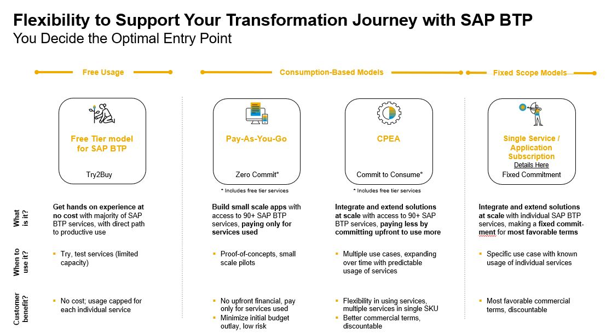

## Enterprise Accounts and Commercial Models 

SAP offers two commercial models for BTP enterprise accounts: 
- **Consumption-based commercial model** in the flavors
    - Cloud Platform Enterprise Agreement (CPEA)
    - Pay-As-You-Go (PAYG)
- **Subscription-based commercial model**. 

 

The consumption-based models **Pay-As-You-Go (PAYG)** and **Cloud Platform Enterprise Agreement (CPEA)** offer, in addition, **Free Tier Service Plans**. 
This provides you an easy way to trial certain SAP services within your enterprise account, free of charge to see if they can meet your needs. 
If your proof of concept proves successful, you can seamlessly update from the free model to the paid model without having to redo any of your work.

**Note:** Free Tier Service Plans are not available for all services and all regions.

 

 

### Consumption-based Model

#### Pay-As-You-Go for SAP BTP including Free Tier Service Plans

[Sign up]((https://store.sap.com/dcp/en/product/display-9999951781_live_v1)) to start using cloud services in your production environment with no upfront cost, no minimum usage requirements, and no financial commitments. 
Contract auto-renews every three months with monthly billing. 
It can be upgraded to a Cloud Platform Enterprise Agreement (CPEA).

If you want to try out an SAP pay-as-you-go account with free tier service plans, follow the tutorial [Set Up an SAP BTP Account for Tutorials](https://developers.sap.com/group.btp-setup.html).

#### SAP BTP, Cloud Platform Enterprise Agreement (CPEA) including Free Tier Service Plans

This model allows for the consumption of cloud credits based on actual usage with the highest flexibility. 
With just one contract, you can access all services available under SAP BTP EA and configure them in your global account. 
This includes new features available after the contract signing date. 
Consume services based on project requirements, without having to change your contract, and only get charged for what is used.

Please reach out to your SAP sales representative for more information. 

 

### Subscription-based pricing

Your organization subscribes only to the services that you plan to use. You can then use these services at a fixed cost, irrespective of consumption.
The contract includes the exact services you can use in your project and will be provisioned in your global account for SAP BTP as preset entitlements. 
The entitled cloud services can be used up to the limit of your purchased subscription. 
To use more, you can increase your license volume.
You can optimize your cost by knowing exactly what you need, getting discounts, and benefiting from budget security throughout the contract period.

You can add new services or modify your contract by contacting your SAP sales representative or visiting the SAP Store. 

 

### Trial

Get a free single-user SAP BTP trial license in case you have no access to BTP. 
This gives you access to our community and all the technical resources, tutorials, or blogs you need. 
Visit the [SAP Developer Center](https://developers.sap.com/) or the [BTP Trial cockpit](https://account.hanatrial.ondemand.com/trial/#/home/trial).

