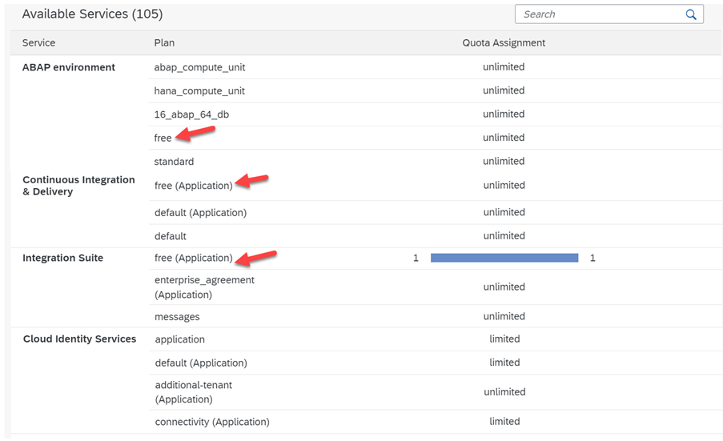
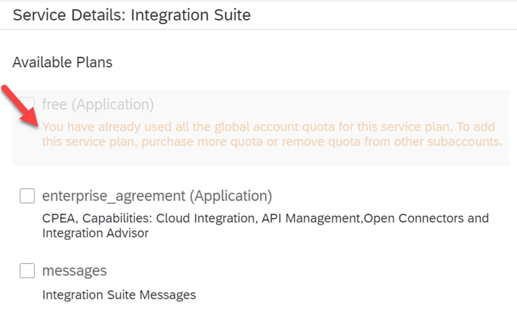

## Learn about the Free Tier model

This is one of the most important topics and we request your attention while activating/using your free tier services.

Free tier services are only available on consumption licenses i.e. PAYG or CPEA. As a customer, if you have opted for any of the license models you are eligible to use the free tier and the options show up in your BTP global account.

Free tier services allow you to try out a growing selection of SAP BTP services without being charged up to specified limits for each service. 
For more information about the free tier service plans and their capacity limits, see [Discovery Center](https://discovery-center.cloud.sap/viewServices?category=freetierservices&regions=all&provider=all) Free Tier Services .

 

## Important!

> **Note:** We have seen situations where customers activate resources in an Enterprise Account unplanned which may end up consuming all the CPEA credits or unexpected bills in case of PAYG.  

> **Note:** Not all services are available with a free service plan and not all free service plans are available in all regions and with all providers.  

> Be careful while you activate services with all the scenarios. Do not activate any services in Enterprise Accounts if you **strictly want to avoid costs** for the services and you are not sure if the service and its service plan is free. In this scenario, consider to use BTP Trial Account first, to become familiar with BTP service configuration.

 

#### Get started with free tier service options:

If you are the global administrator or getting your services activated, it is important to understand the entitlements, with PAYG and CPEA license model your company has access to all the 90+ BTP services without restrictions. 
This unlimited access can help you to spin up all the services as required for your projects.

Let us take a look at service assignments from a Global Account. 
Every service listed in the BTP has its charges which are known as “ service plan” and “quota” to understand the number of units and their usage. 
Taking an example, the image below details some of the free services and a few that are not included as free tiers.

 
 
 
With the Integration Suite, we see that the free tier is applicable and we can also see that the assigned quota is 1 which is consumed (meaning, it's already in use by one of the subaccounts. 

In case the user tries to assign the free tier services to more than one subaccount, a clear message is displayed which indicates that the free service is already in use as shown below.

If you activate the integration suite services with enterprise_agreement or messages, you will be charged based on the pricing details listed in the [Discovery Center](https://discovery-center.cloud.sap/serviceCatalog/integration-suite?region=all&tab=service_plan).
